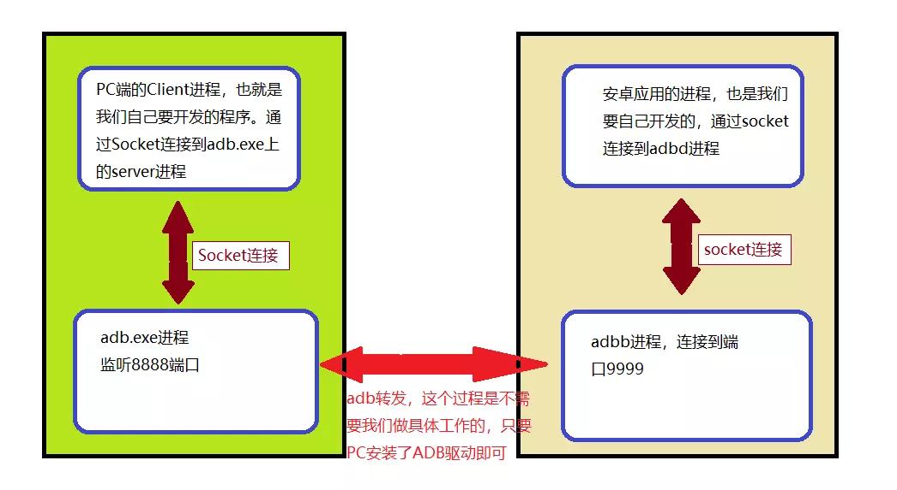

# ADB
## ADB 端口转发
使用ADB端口转发可以实现PC与手机通过USB通信，如下建立从主机端口8888到模拟器/设备端口9999的转发。
```
adb forward tcp:8888 tcp:9999
```


## ADB 反向代理
```
adb reverse tcp:80 tcp:3000
```
区别：
端口转发：解决 PC -> Phone 的访问问题，比如可用于PC通过USB连接Phone上网
反向代理：解决 Phone -> PC 的访问问题

## ADB 按键输入
Usage: input [\<source>] \<command> [\<arg>...]

The sources are: 

      dpad
      keyboard
      mouse
      touchpad
      gamepad
      touchnavigation
      joystick
      touchscreen
      stylus
      trackball

The commands and default sources are:

      text <string> (Default: touchscreen)
      keyevent [--longpress] <key code number or name> ... (Default: keyboard)
      tap <x> <y> (Default: touchscreen)
      swipe <x1> <y1> <x2> <y2> [duration(ms)] (Default: touchscreen)
      draganddrop <x1> <y1> <x2> <y2> [duration(ms)] (Default: touchscreen)
      press (Default: trackball)
      roll <dx> <dy> (Default: trackball)


举个栗子：屏幕页面向下滑动一段距离：

    adb -d shell input touchscreen swip 100  0  100 900 600
