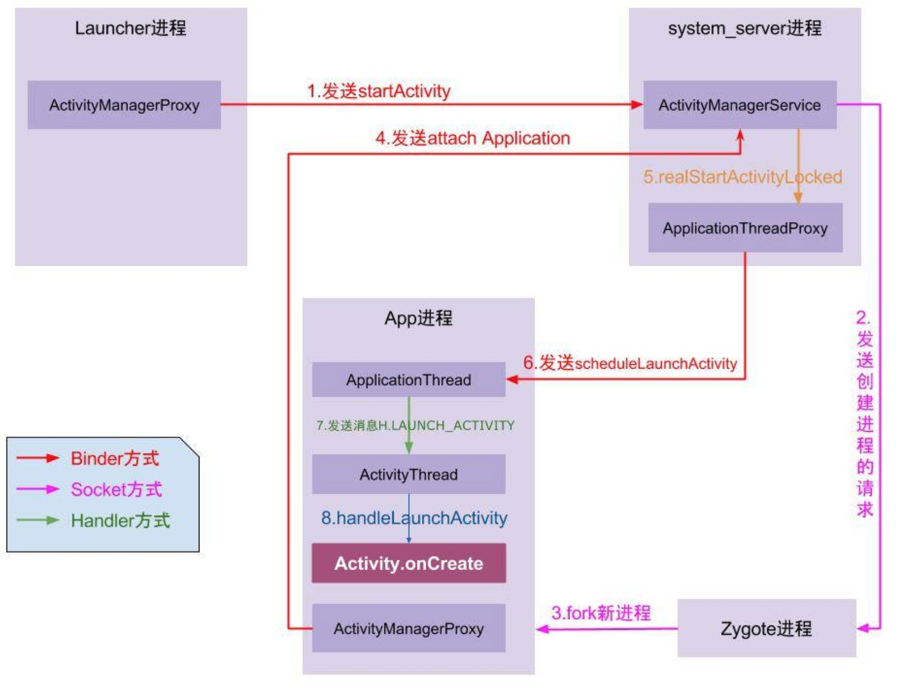

# 启动优化

## 启动流程


1. 从桌面点击应用图标，startActivity(Intent), 会通过Binder IPC机制, 调用到ActivityManagerService，这个服务在system_server进程。 

2. ActivityManagerService会做以下事情：
    * 通过PackageManager的resolveIntent()收集这个intent对象的指向信息。
    * checkGrantUriPermissionLocked()方法来验证用户是否有足够的权限去调用该intent对象指向的Activity。
    * 检查并在新的task中启动目标activity
    * 如果发现进程的ProcessRecord不存在了，则创建新的进程(startProcessLocked)。

3. 启动新的进程是通过Process.start方法来实现，该方法中会通过socket连接到Zygote进程，因为Zygote在启动后会初始化一个ServerSocket来监听请求，Zygote会基于自身预先加载的VM来fork出一个新的VM进程，并通过socket返回新进程的pid。
Zygote在fork出子进程后，会执行ActivityThread的main()方法，该方法中会调用
thread.attach(ApplicationThread)
通过Binder IPC连接到ActivityManagerService服务，调用其attachApplication方法。

4. 然后ActivityManagerService 通过startProcessLocked、bindApplication后，回调回ApplicationThread中的bindApplication。

5. 发送`H.BIND_APPLICATION`消息，调用handleBindApplication继续处理，该方法中会创建ApplicationContext和Application对象，如果有provider会初始化Provider、最后通过Instrumentation调用Application对象的onCreate方法，这样就进入了我们的应用启动的可见流程。

6. 我们的application启动后，回到步骤4，接着调用realStartActivityLocked、scheduleLaunchActivity 通过Binder IPC 又回到ApplicationThread。

7. 创建ActivityClientRecord，发送`H.LAUNCH_ACTIVITY`消息，通过handleLaunchActivity继续处理，接着new出Activity对象，然后调用performLaunchActivity，然后调用到activity.attach方法，接着就是调用activity的onCreate方法，这时应用首页就启动了。

## 应用的启动类型
启动分为冷启动和热启动。其中冷启动就是上面的整个流程，包含创建新进程、启动application，最后启动activity，这个过程耗时较长；而热启动只会启动activity，比冷启动开销低。

以下两种情况可以认为是热启动：

1. 用户退出应用，但随后重新启动它。应用的进程还在运行，但应用必须重新从 onCreate() 开始创建 Activity。

2. 系统从内存中清除了应用(非用户主动)，然后用户重新启动它。进程和 Activity 需要重新启动，但 onCreate() 将接收到保存状态的 Bundle。

## 启动耗时检测
### 查看logcat
从 Android 4.4(API 19) 开始，logcat 的输出包括了一行 `Displayed` 的值。
```
I/ActivityManager: Displayed com.android.contacts/.activities.PeopleActivity: +612ms
```
这个值表示了应用启动进程到 Activity 完成屏幕绘制经过的时间。经过的时间包括以下时间，按顺序为：
```
启动进程
初始化对象
创建和初始化 Activity
布局渲染
完成第一次绘制
```

### 命令行启动
你也可以使用 ADB Shell启动activity并测量启动到显示的时间。下面是一个例子：
```
adb shell am start -S -W com.android.contacts/.activities.PeopleActivity
-c android.intent.category.LAUNCHER
-a android.intent.action.MAIN
```
终端窗口就像显示 Displayed 一样地显示如下内容：
```
Starting: Intent { act=android.intent.action.MAIN cat=[android.intent.category.LAUNCHER] cmp=com.android.contacts/.activities.PeopleActivity }
Status: ok
Activity: com.android.contacts/.activities.PeopleActivity
ThisTime: 701
TotalTime: 701
WaitTime: 718
Complete
```

* ThisTime: 最后一个启动的 Activity 的启动耗时
* TotalTime: 所有的 Activity 的启动耗时
* WaitTime: ActivityManagerService 启动 App 的 Activity 时的总时间，包括前 Activity 的 onPause() 和现在 Activity 的启动


### 代码打点
在应用程序的生命周期节点、 需要初始化的重要方法，如数据库初始化等以及其他一些可能耗时的方法上进行打点上报，这种方法可以在线上环境中使用。

>注意: onWindowFocusChanged只是首帧时间，App启动完成的结束点应该是真实数据展示出来的时候，可以使用getViewTreeObserver().addOnPreDrawListener()，它会把任务延迟到UI显示后再执行。

打点方式可分为：
1. 人工特殊打点
2. 切面打点，如使用AspectJ

## 分析工具
1. Systrace
Systrace 允许您在系统级别收集和检查设备上运行的所有进程的计时信息。 它将来自Android内核的数据（例如CPU调度程序，磁盘活动和应用程序线程）组合起来，以生成HTML报告。

* 收集Android关键子系统（如surfaceflinger、WindowManagerService等Framework部分关键模块、服务、View系统等）的运行信息，这样可以更直观地分析系统瓶颈，改进性能。
* 跟踪系统的I/0操作、内核工作队列、CPU负载等，在UI显示性能分析上提供很好的数据，特别是在动画播放不流畅、渲染卡等问题上。

Systrace 的功能包括跟踪系统的 I/O 操作、内核工作队列、 CPU 负载等，很好收集分析 UI 显示性能的数据。 Systrace 工具可以跟踪、收集、检查定时信息，可以很直观地查看 CPU 周期消耗的具体时间，显示每个线程和进程的跟踪信息，使用了不同的颜色来突出问题的严重性，并提供了解决这些问题的一些建议。

使用TraceView有2种方法：  
1. Systrace工具原为DDMS中的工具，不过现在DDMS 在Android Studio中已经没有入口了，可以使用命令行方式来启动。
```
cd android-sdk/platform-tools/systrace
$ python systrace.py --time=10 -o trace.html sched gfx view wm
```
trace.html 双击打开使用WASD进行缩放、移动查看。  
参数解释
```
-t: 指定统计时间
shced: CPU调度信息
gfx: 图形信息
view: 视图
wm: 窗口管理
am: 活动管理
app: 应用信息
webview: webview信息
-a: 指定包名
-o: 指定输出文件名
```

2. 代码插桩  
Trace.beginSection 和 Trace.endSection 来追踪应用的代码片段，有两个需要注意的地方：
* 这两个 API 需要放在同一个线程里
* 这两个 API 需要成对出现，而且每一个 endSection 都只会与最近的 beginSection 对应。

加入label的好处在于，生成的trace文件中，会在跟踪的代码段执行对应时间轴区间打上一个tag标记。
```java
public class MyAdapter extends RecyclerView.Adapter<MyViewHolder> {

    ...

    @Override
    public MyViewHolder onCreateViewHolder(ViewGroup parent, int viewType) {
        Trace.beginSection("MyAdapter.onCreateViewHolder");
        MyViewHolder myViewHolder;
        try {
            myViewHolder = MyViewHolder.newInstance(parent);
        } finally {
            Trace.endSection();
        }
        return myViewHolder;
    }

   @Override
    public void onBindViewHolder(MyViewHolder holder, int position) {
        Trace.beginSection("MyAdapter.onBindViewHolder");
        try {
            try {
                Trace.beginSection("MyAdapter.queryDatabase");
                RowItem rowItem = queryDatabase(position);
                mDataset.add(rowItem);
            } finally {
                Trace.endSection();
            }
            holder.bind(mDataset.get(position));
        } finally {
            Trace.endSection();
        }
    }
}
```
Systrace对于检查应用程序的`UI性能`特别有用，如检查UI卡顿，因为它可以分析帧速率以识别问题区域并提供可能的解决方案。

> 由于Systrace不会在应用程序进程中收集有关代码执行的信息， 仅以系统的角度返回一些信息，并不能定位到具体的耗时的方法，要进一步获取 CPU 被占用的原因，就需要使用另一个分析工具 Traceview。 

SysTrace原理：通过Lable的开始和结束来确定某个核心过程的执行开始和结束时间，并把这些label信息收集起来得到系统关键路径的运行时间信息，最后得到整个系统的性能信息。Android FrameWork中一些重要的模块都插入了Label信息。

参考：<https://www.androidperformance.com/2019/05/28/Android-Systrace-About/>


2. TraceView  
使用TraceView有2种方法：  
* 使用Android Studio的Profiler  
在CPU工具中点击start Record 和 stop Record，然后可在Top Down/Bottom up区域找出耗时的热点方法。冷启动无法使用该方法
* 代码插桩  
Debug.startMethodTracing() 和 Debug.stopMethodTracing()，然后使用adb导出.trace文件(externalFileDir下)拖到AndroidStudio窗口中查看，和Profiler的窗口一样。

> 运行 Method Trace 将明显地影响应用的运行速率。 所以Method Trace可以用来了解程序的流程及方法的运行时间的比例，其计时时间不可直接作为应用性能的表现。


## 线上监控
1. 确定启动开始和结束的时机，是否使用用户真正可以操作UI的时间作为结束时间。
2. 启动时间扣除，如闪屏、广告和新手引导等
3. 启动排除逻辑，如被Broadcast拉起，启动过程中进入后台等都需要排除统计。

使用什么指标来衡量启动的快慢?
1. 平均时间
2. P90，P95时间(推荐)


## 启动优化方案
### 启动过程中的常见问题
1. 点击图标很久不响应 ———— 预览窗口被禁用或设置为透明了
2. 首页加载太慢 ———— 初始化任务耗时太长
3. 首页显示后无法进行操作或操作很卡 ———— 太多延迟任务占用CPU时间片

### 优化区域
Application和Activity的启动和生命周期回调。

·   任务化：将启动阶段的代码按照业务逻辑封装成独立任务，方便管理和调度。
·   并发：将启动阶段的任务尽量并发执行。
·   延迟：启动阶段只执行第一个页面渲染展示的必要任务，延迟的任务将在第一个页面渲染完成后再进行合理的调度触发。
·   兜底：设计兜底机制，保证程序稳定执行。
·   监控与优化：建立常态化监控机制，监测任务变化情况，实现精准优化。


方案一：主题切换  
为activity设置一个有背景图片的主题(android:windowBackground)，然后在Activity启动后再设置成真正的主题。
这样就避免了启动白屏 和点击图标不响应的情况。但是对于低端机器，这将加长闪屏时间，建议只在Android 6.0以上启用。

方案二：懒加载
一些第三方组件的初始化可以延迟，或使用的时候再初始化

方案三：异步加载
使用新的线程来分担主线程的任务，让串行任务变成并行任务，但是需要注意几点：
1. 注意任务的相互依赖，某个任务必须在某个任务执行完后才能执行
2. 区分CPU密集型和IO密集型任务，如果使用线程池，CPU密集型任务使用固定核心数的线程池(N+1)，而IO密集型核心线程数动态增长。

异步启动最优解：  
思想：充分利用CPU多核，自动梳理任务顺序  
流程：任务Task化、根据任务的依赖关系排序生成一个有向无环图、多线程按照排序后的优先级依次执行各任务。

方案四：延迟初始化
1. 在闪屏页做部分初始化，可能导致界面卡顿
2. 利用IdleHandler在CPU空闲时做部分初始化


方案五：MultiDex预加载优化


方案六：类预加载优化
在Application中提前加载初始化耗时比较长的类（可替换系统ClassLoader，打印出类加载时间，按需选择异步加载的类）。
一个Java类加载到JVM中经过的三个步骤  
* 装载： 查找和导入类或接口的二进制数据
* 链接： 分别执行 校验，准备，和解析
* 校验： 检查导入类或接口的二进制数据的正确性
* 准备： 给类的静态变量分配并初始化存储空间
* 解析： 将符号引用转成直接引用
* 初始化： 激活类的静态变量的初始化Java代码和静态Java代码块

Class.forName 执行之后已经对被加载类的静态变量分配完毕了存储空间，而classLoader.loadClass通过类的权限定名来获取描述类的二进制字节流，所以loadClass()不能初始化类的，但是可以获取类的 Class 对象，再对类进行初始化。

方案七：页面数据预加载
在闪屏页提前预加载数据到内存中

方案八：启动阶段不要启动其他进程
新开子进程会分担CPU资源，导致CPU紧张，任务执行时间加长。

方案九：首页过度绘制和布局优化


方案十：启动阶段抑制GC
启动阶段GC抑制，允许堆内存一直增长，实现方法略。

方案十一：IO优化
启动过程不建议出现网络IO；为了只解析启动过程中所需的数据，合理选择数据结构。将ArrayMap改造成支持随机读写、延时解析的数据存储结构以代替SharePreference。

黑科技：
类重排：FaceBook的ReDex的interDex调整类在Dex中的排列顺序
微信HardCoder: 直接与厂商ROM通信


## CPU time与WALL time
进程时间也称CPU时间，用以度量进程使用的中央处理器资源。进程时间以时钟嘀嗒计算，实际时间（Real），用户CPU时间（User），系统CPU时间（Sys）

实际时间指实际流逝的时间；用户时间和系统时间指特定进程使用的CPU时间：

* real time是从进行开始执行到完成所经历的墙上时钟时间（wall clock）时间，包括其他进程使用的时间片（time slice）和本进程耗费在阻塞（如等待I/O操作完成）上的时间
* user time是进程执行用户态代码（内核外）耗费的CPU时间，仅统计该进程执行时实际使用的CPU时间，而不计入其他进程使用的时间片和本进程阻塞的时间
* sys time 是该进程在内核态运行所耗费的CPU时间，即内核执行系统调用所使用的CPU时间

CPU总时间（user + sys）是CPU执行用户进程操作和内核（代表用户进程执行）系统调用所耗时间的总和，即该进程（包括线程和子进程）所使用的实际CPU时间。若程序循环遍历数组，则增加用户CPU时间；若程序执行exec或fork等系统调用，则增加系统CPU时间。

在多核处理器机器上，若进程含有多个线程或通过fork调用创建子进程，则实际时间可能小于CPU总时间，因为不同线程或进程可并行执行，但其时间会计入主进程的CPU总时间。若程序在某段时间处于等待状态而并未执行，则实际时间可能大于CPU总时间：  
* real < CPU  表明进程为计算密集型（CPU bound），利用多核处理器的并行执行优势
* real ≈ CPU  表明进程为计算密集型，未并行执行
* real > CPU  表明进程为I/O密集型 （I/O bound），多核并行执行优势并不明显