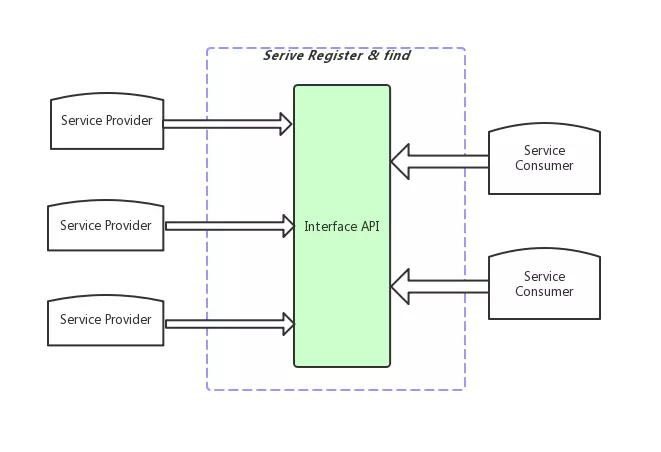

## APP工程可能面临的问题
1. 代码耦合度高，牵一发而动全身
2. 主工程编译耗时越来越长
3. 依赖倒置，业务模块有时依赖主工程的东西
4. SDK界限模糊，基础库和业务库界限不明确
5. 业务模块间可以任意依赖和使用，依赖规则不明确
6. 类库越来越多，不好管理

## 动态化
`插件化`可作为动态化的一项技术方案。最近几年，插件化框架层出不穷，各大厂都放出了自家开源的插件化框架。但是插件化方案难免涉及到 hook framework、修改 aapt、包装 Gradle Plugin、代理组件等非常规操作，随着Android端系统版本的不断迭代，尤其是Android P发布以后，限制 hook framework 后，稳定性、兼容性、新版本适配等等问题层出不穷，插件化方案的维护成本逐渐增加。

除了插件化，近年来以ReactNative、Weex、Flutter等代表的大前端方向也逐渐火起来，涉及到跨平台混合开发技术。

## 组件化
一般来说一个App工程包含4个层级
* App壳工程
* 业务组件
* 基础业务SDK
* 基础LIB，与业务无关。如uiLib、toolLib

组件化的核心是高内聚和低耦合，组件化的优势:
* 代码边界清晰，代码变动影响面可以准确评估
* 提高开发效率，每个组件可以独立打包和调试
* 降低主工程编译时间，理想情况下，主工程仅仅是一个空壳，用于加载各个业务组件

组件化的主要工作是解耦，实际中需要处理几个方面：

1、页面跳转(路由)  
2、模块间方法调用  
3、消息总线  
4、数据总线  

### 页面跳转(路由)  
路由分发是把直接依赖引用转化为中心化管理分发的一个过程，本质还是总分结构，由于组件化拆分后，各个业务组件间不存在直接的依赖关系，所以必然要有一个统一收集页面跳转规则进而再分发的过程。

路由分发的主要原理是组件内注册路由，编译时在组件内生成独立的路由表，并用 AOP 在编译时做好所有组件内路由表汇总的工作，调用初始化方法时进行路由表汇总，页面跳转时再进行管理分发。

参考:[ Android 组件化 —— 路由设计最佳实践 ](https://www.jianshu.com/p/8a3eeeaf01e8)

业内的实现方案比如阿里巴巴的ARouter，美团外卖的WMRouter等。

### 模块间方法调用
组件间层次和边界模糊问题的产生，根本原因是各个业务组件间的相互依赖关系混乱，为了进行业务组件间的隔离，首先要做好组件之间的服务调用关系解耦。

#### SPI
SPI，全称Service Provider Interfaces，服务提供接口。是Java提供的一套供第三方实现或扩展使用的技术体系。主要通过解耦服务具体实现以及服务使用，使得程序的可扩展性大大增强，甚至可插拔。

基于SPI的思想，JDK中ServiceLoader可以轻松实现面向服务的注册与发现，完成服务提供与使用的解耦。

完成分离后的服务，使得服务提供方的修改或替换，不会给服务使用方带来代码上的修改，基于面向接口的服务约定，提供方和使用方各自直接面向接口编程，而不用关注对方的具体实现。同时，服务使用方使用到服务时，也才会真正意义上去发现服务，以完成服务的初始化，形成了服务的动态加载。

基于ServiceLoader机制，实际上已经为我们提供了一种Android组件化之间的组件解耦与通信机制。通过将接口约定下沉到公共baseLib模块，不同的模块内可以按照实际需要，提供接口的具体实现，其他模块直接通过形如ServiceLoader.load(IMyServiceProvider.class)方式，即可得到具体的服务并调用之。

与路由初始化汇总路由表不同的是，ServiceLoader 在调用时查找，省去了初始化的逻辑，Service 不会像路由这么多，查找起来不会存在遍历太慢的问题。

针对ServiceLoader的一些改进，参考：[WMRouter中对ServiceLoader的改进](https://juejin.im/post/5d2db85d6fb9a07ea7134408#heading-5)

#### 组件结构
每个组件内一般包含三个子模块：
1. 接口
声明对外暴露的服务接口和对外暴露的实体类及事件  
2. 实现  
接口的具体实现，不对外暴露细节，不允许其他组件对这部分进行直接依赖
3. 壳工程  
主要用于单独运行和调试该组件

### 消息总线
除了接口调用，还有就是事件分发，这个可以使用EventBus来实现，在接口模块中声明和暴露。

### 数据总线
即统一的数据缓存框架，如GreenDao、Room等。

## 混合开发
### Hybrid 容器
Native 和 H5 混合开发一般是比较常见的混合开发模式，H5开发效率高、迭代快速、不依赖App发版。

由于 H5 不能直接调用原生方法，所以原生壳要提供一套通用的通信方式，如JsBridge，除此之外，管理和维护好 Native接口方法 才是核心。

业界实现方案：如PhoneGap、Cordova、微信小程序、美团的KNB等。

Hybrid 混合开发的一大劣势就是性能比较差，特别是在弱网情况下，打开页面较慢，相应的解决方案是下发离线包来提升页面打开速度。

### 其他混合方案
Facebook的React Native、阿里巴巴的Weex、Google的Flutter。