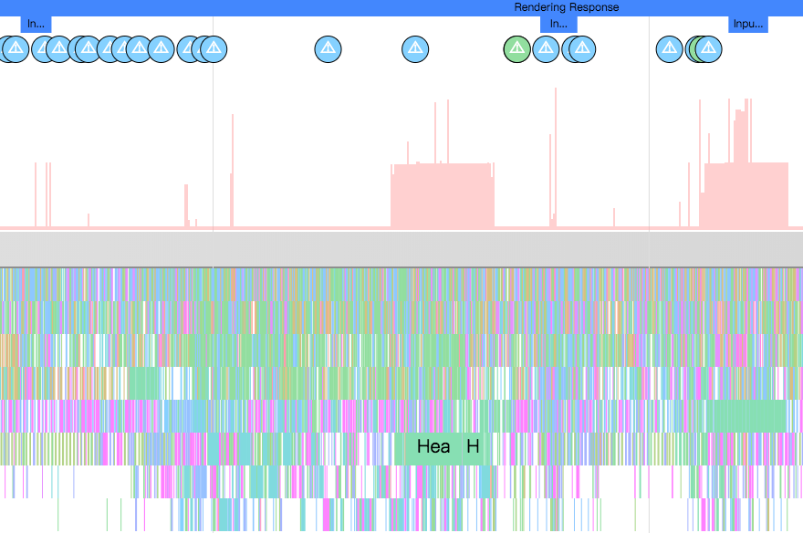

# UI 性能优化

## 定位卡顿

* 直观分析
* Systrace
* 定制性能监控工具

### 直观分析
1. 打开开发者选项，打开【GPU呈现模式分析】，选择【在屏幕上显示为竖条】

    * 沿水平轴的每个竖条代表一个帧，每个竖条的高度表示渲染该帧所花的时间（毫秒）。
    * 水平绿线表示 16 毫秒。要实现每秒 60 帧，代表每个帧的竖条需要保持在此线以下。当竖条超出此线时，可能会使动画出现暂停。
    * 该工具通过加宽对应的竖条并降低透明度来突出显示超出 16 毫秒阈值的帧。


该工具可以帮助你直观地看到绘制UI窗口的每一帧相对16ms每帧的标准花费了多长时间，如果你需要更详细的信息来分析问题，可以借助Systrace。

### systrace工具
Systrace是分析Android性能问题的神器，Google IO 2017上更是对其各种强推。相比于TraceView，Systrace有着非常小的运行时开销，因此你在分析问题的时候可以体验到真实的卡顿。systrace要求apk必须是debuggable的(当然在非debuggable版本使用反射也可以开启Trace)

```
./systrace.py -t 10 sched gfx view wm am app webview -a <package-name>
```



我们可以添加自定义的TraceLabel，以方便我们观察systrace的结果图。
```java
public View onCreateView(LayoutInflater inflater, @Nullable ViewGroup container,
            Bundle savedInstanceState) {
    Trace.beginSection("Fragement_onCreateView");
    // .. 其他代码
    // ...
    // .. 结束处
    Trace.endSection();
}
```


我们可以在任意自己感兴趣的地方添加自定义的Label。一般来说，分析过程就是，你怀疑哪里有问题，就在那那个函数加上Label，运行一遍抓一个Trace，看看自己的猜测对不对；如果猜测正确，进一步加Label缩小范围，定位到具体的自定义函数，函数最终调用到系统内部，那就开启系统相关模块的Trace，继续定位；如果猜测错误，那就转移目标，一步步缩小范围，直至问题收敛。

 Android CPU Profiler 可以用来记录采样或者插桩的method trace。不过通常情况下，method trace不适合用来定位卡顿问题，因为它们运行时的开销太高可能会造成误报，并且它无法看到线程是在运行还是处于阻塞状态。但是 method trace 可以帮助你定位代码中耗时长的方法；在定位到耗时方法之后，可以添加Trace标记，然后重新运行systrace来查看是否是因为这些方法引起的卡顿

### 定制性能监控工具
如果你无法在本地设备上重现卡顿问题，可以在App内构建自定义的性能监控工具，通过线上设备来帮助定位卡顿问题。

要定制性能监控工具，可以通过 FrameMetricsAggregator 来收集App某个特定部分的帧渲染时间，然后通过 [Firebase Preformance Monitoring](https://firebase.google.com/docs/perf-mon/issue-management) 来记录和分析数据。


## 修复卡顿
要避免卡顿问题，耗时较长的任务应该在UI线程之外异步完成；因此需要时刻注意你的代码运行在哪个线程，并且在post不重要的任务到主线程的时候保持谨慎。

如果你的App有一个复杂而重要的UI，可以考虑 instrumentation tests 来自动监测较慢的渲染时间，然后定期运行测试case来避免问题复发。更多内容见[Automated Performance Testing Codelab](https://codelabs.developers.google.com/codelabs/android-perf-testing/index.html#0)。


## 常见卡顿原因
ListView 和 RecyclerView 被广泛用于复杂的滚动列表里面，它们是最容易导致卡顿的部分。这两个控件内部都添加了Systrace Label标记，因此你可以借助systrace来分析它们是否造成了app的卡顿。

### RecyclerView:notifyDataSetChanged

如果你观察到在某一帧内RecyclerView中的每个item都被重新绑定了（并因此重新布局和重新绘制），请需要看下对RecyclerView执行局部更新的时候是否调用了 notifyDataSetChanged(), setAdaper(Adapter)或者 swapAdaper(Adaper, boolean)。

这些方法表示整个列表内容改变，并且会在systrace里面显示为 RV FullInvaludate。在内容改变或者添加内容的时候应该使用 `SortedList` 或者 `DiffUtil` 生成更小的更新操作。

```java
void onNewDataArrived(List<News> news) {
    List<News> oldNews = myAdapter.getItems();
    DiffResult result = DiffUtil.calculateDiff(new MyCallback(oldNews, news));
    myAdapter.setNews(news);
    result.dispatchUpdatesTo(myAdapter);
}
```

### 布局性能

Android UI 绘制工作分为两个阶段：运行在在UI线程的 View#draw，以及在RenderThread里执行的DrawFrame。第一个阶段会执行被标记为invalidated的View的 draw(Canvas) 方法，这个方法通常会调用很多你的App代码里面的自定义View的相关方法；第二个阶段发生在native线程RenderThread里面，它会基于第一阶段View#draw的调用来执行相应的操作。

如果 View#draw 调用花费了较长时间，常见的一种情况是在UI线程在绘制一个Bitmap。绘制Bitmap会使用CPU渲染，因此需要尽量避免在draw方法中使用setShader、setXfermode等方法。

你也可以使用缓存，尝试在支持硬件加速的Canvas上直接绘制，或必要的时候调用 setLayerType 设置为 LAYER_TYPE_HARDWARE 来缓存复杂的渲染输出，这样也可以享受GPU渲染的优势。

### 渲染性能：RenderThread

某些Canvas操作在UI线程是非常廉价的，但却会在RenderThead触发大量昂贵的计算操作。通常Systrace会给这些调用给出警告提示。

Canvas.saveLayer()

要尽量避免 Cavas.saveLayer() 调用，这个方法会在每一帧触发昂贵、未被缓存的离屏渲染。虽然在Android 6.0上优化了这个操作的性能（避免了GPU上的渲染目标切换），仍然需要尽可能地避免调用这个方法；如果实在需要调用它，确保给它传递CLIP_TO_LAYER_SAVE_FLAG**。

Animating large Paths

如果在一个支持硬件加速的Canvas上调用 Canvas.drawPath(), 系统会首先在CPU上绘制这些path，然后把它传递给GPU。如果你的path对象很大，那最好避免在每一帧之间修改它，这样path对象就可以被系统缓存起来，使得绘制更加高效。drawPoints(), drawLines(), drawRect/Circle/Oval/RoundRect() 比 drawPath 更加高效——因此最好使用它们替代相应的drawPath操作，虽然可能用的代码量更多。

Canvas.clipPath

clipPath(Path)** 会触发昂贵的裁剪操作，因此也需要尽量避免。在可能的情况下，应该尽量直接绘制出需要的形状，而不是裁剪成相应的图形；这样性能更高，并且支持反锯齿；例如下面这个clipPath 操作：

canvas.save();
canvas.clipPath(mCirclePath);
canvas.drawBitmap(mBitmap);
canvas.restore();

可以用如下代替：

// one time init:
mPaint.setShader(new BitmapShader(mBitmap, TileMode.CLAMP, TileMode.CLAMP));
// at draw time:
canvas.drawPath(mCirclePath, mPaint);

Bitmap uploads

Android的显示系统使用OpenGL，bitmap在底层表现为OpenGL的纹理，因此在bitmap第一次被展示的时候，bitmap会被首先上传的GPU上。Systrace上标记为 Upload width x height Texture就是这种情况。这个过程可能会花费数毫秒（如下图），但是这是GPU显示图像的必要过程。

img

App在上传一个180万像素的bitmap时花费了10ms，要么减少图片的大小，那么使用prepareToDraw提前完成这个操作

如果这个过程花费了较长时间，首先检查在trace里面显示的图片的宽和高，确保图片的大小不比它显示出来的区域大太多，因为这样会浪费上传时间和内存。常见的图片加载库都会提供一个方便的方式来获取和请求一个合适大小的Bitmap。

在Android 7.0上，图片加载代码（通常是图片加载库）可以调用 prepareToDraw** 在需要的时候提前触发Bitmap上传动作；这种方式可以使Bitmpa在RenderThread空闲的时候提前完成。可以在图片解码之后或者在Bitmap绑定到View上的时候完成这个操作——理想情况下，图片加载库会帮助你完成这些；如果你想要自己掌控图片加载，或者需要确保不在绘制的时候触发Bitmap上传，可以直接在代码里面调用 prepareToDraw。

## 线程调度延迟
比如Binder调用，UI线程不应该等待其他线程的执行结果——别的线程应该在拿到结果之后post给UI线程。

## 对象分配和垃圾回收
自从Android引入 ART 并且在Android 5.0上成为默认的运行时之后，对象分配和垃圾回收（GC）造成的卡顿已经显著降低了，但是由于对象分配和GC有额外的开销，它依然又可能使线程负载过重。 在一个调用不频繁的地方（比如按钮点击）分配对象是没有问题的，但如果在在一个被频繁调用的紧密的循环里，就需要避免对象分配来降低GC的压力。

可以通过Systrace来确定是否发生了频繁的GC，然后用 Android Memory Profier** 分析分配的对象都是些什么。如果你尽可能地做到了避免分配对象（特别是在紧密的循环里），那就几乎不会遇到这种问题。