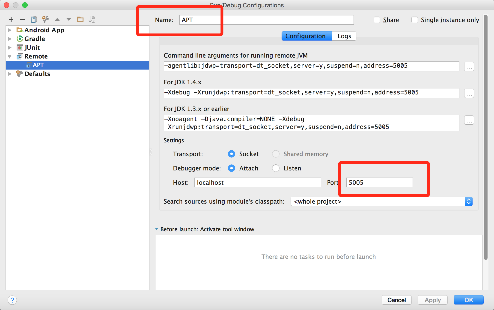

编译时注解处理器是运行在一个单独的JVM当中，因此我们想要对它进行调试可以使用Remote Debug。无论是是Eclipse中还是，IDEA当中，对Remote Debug功能都提供了良好的支持，作为IDEA二次开发出的Android Studio同样也不例外。

先来看一下如何开启JVM的远程调试功能，在启动JVM的时候加上以下参数即可：

    //jdk 1.5以前写法，当然该命令是先后兼容的
    -J-Xdebug -J-Xrunjdwp:transport=dt_socket,server=y,suspend=y,address=5005

    //jdk 1.5及以后版本写法
    -agentlib:jdwp=transport=dt_socket,server=y,suspend=n,address=5005

这些参数的含义这里不细说，你唯一要做的就是修改address指定一个端口号。  

现在我们以Android Studio中调试注解处理器为例   

1、打开Edit Configurations，点击左上角+号，选择Remote，Name可以随便起名，假设这里叫Apt，port默认填写5005，点击ok。


2、由于编译时注解是在compileDebugJavaWithJavac脚本中处理的，所以我们要为其添加JVM参数将其设置为可远程调试。
```bash
./gradlew --no-daemon -Dorg.gradle.debug=true :app:clean :app:compileDebugJavaWithJavac
```
这时命令行会卡主，等待debug进程连上5005端口

3、然后在你需要调试的地方打上断点，这时候点击debug按钮等待几秒钟，就可以连接上远程调试器进行Annotation的调试啦。


