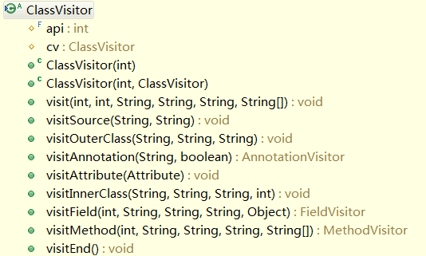

# ASM
参考：<https://www.ibm.com/developerworks/cn/java/j-lo-asm30/>、<https://kahnsen.github.io/kahnblog/2017/11/29/ASM%E5%85%A8%E8%A7%A3%E6%9E%90/>、[ASM英文手册](https://asm.ow2.io/asm4-guide.pdf)

# 概念
ASM 是一个 Java 字节码操控框架。它能被用来动态生成类或者增强既有类的功能。ASM 可以直接产生二进制 class 文件，也可以在类被加载入 Java 虚拟机之前动态改变类行为。

# 原理
ASM 在读取 “.class” 文件内容时也会按照递class结构顺序进行调用。每拜访一个结构中的成员都会使用相应的接口，具体关系如下：
树形关系|使用的接口
---|---
Class|ClassVisitor
Field|FieldVisitor
Method|MethodVisitor
Annotation|AnnotationVisitor

ClassVisitor，在 ASM3.0 中是一个接口，到了 ASM4.0 与 ClassAdapter 抽象类合并。主要负责 visit 类成员信息。其中包括（标记在类上的注解，类的构造方法，类的字段，类的方法，静态代码块）, 它的完整接口如下：



1. visit(int version, int access, String name, String signature, String superName, String[] interfaces)  
该方法是当扫描类时`第一个`调用的方法，主要用于类声明使用。
    * version：JDK版本（V1_6、V1_7等）
    * access：类的修饰符（ACC_PUBLIC、ACC_FINAL、ACC_INTERFACE等）
    * name：完整类名，如 org/more/test/asm/simple/TestBean
    * signature：泛型信息
    * superName：继承的父类类名，所有类都继承自 java.lang.Object 
    * interfaces：类实现的接口，如[java/io/Serializable, java/util/List]

2. visitAnnotation(String desc, boolean visible)
该方法是当扫描器扫描到类注解声明时进行调用。  
    * desc：注解的类型，如"Lnet/hasor/core/gift/bean/Bean"
    * visible：该注解是否在 JVM 中可见

3. visitField(int access, String name, String desc, String signature, Object value)
该方法是当扫描器扫描到类中字段时进行调用。 

    * access：字段的修饰符
    * name：字段名称
    * desc：字段类型，如"Ljava/lang/String;"
    * signature：字段泛型信息
    * value：字段默认值

4. visitMethod(int access, String name, String desc, String signature, String[] exceptions)  
该方法是当扫描器扫描到类的方法时进行调用。  
    * access：方法修饰符
    * name：方法名称
    * desc：方法签名，如"(Ljava/lang/String;)V"
    * signature：泛型信息
    * exceptions：可能会抛出的异常，如["java/lang/Exception"]

5. visitCode  
该方法是当扫描器在开始扫描方法体时调用。

6. visitInsn  
方法体内每执行一个指令都会调用

7. visitLdcInsn  
可以在JVM指令表中查到，Ldc表示将int, float或String型常量值从常量池中推送至栈顶

8. visitEnd  
该方法是当扫描器完成扫描时才会调用，如果想在类中追加某些方法。可以在该方法中实现。

9. visitMaxs  
该方法用于指定本方法执行帧的本地变量区和操作栈大小。当然也可以不用操心最大操作栈大小，可以依靠‘COMPUTE_MAXS’参数，使用该参数后会计算出最佳的操作栈大小，而不是最坏情况的值。

10. visitLabel  
label是指方法中字节码的一个位置，label用于逻辑跳转、goto、switch、try...catch等场景下，当调用visitLabel后，后面的指令就是当前label下的。

方法签名：
```
"I"        = int
"B"        = byte
"C"        = char
"D"        = double
"F"        = float
"J"        = long
"S"        = short
"Z"        = boolean
"V"        = void
"[...;"    = 数组
"[[...;"   = 二维数组
"L....;"   = 引用类型
```

Android Studio可以安装一款插件[ASM Bytecode Outline](https://plugins.jetbrains.com/plugin/5918-asm-bytecode-outline/versions)，可以把java代码翻译成ASM指令。

# 实践
## 新增方法
可以在ClassVisitor的visit或者 visitEnd 回调处增加ASM指令。

## 新增成员
可在visit回调中增加相关指令。
```
    @Override
    public void visit(int version, int access, String name, String signature, String superName, String[] interfaces) {
        super.visit(version, access, name, signature, superName, interfaces);

        FieldVisitor fv = super.visitField(Opcodes.ACC_PRIVATE, "addField", "Ljava/lang/String;", null, null);
        if (fv != null) {
            fv.visitEnd();
        }
    }
```

## 删除方法
```java
    @Override
    public MethodVisitor visitMethod(int access, String name, String desc, String signature, String[] exceptions) {
        if (name.equals("removedMethod")) {
            return null;
        }
        return super.visitMethod(access, name, desc, signature, exceptions);
    }
```

## 删除方法体
```java
class EmptyMethodVisitor extends MethodVisitor {

        public EmptyMethodVisitor(int api, MethodVisitor mv) {
            super(api, mv);
        }

        @Override
        public void visitCode() {
            super.visitCode();
            visitInsn(Opcodes.RETURN);
        }

        @Override
        public void visitMaxs(int maxStack, int maxLocals) {
            super.visitMaxs(0, 0);
        }
}
```

## 修改方法
```java
class ModifierMethodWriter extends MethodVisitor{

    public ModifierMethodWriter(int api, MethodVisitor mv) {
        super(api, mv);
    }

    @Override
    public void visitCode() {
        super.visitCode();
        //InjectCodeHere
    }
}
```

## 用途
打Log、性能监控、安全性检查、埋点打桩等。

## QA

1. How do I make ASM calculate visitMaxs for me?
When calling the constructor for ClassWriter use the COMPUTE_MAXS flag. You must also still include the visitMaxs method call, but the values you give are ignored, so visitMaxs(0,0) is fine.

2. How do I replace a method/field? I end up with duplicated members!
You must either return the replacement method/field when you visit the original one using a ClassVisitor, or you must first remove the original method/field in the ClassVisitor (see "1. How do I remove a method/field?"), and then add the new method/field by calling a visit method on the ClassWriter.

## DEMO
<https://github.com/qylk/AsmPluginTest>


ASM  对方法的处理
Java 代码是在线程内部执行的。每个线程都有自己的执行栈，栈由帧组成。每个帧表示一个方法调用: 每次调用一个方法时，会将一个新帧压入当前线程的执行栈。当方法返回时，或者是正常返回，或者是因为异常返回，会将这个帧从执行栈中弹出，执行过程在发出调用的方法中继续进行(这个方法的帧现在位于栈的顶端)。

每一帧包括两部分:一个局部变量部分和一个操作数栈部分。局部变量部分包含可根据索引以随机顺序访问的变量。由名字可以看出，操作数栈部分是一个栈，其中包含了供字节代码指令用作操作数的值。这意味着这个栈中的值只能按照“后入先出”顺序访问


## JVM常用指令
1. ALOAD  
从局部变量表的相应位置装载一个对象引用到操作数栈的栈顶。  
aload_0把this装载到了操作数栈中，aload_1把第一个局部参数装载到了操作数栈中，aload_0是一组格式为aload_的操作码中的一个，这一组操作码把对象的引用装载到操作数栈中，标志了待处理的局部变量表中的位置，但取值仅可为0、1、2、3

2. ILOAD,LLOAD,FLOAD,DLOAD
和ALOAD作用类似，这里的I代表int型，L代表long型，F代表float型以及D代表double型，在局部变量表中的索引位置大于3的变量的装载可以使用ILOAD、LLOAD、FLOAD,、DLOAD和ALOAD，这些操作码都需要一个操作数的参数，用于确认需要装载的局部变量的位置。

3. ICONST_、BIPUSH、SIPUSH、IDC
整形常量值入栈指令
当 int 取值 -1~5 采用 ICONST 指令，取值 -128~127 采用 BIPUSH 指令，取值 -32768~32767 采用 SIPUSH 指令，取值 -2147483648~2147483647 采用 LDC 指令。

4. ASTORE_、ISTORE_、LSTORE_、FSTORE_、DSTORE_
将一个数值从操作数栈取出，存储到局部变量表的指令，参考XLOAD

4. NEW
创建对象实例的指令

5. NEWARRAY
创建对象数组的指定

6. DUP
复制操作数栈的栈顶数据并压栈

7. GETFILED、PUTFIELD、GETSTATIC,PUTSTATIC
访问字段指令

8. INVOKESPECIAL、INVOKEVIRTUAL、INVOKESTATIC、INVOKEINTERFACE
调用方法
INVOKESPECIAL只能调用三类方法：<init>方法；private方法；super.method()。
INVOKEVIRTUAL是调用对象的实例方法
INVOKESTATIC是调用静态方法
INVOKEINTERFACE是调用接口方法
操作数栈中的操作数将出栈(包括this,参数)

9. AASTORE
栈顶的引用型数值（value）、数组下标（index）、数组引用（arrayref）出栈，将数值存入对应的数组位置中，注意：操作数栈 出栈了3个操作数

10. return、ireturn、lreturn、freturn、dreturn、areturn
返回值为void的指令

11. IFEQ
当栈顶int型数值等于0时跳转

12. CHECKCAST
强制类型转换

参考：<https://segmentfault.com/a/1190000009956534>

、、、、、、https://km.sankuai.com/page/25692230


## 实例分析
1. label的使用
```java
public void call(int a) {
    if (a > 0) {
       System.out.println("inner");
       return;
    }
    System.out.println("return");
}
```
字节码大致是下面这样：
```
public call(I)V
    ILOAD 1
    IFLE L1
    GETSTATIC java/lang/System.out : Ljava/io/PrintStream;
    LDC "inner"
    INVOKEVIRTUAL java/io/PrintStream.println (Ljava/lang/String;)V
    RETURN
   L1
    GETSTATIC java/lang/System.out : Ljava/io/PrintStream;
    LDC "return"
    INVOKEVIRTUAL java/io/PrintStream.println (Ljava/lang/String;)V
```
Asm代码大致是这样：
```java
mv.visitVarInsn(ILOAD, 1); //载入参数a
Label l1 = new Label();//label1
mv.visitJumpInsn(IFLE, l1);//如果a<=0，goto label1处
mv.visitFieldInsn(GETSTATIC, "java/lang/System", "out", "Ljava/io/PrintStream;");
mv.visitLdcInsn("inner");
mv.visitMethodInsn(INVOKEVIRTUAL, "java/io/PrintStream", "println", "(Ljava/lang/String;)V", false);
mv.visitInsn(RETURN);//return

mv.visitLabel(l1);//label1从这开始
mv.visitFieldInsn(GETSTATIC, "java/lang/System", "out", "Ljava/io/PrintStream;");
mv.visitLdcInsn("return");
mv.visitMethodInsn(INVOKEVIRTUAL, "java/io/PrintStream", "println", "(Ljava/lang/String;)V", false);
mv.visitInsn(RETURN);//return
```

## ASM插桩
参考Robust


## 附录
1. Java中常用的操作码
```
aconst_null: 将null推送至栈顶；相当于定义null
ldc: 将int, float或String型常量值从常量池中推送至栈顶
iload: 将指定的int型本地变量推送至栈顶；在方法内iload_n就是第几个变量；对应的还有lload、fload、dload、aload
iload_0: 将第一个int型本地变量推送至栈顶；
aload0: 将第一个引用类型本地变量推送至栈顶；在类中；aload0通常指向this指针
astore: 将栈顶引用型数值存入指定本地变量；用于存储变量
areturn: 从当前方法返回对象引用
return: 从当前方法返回void
getstatic: 获取指定类的静态域，并将其值压入栈顶
putstatic: 为指定的类的静态域赋值
getfield:  获取指定类的实例域，并将其值压入栈顶
putfield:  为指定的类的实例域赋值
invokevirtual:  调用实例方法
invokespecial:  调用超类构造方法，实例初始化方法，私有方法
invokestatic:  调用静态方法
invokeinterface:  调用接口方法
arraylength:  获得数组的长度值并压入栈顶
new:  创建一个对象，并将其引用值压入栈顶
newarray:  创建一个指定原始类型（如int, float, char…）的数组，并将其引用值压入栈顶
goto:  无条件跳转
ifeq:  当栈顶int型数值等于0时跳转
pop:  将栈顶数值弹出 (数值不能是long或double类型的)
dup:  复制栈顶数值并将复制值压入栈顶
iadd:  将栈顶两int型数值相加并将结果压入栈顶
isub:  将栈顶两int型数值相减并将结果压入栈顶
imul:  将栈顶两int型数值相乘并将结果压入栈顶
idiv:  将栈顶两int型数值相除并将结果压入栈顶
if_icmpeq:  比较栈顶两int型数值大小，当结果等于0时跳转
athrow:  将栈顶的异常抛出
checkcast:  检验类型转换，检验未通过将抛出ClassCastException
instanceof:  检验对象是否是指定的类的实例，如果是将1压入栈顶，否则将0压入栈顶
monitorenter:  获得对象的锁，用于同步方法或同步块
monitorexit:  释放对象的锁，用于同步方法或同步块
ifnull:  为null时跳转
```

2. ASM常操作码
```
方法：visitInsn()  可以用于的操作指令：NOP, ACONSTNULL, ICONSTM1, ICONST0, ICONST1, ICONST2, ICONST3, ICONST4, ICONST5, LCONST0, LCONST1, FCONST0, FCONST1, FCONST2, DCONST0, DCONST1,IALOAD, LALOAD, FALOAD, DALOAD, AALOAD, BALOAD, CALOAD, SALOAD, IASTORE, LASTORE, FASTORE, DASTORE, AASTORE, BASTORE, CASTORE, SASTORE, POP, POP2, DUP, DUPX1,DUPX2, DUP2, DUP2X1, DUP2_X2, SWAP, IADD, LADD, FADD, DADD, ISUB, LSUB, FSUB, DSUB, IMUL, LMUL, FMUL, DMUL, IDIV, LDIV, FDIV, DDIV, IREM, LREM, FREM, DREM, INEG,LNEG, FNEG, DNEG, ISHL, LSHL, ISHR, LSHR, IUSHR, LUSHR, IAND, LAND, IOR, LOR, IXOR, LXOR, I2L, I2F, I2D, L2I, L2F, L2D, F2I, F2L, F2D, D2I, D2L, D2F, I2B, I2C, I2S,LCMP, FCMPL, FCMPG, DCMPL, DCMPG, IRETURN, LRETURN, FRETURN, DRETURN, ARETURN, RETURN, ARRAYLENGTH, ATHROW, MONITORENTER, or MONITOREXIT.
方法：visitFieldInsn()   可以用于的操作指令：GETSTATIC, PUTSTATIC, GETFIELD, or PUTFIELD.
方法：visitIntInsn()    可以用于的操作指令：BIPUSH, SIPUSH, or NEWARRAY.
方法：visitJumpInsn()   可以用于的操作指令：IFEQ, IFNE, IFLT, IFGE, IFGT, IFLE, IFICMPEQ, IFICMPNE, IFICMPLT, IFICMPGE, IFICMPGT, IFICMPLE, IFACMPEQ, IFACMPNE, GOTO, JSR, IFNULL, or IFNONNULL.
方法：visitTypeInsn()  可以用于的操作指令：NEW, ANEWARRAY, CHECKCAST, or INSTANCEOF.
方法：visitVarInsn()  可以用于的操作指令：ILOAD, LLOAD, FLOAD, DLOAD, ALOAD, ISTORE, LSTORE, FSTORE, DSTORE, ASTORE, or RET.
方法：visitMethodInsn()  可以用于的操作指令：INVOKEVIRTUAL, INVOKESPECIAL, INVOKESTATIC, or INVOKEINTERFACE.
方法：visitIincInsn()  自增.
方法：visitLdcInsn()  定义变量LDC
方法：visitLabel()  label.用于跳转
```

参考：<https://segmentfault.com/a/1190000009956534>、<https://www.jianshu.com/p/a2d7565945d8>、<https://blog.csdn.net/saifeng/article/details/46238387>