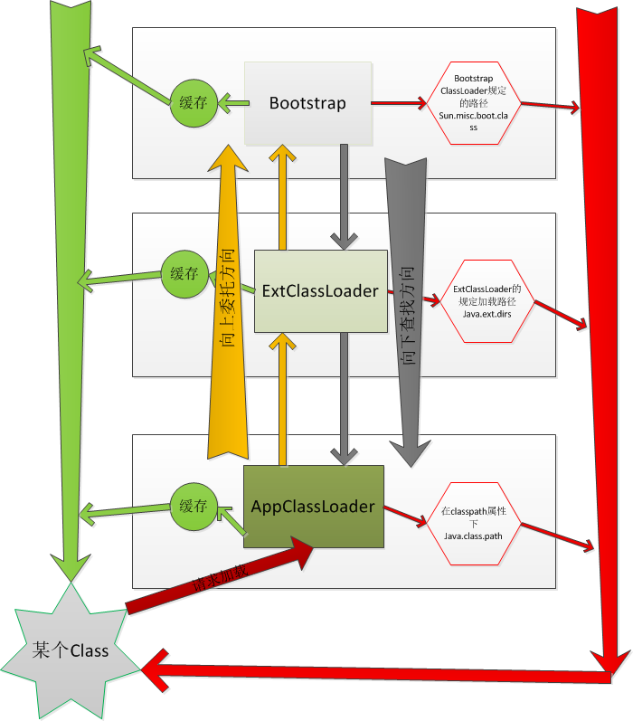

# 简介
ClassLoader顾名思义是Java虚拟机用来加载Class的。

Java应用中主要的ClassLoader是：
* BootStrapClassLoader：虚拟机层面ClassLoader，使用C++编写，用来加载java核心jar包中的Class，如String.class。
* ExtClassLoader：标准扩展类加载器
* AppClassLoader：加载当前应用程序中的所有类

____

由于Android虚拟机不同于普通Java虚拟机，Java虚拟机执行的是jar包里的Class文件，而android上Class被编译进android特有的DEX文件中，因此在ClassLoader这块也有些不同。


Android 中 ClassLoader 一共有上图几种，比较常见的是`BootClassLoader`和`PathClassLoader`。


* BootClassLoader，是用来加载android framework中的Class
* PathClassLoader，是通过指定Path来加载Class的，通常用来加载我们应用程序中的Class

```java
public MainActivity extends Activity {
    public void onCreate(){
        ClassLoader bootClassLoader = Activity.class.getClassLoader();
        ClassLoader pathClassLoader = MainActivity.class.getClassLoader();
    }
}
```

另外一个`DexClassLoader`也比较常用，一般用来加载自定义的jar/dex，常用在插件化和热修复等场景中。

# 源码分析1
先看ClassLoader的构造方法，需要传入一个参数为parent的ClassLoader。
```java
    /**
     * Creates a new class loader using the specified parent class loader for
     * delegation.
     *
     * @param  parent The parent class loader
     */
    protected ClassLoader(ClassLoader parent) {
        this(checkCreateClassLoader(), parent);
    }
```
通常加载一个class，需要给定class名称，并调用ClassLoader的loadClass方法。
```java
classLoader.loadClass("com.xxx.yyy")
```
看下loadClass方法实现
```java
//ClassLoader.java
protected Class<?> loadClass(String name, boolean resolve)
    throws ClassNotFoundException
{
        //先检查是否之前已经加载过，如果已经加载过，则返回
        Class<?> c = findLoadedClass(name);
        if (c == null) {
            try {
                if (parent != null) {
                    //让parent去加载class
                    c = parent.loadClass(name, false);
                } else {
                    c = findBootstrapClassOrNull(name);
                }
            } catch (ClassNotFoundException e) {
                
            }
            if (c == null) {
                //parent没有找到，使用findClass来自己找
                c = findClass(name);
            }
        }
        return c;
}
```
可以看到，加载class的流程是：
1. `findLoadedClass`，先尝试找找是否这个class已经之前加载过，如果找到，直接返回已加载的class。
2. 调用相同的接口`loadClass`，让`parent`去加载class，这叫委托。
3. 如果parent没有找到，最后通过this.`findClass`自己来找class，如果还没有找到，findClass将抛出ClassNotFoundException异常，如果找到，返回class。

# 双亲委托
从上面的流程可以看到，当一个Classloader去加载class时，会先委托自己的parentClassLoader去加载，parent没找到，才轮到自己来加载。在标准的Java中，这叫`双亲委托机制`。



为什么采用`双亲委托`呢？  
主要是考虑安全性，我们知道java核心库中有一个类叫java.lang.String，如果我们的应用程序也写了这样一个类java.lang.String，名字一模一样。由于classLoader加载class只根据类名查找，因此如果不采用`双亲委托`机制，那么虚拟机可能会优先加载我们自己写的java.lang.String类，可想而知这是非常危险的。

`双亲委托机制`是JVM规范要求，android虚拟机也遵循该要求。比如，当我们使用PathClassLoader去加载应用程序中的class的时候，PathClassLoader会委托parent，也就是BootCLassLoader先加载。

# 源码分析2 
继续来看findClass的实现
```java
//ClassLoader
protected Class<?> findClass(String name) throws ClassNotFoundException {
    throw new ClassNotFoundException(name);
}
```
可以看到直接抛出异常，说明具体的实现不在ClassLoader.java中，我们先看BootClassLoader中的实现
```java
//BootClassLoader
@Override
protected Class<?> findClass(String name) throws ClassNotFoundException {
    return Class.classForName(name, false, null);
}
```
Class#classForName是一个native方法，交给android虚拟机在C++层面加载。  

再看下PathClassLoader中的实现
```java
/*
* 由于PathClassLoader继承自BaseDexClassLoader，
* 我们在BaseDexClassLoader中找到了findClass的实现
*/
@Override
protected Class<?> findClass(String name) throws ClassNotFoundException {
    Class clazz = pathList.findClass(name);//通过pathList查找
    if (clazz == null) {
       throw new ClassNotFoundException(name);
    }
    return clazz;
}
```
pathList是什么？看下类型定义
```java
private final DexPathList pathList;
```
继续找到它的findClass的实现
```java
//DexPathList

/** list of dex/resource (class path) elements */
private final Element[] dexElements;

public Class findClass(String name) {
        //遍历dexElements数组
        for (Element element : dexElements) {
            //从element中取出dexFile(这代表一个dex文件)
            DexFile dex = element.dexFile;
            if (dex != null) {
                //从dexFile中加载class
                Class clazz = dex.loadClassBinaryName(name, definingContext);
                if (clazz != null) {
                    return clazz;
                }
            }
        }
        return null;
}
```

```java
// DexFile构造函数
public DexFile(File file) throws IOException {
    this(file.getPath());
}
```

我们知道android中应用代码的class会被编译进dex文件中。  
而通过上面代码可知，PathClassLoader(其实是BaseDexClassLoader)维护一个`DexPathList`成员对象，该对象中又维护了一个`dexElements`数组，每个数组元素又包装了一个`DexFile`对象，最终从`DexFile`加载我们需要的class，这个过程是通过`loadClassBinaryName`来实现的，由于是native方法，且涉及到Dex文件格式的知识，不再研究，但是作用已经很明显了，就是从编译的dex文件中取出class。


前面提到还有一个DexClassLoader，他和PathClassLoader都传承自BaseDexClassLoader，因此他们都可以用来加载dex文件中的class，那么有什么不同呢? 

```java
// DexClassLoader
public class DexClassLoader extends BaseDexClassLoader {
    public DexClassLoader(String dexPath, String optimizedDirectory,
            String libraryPath, ClassLoader parent) {
        super(dexPath, new File(optimizedDirectory), libraryPath, parent);
    }
}

// PathClassLoader
public class PathClassLoader extends BaseDexClassLoader {
    public PathClassLoader(String dexPath, ClassLoader parent) {
        super(dexPath, null, null, parent);
    }

    public PathClassLoader(String dexPath, String libraryPath,
            ClassLoader parent) {
        super(dexPath, null, libraryPath, parent);
    }
}
```
上面就是两个ClassLoader的全部代码，可见非常简单，无非就是构造函数不一样。  
仔细看可知，唯一的不同是DexClassLoader需要传入一个optimizedDirectory的参数，而PathClassLoader不需要，在对父类BaseClassLoader初始化时，PathClassLoader传入了null。

这个`optimizedDirectory`是什么意思呢？其实看名字知道这是一个目录，我们知道dex文件首次加载时会进行dexopt操作，将dex文件优化为odex文件，`optimizedDirectory`即为优化后的odex文件的存放目录。

通过进一步的源码分析可知：如果`optimizedDirectory`参数为空，则使用系统默认的odex缓存路径，一般是：`/data/dalvik-cache/`。

所以DexClassLoader与PathClassLoader的本质区别就是DexClassLoader可以指定odex的缓存路径，而PathClassLoader则采用系统默认的缓存路径。
实际上这个 `optimizedDirectory` 在 Android 8.0 以后也被舍弃了，只能使用系统默认的位置了。
```java
public class DexClassLoader extends BaseDexClassLoader {
    /**
     * @param optimizedDirectory this parameter is deprecated * and has no effect since API level 26.
     */
    public DexClassLoader(String dexPath, String optimizedDirectory,
            String librarySearchPath, ClassLoader parent) {
        super(dexPath, null, librarySearchPath, parent);
    }
}
```
所以说 PathClassLoader 和 DexClassLoader 其实并没有多大区别，但是一般而言，使用PathDexClassLoader用来加载已安装的apk的dex，使用DexClassLoader加载未被虚拟机加载的外部dex。
假如非要使用PathDexClassLoader来加载外部的dex其实也是可以成功的。