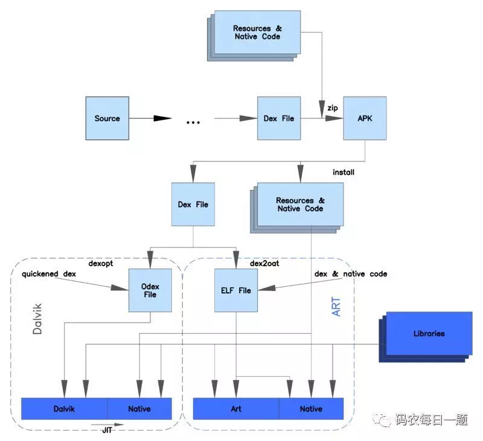

# dexopt 与 dex2oat 区别
前者针对 Dalvik 虚拟机，后者针对 Art 虚拟机。

dexopt 是对 dex 文件 进行 verification 和 optimization 的操作，其对 dex 文件的优化结果变成了 odex 文件，这个文件和 dex 文件很像，只是使用了一些优化操作码（譬如优化调用虚拟指令等）。

dex2oat 是对 dex 文件的 AOT 提前编译操作，其需要一个 dex 文件，然后对其进行编译，结果是一个本地可执行的 ELF 文件，可以直接被本地处理器执行。

除此之外在上图还可以看到 Dalvik 虚拟机中有使用 JIT 编译器，也就是说其也能将程序运行的热点 java 字节码编译成本地 code 执行，所以其与 Art 虚拟机还是有区别的。Art 虚拟机的 dex2oat 是提前编译所有 dex 字节码，而 Dalvik 虚拟机只编译使用启发式检测中最频繁执行的热点字节码。

## inline优化
方法内联优化是dex2oat的重要一步。

好处：
1. 避免了函数调用必须的压栈和出栈操作
2. 将方法体内联至调用处，编译器可以获得上下文代码信息，并对代码做进一步的优化。

坏处：
1. 重复被内联到多出，造成代码内存空间的浪费
2. 可能对热修复相关的技术造成一定的影响

当以下条件均满足时被调用的方法将被inline：

1. App不是Debug版本的；
2. 被调用的方法所在的类与调用者所在的类位于同一个Dex；（注意，符合Class N命名规则的多个Dex要看成同一个Dex）
3. 被调用的方法的字节码条数不超过dex2oat通过--inline-max-code-units指定的值，6.x默认为**100**，7.x默认为**32**；
4. 被调用的方法不含try块；
5. 被调用的方法不含非法字节码；
6. 对于7.x版本，被调用方法还不能包含对接口方法的调用。（invoke-interface指令）

此外，Optimizing Compiler的方法内联可以跨多级方法调用进行，若有这样的调用链：method1->method2->method3->method4，则在四个方法都满足内联条件的情况下，最终内联的结果将是method1包含method2，method3，method4的代码，method2包含method3，method4的代码，以此类推。但这种跨调用链内联会受到调用dex2oat时通过--inline-depth-limit参数指定的值的限制，默认为5，即超过5层的调用就不会再被内联到当前方法了。