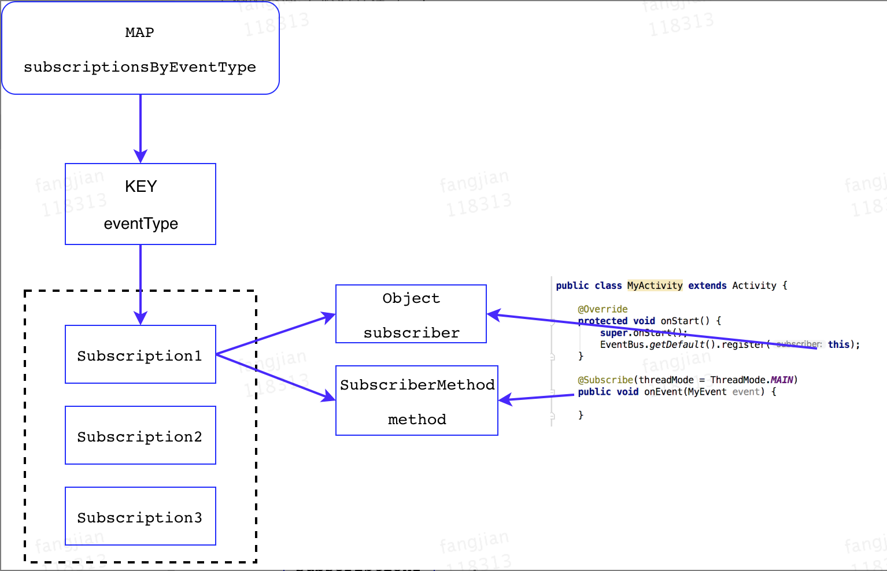

EventBus 的核心工作机制，看图


----

EventBus 核心数据保存在`subscriptionsByEventType`字段中，`subscriptionsByEventType`是个map结构，KEY为Class类型，具体的是每一个事件类的Class，VALUE为List列表类型，列表中存储着Subscription对象，每一个Subscription对象保存着订阅者方法(subscribeMethod)以及订阅者实例(subscriber)



----

EventBus3使用注解`Subscribe`标记订阅方法，并支持索引加速，主要为了避免在注册时使用反射来扫描当前类中所有订阅方法，不过EventBus3依然支持使用反射注册，索引加速是可选服务。  
索引加速是指在编译期间，通过apt扫描所有带有注解`Subscribe`的方法，通过静态注册将这些方法的相关信息存储起来，那么在运行时注册时通过MAP直接找到方法信息，就避免了使用反射获取方法信息，加快了注册的效率。
```java
/** This class is generated by EventBus, do not edit. */
public class MyEventBusIndex implements SubscriberInfoIndex {
    private static final Map<Class<?>, SubscriberInfo> SUBSCRIBER_INDEX;

    static {
        SUBSCRIBER_INDEX = new HashMap<Class<?>, SubscriberInfo>();
        putIndex(new SimpleSubscriberInfo(com.test.MyActivity.class, true, new SubscriberMethodInfo[] {
            new SubscriberMethodInfo("onEvent", com.test.MyEvent.class, ThreadMode.MAIN), 
        }));
    }

    private static void putIndex(SubscriberInfo info) {
        SUBSCRIBER_INDEX.put(info.getSubscriberClass(), info);
    }

    @Override
    public SubscriberInfo getSubscriberInfo(Class<?> subscriberClass) {
        SubscriberInfo info = SUBSCRIBER_INDEX.get(subscriberClass);
        if (info != null) {
            return info;
        } else {
            return null;
        }
    }
}
```
不过，目前索引加速并`不支持父类以及内部类`的订阅方法的索引，注册时仍然需要使用反射扫描父类/内部类中所有方法。

----

EventBus支持5种ThreadMode方式

* POSTING 在当前线程直接调用订阅方法，可以看成是同步post，应该尽快返回，否则卡当前线程
* MAIN 抛给主线程处理，如果当前线程是主线程，则直接调用订阅方法，否则加入队列等待使用Handler处理
* MAIN_ORDERED 统一加入队列等待使用Handler处理，保证了事件`产生顺序`和事件`处理顺序`是一致的
* BACKGROUND 如果当前线程是主线程，则使用线程池处理事件，否则直接调用订阅方法，默认的线程池是`newCachedThreadPool`, 由于使用了外部队列，同一时间一般`只有一个线程在执行`，事件是`排队`被处理的，如果有事件比较耗时，则可能导致后面的事件长时间阻塞。
* ASYNC 不管当前线程，直接使用线程池`立即`异步处理事件，同一时间可能有多个线程在执行，可避免事件长时间阻塞。

----

EventBus性能优化：  

    1、开启索引加速  
    2、尽量避免在父类以及内部类中添加订阅方法，因为需要使用反射  
    3、添加订阅方法的类，最好直接继承自系统类，否则注册时仍然使用反射扫描父类
    4、事件类型最好不要搞继承关系，因为在post一个子类的事件时，EventBus默认会再
       post一个父类类型的事件，可以通过关闭eventInheritance来禁用该特性