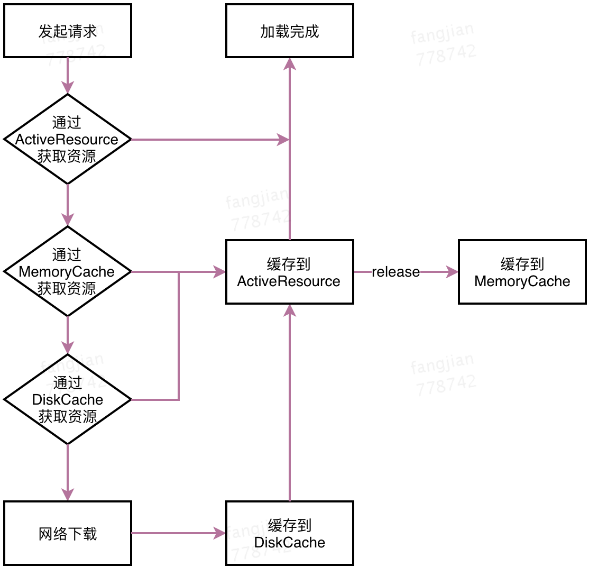
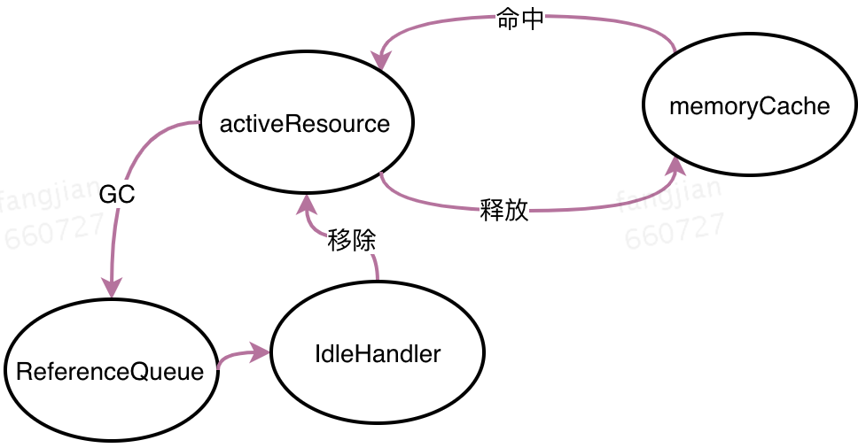

## Glide资源请求流程


___
Glide中有几个缓存相关的类
```java
//根据当前机器参数计算需要设置的缓存大小
MemorySizeCalculator calculator = new MemorySizeCalculator(context);
//创建 Bitmap 池
if (bitmapPool == null) {
    if (Build.VERSION.SDK_INT >= Build.VERSION_CODES.HONEYCOMB) {
        int size = calculator.getBitmapPoolSize();
        bitmapPool = new LruBitmapPool(size);
    } else {
        bitmapPool = new BitmapPoolAdapter();
    }
}

//创建内存缓存（Lru算法）
if (memoryCache == null) {
    memoryCache = new LruResourceCache(calculator.getMemoryCacheSize());
}

//创建磁盘缓存(Lru算法)
if (diskCacheFactory == null) {
    //默认250M磁盘容量
    diskCacheFactory = new InternalCacheDiskCacheFactory(context);
}
```
除此之外 Engine 中还有一个 ActiveResources 作为第一级缓存
> 在旧版本的Glide中，你可能发现 ActiveResources 并不是第一级缓存，而是第二级。

## ActiveResources 与 MemoryCache
ActiveResources 是第一级缓存，表示当前活动中的资源。
```java
private final Map<Key, WeakReference<EngineResource<?>>> activeResources;
```
ActiveResources 中通过一个 HashMap 来存储，数据保存在一个弱引用（WeakReference）中。

通过ResourceWeakReference将资源，资源key和ReferenceQueue包装起来，作为value存入activeResources。
```java
activeResources.put(key, new ResourceWeakReference(key, cached, getReferenceQueue()));
```
ResourceWeakReference是一个WeakReference，没什么特别的。关键是我们传入了一个ReferenceQueue参数。
```java
private static class ResourceWeakReference extends WeakReference<EngineResource<?>> {
        private final Key key;

        public ResourceWeakReference(Key key, EngineResource<?> r, ReferenceQueue<? super EngineResource<?>> q) {
            super(r, q);
            this.key = key;
        }
    }
```
getReferenceQueue方法将新建一个ReferenceQueue返回，我们知道对象被GC时会先放入ReferenceQueue中，通过ReferenceQueue可以跟踪那些被GC的弱引用（或者软引用、虚引用）。
```java
private ReferenceQueue<EngineResource<?>> getReferenceQueue() {
        if (resourceReferenceQueue == null) {
            resourceReferenceQueue = new ReferenceQueue<EngineResource<?>>();
            
            MessageQueue queue = Looper.myQueue();
            queue.addIdleHandler(new RefQueueIdleHandler(activeResources, resourceReferenceQueue));
        }
        return resourceReferenceQueue;
}
```
同时在当前线程Looper添加IdleHandler回调，IdleHandler回调是指Looper空闲(队列中没有处理任务)的时候调用。
```java
private static class RefQueueIdleHandler implements MessageQueue.IdleHandler {
        private final Map<Key, WeakReference<EngineResource<?>>> activeResources;
        private final ReferenceQueue<EngineResource<?>> queue;

        public RefQueueIdleHandler(Map<Key, WeakReference<EngineResource<?>>> activeResources,
                ReferenceQueue<EngineResource<?>> queue) {
            this.activeResources = activeResources;
            this.queue = queue;
        }

        @Override
        public boolean queueIdle() {
            //闲的时候检查ReferenceQueue中有没有被回收的资源对象
            ResourceWeakReference ref = (ResourceWeakReference) queue.poll();
            if (ref != null) {
                //有的话就从activeResources移除
                activeResources.remove(ref.key);
            }
            //返回true，表示下次继续回调
            return true;
        }
}
```
可见，通过在线程空闲的时候不断检查ReferenceQueue，如果有被GC的资源对象(也就是ResourceWeakReference)，就从activeResources中移除该资源。

我们已经知道Glide查找资源的顺序，先loadFromActiveResources，再loadFromCache，看下源码：
```java
public class Engine implements EngineJobListener,
        MemoryCache.ResourceRemovedListener,
        EngineResource.ResourceListener {

    private final MemoryCache cache;
    private final Map<Key, WeakReference<EngineResource<?>>> activeResources;
    ...

    private EngineResource<?> loadFromCache(Key key, boolean isMemoryCacheable) {
        if (!isMemoryCacheable) {
            return null;
        }
        EngineResource<?> cached = getEngineResourceFromCache(key);
        if (cached != null) {
            cached.acquire();
            //注意，从memory取到的资源要存入activeResources
            activeResources.put(key, new ResourceWeakReference(key, cached, getReferenceQueue()));
        }
        return cached;
    }

    private EngineResource<?> getEngineResourceFromCache(Key key) {
        //注意是remove(key)，不是get(key)
        Resource<?> cached = cache.remove(key);
        final EngineResource result;
        if (cached == null) {
            result = null;
        } else if (cached instanceof EngineResource) {
            result = (EngineResource) cached;
        } else {
            result = new EngineResource(cached, true /*isCacheable*/);
        }
        return result;
    }

    private EngineResource<?> loadFromActiveResources(Key key, boolean isMemoryCacheable) {
        if (!isMemoryCacheable) {
            return null;
        }
        EngineResource<?> active = null;
        WeakReference<EngineResource<?>> activeRef = activeResources.get(key);
        if (activeRef != null) {
            active = activeRef.get();
            if (active != null) {
                active.acquire();
            } else {
                //资源被回收了，要移除
                activeResources.remove(key);
            }
        }
        return active;
    }

    ...
}
```
可以看到，当我们从MemoryCache中获取到缓存图片之后会将它从缓存中**移除**，并将缓存图片存储到activeResources当中。
另外注意到，每次获取到缓存资源后，都会调用acquire方法。
看下acquire源码：
```java
class EngineResource<Z> implements Resource<Z> {
    ...
    private int acquired;
    private boolean isRecycled;

    void acquire() {
        ++acquired;
    }

    void release() {
        if (--acquired == 0) {
            listener.onResourceReleased(key, this);
        }
    }
}
```
EngineResource中维护了一个计数器，类似引用计数，当资源需要release时，检查计数器是否为0，如果为0，表示该资源没有引用了，资源可以回收。
onResourceReleased回调到Engine中
```java
    @Override
    public void onResourceReleased(Key cacheKey, EngineResource resource) {
        activeResources.remove(cacheKey);
        if (resource.isCacheable()) {
            cache.put(cacheKey, resource);
        } else {
            resourceRecycler.recycle(resource);
        }
    }
```
首先从activeResources移除，因为其不再是active资源了，然后检查resource是否可以被缓存，如果可以，就重新回到MemoryCache中，否则将recycle掉。



为什么要搞一个activeResource呢？   
使用activeResources来缓存正在使用中的图片，用来保护正在使用中的图片不会被LruCache算法回收掉。

## BitmapPool
BitmapPool是用来复用Bitmap从而避免重复创建Bitmap而带来的内存浪费，BitmapPool的实现类是LruBitmapPool。
BitmapPool是根据Bitmap尺寸和Bitmap.Config来查找可复用的Bitmap对象，复用过程主要发生在图片的transform阶段，因为这个阶段对Bitmap的操作比较多，创建、回收都比较频繁，因此使用BitmapPool重用Bitmap，可减少内存抖动。
```java
public interface BitmapPool {
   boolean put(Bitmap bitmap);
   Bitmap get(int width, int height, Bitmap.Config config);
   ...
}
```
