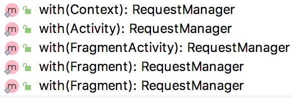

## Glide源码分析 - with方法

with方法有多个重载，但代码基本相同

```java
public static RequestManager with(Activity activity) {
        RequestManagerRetriever retriever = RequestManagerRetriever.get();
        return retriever.get(activity);
    }
```
`RequestManagerRetriever`是个单例
```java
    public RequestManager get(Context context) {
        if (context == null) {
            throw new IllegalArgumentException("You cannot start a load on a null Context");
        } else if (Util.isOnMainThread() && !(context instanceof Application)) {
            if (context instanceof FragmentActivity) {
                return get((FragmentActivity) context);
            } else if (context instanceof Activity) {
                return get((Activity) context);
            } else if (context instanceof ContextWrapper) {
                return get(((ContextWrapper) context).getBaseContext());
            }
        }

        return getApplicationManager(context);
    }
```
get方法也有多个重载
```java
    public RequestManager get(Activity activity) {
        if (Util.isOnBackgroundThread() || Build.VERSION.SDK_INT < Build.VERSION_CODES.HONEYCOMB) {
            return get(activity.getApplicationContext());
        } else {
            assertNotDestroyed(activity);
            android.app.FragmentManager fm = activity.getFragmentManager();
            return fragmentGet(activity, fm);
        }
    }
```
从重载方法可以看出，如果传入的`context`为`application` 或者 当前线程不在主线程(`isOnBackgroundThread`)，则通过调用`getApplicationManager`返回，否则都调用`fragmentGet`方法返回`RequestManager`。  

我们后面会知道Glide通过fragment感知界面生命周期，所以我们开发过程中，应该确认context不为applicationContext，且在主线程调用，否则将失去Glide对界面生命周期感知这一功能。

感知生命周期有什么好处呢？
Glide对于图片请求会在onStop的时候自动暂停，然后在onStart的时候重新启动，gif的动画也会在onStop的时候停止，以免在后台消耗电量。

```java
    RequestManager fragmentGet(Context context, android.app.FragmentManager fm) {
        RequestManagerFragment current = getRequestManagerFragment(fm);
        RequestManager requestManager = current.getRequestManager();
        if (requestManager == null) {
            //传入Lifecycle接口，让requestManager可监听fragment的生命周期
            requestManager = new RequestManager(context, current.getLifecycle(), current.getRequestManagerTreeNode());
            //requestManager保存在fragment中
            current.setRequestManager(requestManager);
        }
        return requestManager;
    }

    RequestManagerFragment getRequestManagerFragment(final android.app.FragmentManager fm) {
        //先找之前有没有创建
        RequestManagerFragment current = (RequestManagerFragment) fm.findFragmentByTag(FRAGMENT_TAG);
        if (current == null) {
            current = pendingRequestManagerFragments.get(fm);
            if (current == null) {
                current = new RequestManagerFragment();
                //因为添加fragment是异步的，所以先加入pending，避免重复new RequestManagerFragment
                pendingRequestManagerFragments.put(fm, current);
                fm.beginTransaction().add(current, FRAGMENT_TAG).commitAllowingStateLoss();
                handler.obtainMessage(ID_REMOVE_FRAGMENT_MANAGER, fm).sendToTarget();//稍后从penging中移除
            }
        }
        return current;
    }
```
可知，不管加载多少图片，一个activity，总是对应一个有RequestManagerFragment对象，且RequestManagerFragment包含一个RequestManager对象，所以他们的生存期是一样的。
Glide的with方法最终返回了一个RequestManager对象，顾名思义，RequestManager应该是管理Request的，是一个管理者。  
load方法显然在RequestManager中，load也是有多个重载方法，可以传入不同类型的参数，以常用的String类型的url为例：
```java
    public DrawableTypeRequest<String> load(String string) {
        return (DrawableTypeRequest<String>) fromString().load(string);
    }

    public DrawableTypeRequest<String> fromString() {
        return loadGeneric(String.class);
    }

    private <T> DrawableTypeRequest<T> loadGeneric(Class<T> modelClass) {
        ModelLoader<T, InputStream> streamModelLoader = Glide.buildStreamModelLoader(modelClass, context);
        ModelLoader<T, ParcelFileDescriptor> fileDescriptorModelLoader =
                Glide.buildFileDescriptorModelLoader(modelClass, context);
        return optionsApplier.apply(
                new DrawableTypeRequest<T>(modelClass, streamModelLoader, fileDescriptorModelLoader, context,
                        glide, requestTracker, lifecycle, optionsApplier));
    }
```

* modelClass是指输入参数类型，比如我们传入的是String类型的url字符串，则modelClass为String.class
* resourceClass是指数据资源类型，我们从网络上下载图片，图片数据以流的形式存在，则resourceClass为InputStream.class

我们知道Glide在其构造方法中默认注册了一大堆ModelLoader工厂类，比如：
```java
register(String.class, InputStream.class, new StreamStringLoader.Factory());
```
loadGeneric方法最终创建一个DrawableTypeRequest对象返回，并在其中注入了modelClass，modeLoader，lifecycle等等参数。

```java
public class DrawableTypeRequest<ModelType> extends DrawableRequestBuilder<ModelType>
public class DrawableRequestBuilder<ModelType>
        extends GenericRequestBuilder<ModelType, ImageVideoWrapper, GifBitmapWrapper, PicassoDrawable>
public class GenericRequestBuilder<ModelType, DataType, ResourceType, TranscodeType>         
```
DrawableTypeRequest 继承自 DrawableRequestBuilder，DrawableRequestBuilder 又继承自 GenericRequestBuilder。

GenericRequestBuilder中的Generic是指拥有泛型，可见GenericRequestBuilder需要指定4个泛型：

* ModelType: 图片资源地址的类型，如String.class
* DataType: 图片原始数据类型，如InputStream.class
* ResourceType: 图片类型，如Bitmap.class, GifDrawable.class
* TranscodeType: 图片转换后额类型，如Drawable.class

DrawableRequestBuilder 除了ModelType，确定了后三个泛型：

* DataType -> ImageVideoWrapper，包装了InputStream和ParcelFileDescriptor两种类型
* DataType -> GifBitmapWrapper，包装了GifDrawable和Bitmap两种类型
* TranscodeType -> PicassoDrawable，引自于Picasso项目的Drawable类

DrawableTypeRequest 在 DrawableRequestBuilder 区别不大，只是添加了一些额外几个方法而已。
显然DrawableTypeRequest也是个RequestBuilder，既然是Builder，作用就是记录request的各种参数以及类型。