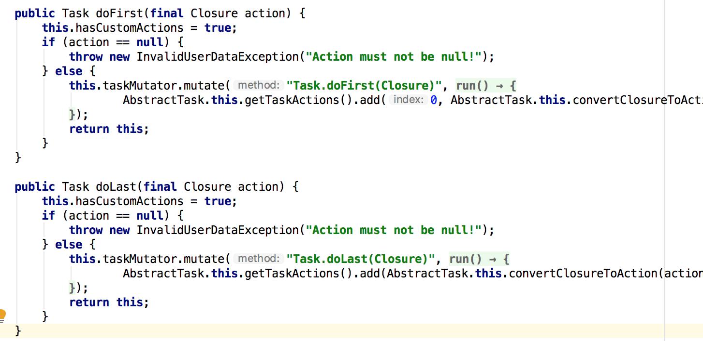
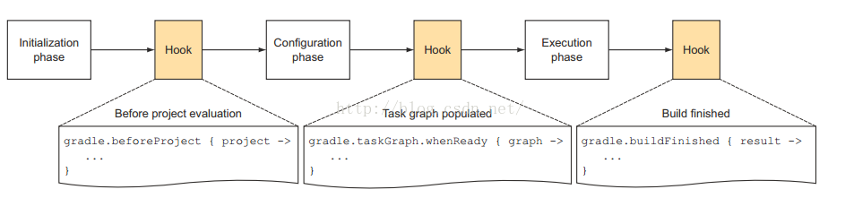

https://www.jianshu.com/p/e7a40a592f15
https://juejin.im/post/5c4af28be51d4511dc72fcca
https://www.w3cschool.cn/gradle/sh8k1htf.html

# Gradle

## 介绍
Gradle 的核心在于基于 Groovy 的域描述语言(DSL)

### Groovy
Groovy是一种动态语言。它和Java一样，也运行于Java虚拟机中。Groovy对自己的定义就是：Groovy是在 java平台上的、 具有像Python， Ruby 和 Smalltalk 语言特性的灵活动态语言， Groovy保证了这些特性像 Java语法一样被 Java开发者使用。除了语言和Java相通外，Groovy有时候又像一种脚本语言。当执行Groovy脚本时，Groovy会先将其编译成Java类字节码，然后通过Jvm来执行这个Java类。

### 基础的Groovy知识
1. 注释  
Groovy注释标记和Java一样，支持//或者/**/
2. 无分号  
Groovy语句可以不用分号结尾
3. 定义变量  
Groovy中支持动态类型，即定义变量的时候可以不指定其类型。Groovy中，变量定义可以使用关键字def。注意，虽然def不是必须的，但是为了代码清晰，建议还是使用def关键字
4. 函数参数
函数的参数的类型可以不指定  
```groovy
//无需指定参数类型
String testFunction(arg1,arg2){
  ...
}
```
5. 函数返回值
返回值可以是无类型的，函数最后一行代码的执行结果就是本函数的返回值，可以不加`return`关键字
```groovy
//无类型的函数定义，必须使用def关键字
def  nonReturnTypeFunc(){
    last_line
}
//如果指定了函数返回类型，则可不必加def关键字来定义函数
String  getString(){
   return 'I am a string'
}
```
6. 字符串  
`单引号`中的内容严格对应Java中的String，不对$符号进行转义  
`双引号`的内容则和脚本语言的处理有点像，如果字符中有`$`号的话，则它会`$`表达式先求值
```groovy
def x = 1
def doubleQuoteWithDollar = "I am $x dolloar"
```
`三个引号`中的字符串支持随意换行 
7. 函数调用  
函数调用的时候还可以不加括号
```groovy
println("test")
println "test"
```
8. 数据类型
基础数据类型，对应Java中的数据类型  
容器类：List：链表，Map：键-值表，Range：范围
```groovy
def aList = [5,'string',true]
assert aList[1] == 'string'

def aMap = ['key1':'value1','key2':true] 
//Map中元素的存取更加方便，它支持多种方法：
println aMap.key1    //<==这种表达方法好像key就是aMap的一个成员变量一样
println aMap['key1'] //<==这种表达方法更传统一点
aMap.key3 = "i am map" // <==为map添加新元素

def aRange = 1..5//[1,5]
def aRangeWithoutEnd = 1..<5//[1,5)
println aRange.from
println aRange.to
```
9. 闭包
闭包，英文叫Closure，是Groovy中非常重要的一个数据类型  
```groovy
def aClosure = { 
    String param1, int param2 -> 
        println "this is code"
}
```
简而言之，Closure的定义格式是：
```
def xxx = {参数 -> code}  //或者  
def xxx = {无参数，纯code}  这种case不需要->符号
```
闭包的执行有2种：
```groovy
aClosure.call("this is string", 100) //或者  
aClosure("this is string", 100)
```
如果闭包没定义参数的话，则隐含有一个参数，这个参数名字叫it，和this的作用类似，it代表闭包的参数。
```groovy
def greeting = { "Hello, $it!" }
def greeting = { it -> "Hello, $it!" }
assert greeting('Patrick') == 'Hello, Patrick!'
```
闭包在Groovy中大量使用，比如很多类都定义了一些函数，这些函数最后一个参数都是一个闭包。比如：
```groovy
public static <T> List<T> each(List<T> self, Closure closure)
```
Groovy中，当函数的最后一个参数是闭包的话，可以省略圆括号。
```groovy
def iamList = [1,2,3,4,5]
iamList.each {//省略圆括号
      println it
}

def testClosure(int a1, Closure closure){
      closure()
}
testClosure 4, {
   println "i am in closure"
}
```

## 基本组件
project 和 task 是 Gradle 中最重要的两个概念。
Gradle中，每一个待编译的工程都叫一个Project，任何一个 Gradle 构建都是由一个或多个 project 组成，每个 project 包括许多可构建组成部分。而每一个Project在构建的时候都包含一系列的Task，每个 task 都代表了构建执行过程中的一个原子性操作。如编译，打包，生成 javadoc，发布到某个仓库等操作。

### Task
1. 定义task
```gradle
task hello {
    doLast {
        println 'Hello world!'
    }
}
task hello << {
    println 'Hello world!'
}
```

2. 任务依赖
在两个任务之间指明依赖关系
```gradle
task hello << {
    println 'Hello world!'
}
task intro(dependsOn: hello) << {
    println "I'm Gradle"
}
```
对于如下的任务依赖图：


```gradle
task compile << {
    println 'compiling source'
}
task compileTest(dependsOn: compile) << {
    println 'compiling unit tests'
}
task test(dependsOn: [compile, compileTest]) << {
    println 'running unit tests'
}
task dist(dependsOn: [compile, test]) << {
    println 'building the distribution'
}
```


对于未定义的依赖，可以采取延迟依赖
```gradle
task taskX(dependsOn: 'taskY') << {
    println 'taskX'
}
task taskY << {
    println 'taskY'
}
```

3. 增加依赖关系
通过 API 进行任务之间的依赖设置
```gradle
task0.dependsOn task2, task3
```
除了dependsOn，还可以使用mustRunAfter来做任务排序(任务排序并不意味着任务执行)
```
task taskX << {
    println 'taskX'
}
task taskY << {
    println 'taskY'
}
taskY.mustRunAfter taskX  
```

4. 动态创建task
```gradle
4.times { counter ->
    task "task$counter" << {
        println "I'm task number $counter"
    }
}
```

5. 增加任务行为
```gradle
task hello << {
    println 'Hello Earth'
}
hello.doFirst {
    println 'Hello Venus'
}
hello.doLast {
    println 'Hello Mars'
}
```
<< 操作符 是 doLast 的简写方式，doFirst和doLast可以多次调用，他们分别被添加在任务的TaskAction列表的开头和结尾。



6. 短标记法
以属性的方式访问任务  
```gradle
task hello << {
    println 'Hello world!'
}
hello.doLast {
    println "Greetings from the $hello.name task."
}
```

7. 增加自定义属性
你可以用 ext.xxx 的方式为一个任务添加额外的属性。这样便增加了一个自定义属性。
```groovy
task myTask {
    ext.myProperty = "myValue"
}

task printTaskProperties << {
    println myTask.myProperty
}
```

8. 替换任务
```groovy
task copy(type: Copy)
task copy(overwrite: true) << {
    println('I am the new one.')
}  
```

9. 跳过任务
你可以使用 onlyIf()方法将断言附加到一项任务中。如果断言结果为 true，才会执行任务的操作。你可以用一个闭包来实现断言。闭包会作为一个参数传给任务，并且任务应该执行时返回 true，或任务应该跳过时返回 false。断言只在任务要执行前才计算。
```groovy
task hello << {
    println 'hello world'
}
hello.onlyIf { !project.hasProperty('skipHello') }  
```

10. 启用和禁用任务
每一项任务有一个默认值为 true 的 enabled 标记。将它设置为 false，可以不让这个任务的任何操作执行。
```groovy
task disableMe << {
    println 'This should not be printed if the task is disabled.'
}
disableMe.enabled = false 
```

11. 声明一个任务的输入和输出
若要使用 Gradle 的最新状态（up-to-date）检查，您需要声明这个任务的输入和输出。每个任务都有一个 inputs 和 outputs 的属性，用来声明任务的输入和输出。
```groovy
task transform {
    ext.srcFile = file('mountains.xml')
    ext.destDir = new File(buildDir, 'generated')
    inputs.file srcFile
    outputs.dir destDir
    doLast {
        println "Transforming source file."
        destDir.mkdirs()
        def mountains = new XmlParser().parse(srcFile)
        mountains.mountain.each { mountain ->
            def name = mountain.name[0].text()
            def height = mountain.height[0].text()
            def destFile = new File(destDir, "${name}.txt")
            destFile.text = "$name -> ${height}\n"
        }
    }
}
```
一个没有定义输出的任务将永远不会被当作是最新的。对于任务的输出并不是文件的场景，或者是更复杂的场景， TaskOutputs.upToDateWhen() 方法允许您以编程方式计算任务的输出是否应该被判断为最新状态。

12. Task创建时可以指定Type，其实就是指task对象从哪个基类Type派生
```groovy
task copyTask(type:Copy){
    from xxx
    to yyy
}
```

### Gradle插件
一个Project到底包含多少个Task，其实是由编译脚本指定的插件决定。  
Gradle是一个框架，作为框架，它负责定义流程和规则。而具体的编译工作则是通过插件的方式来完成的。比如编译Java有Java插件，编译Groovy有Groovy插件，编译Android APP有Android APP插件，编译Android Library有Android Library插件。  
大部分 Java 项目基本流程都是相似的：编译源文件，进行单元测试，创建 jar 包。使用 Gradle 做这些工作不必为每个工程都编写代码。Gradle 已经提供了完美的插件来解决这些问题。插件就是 Gradle 的扩展，简而言之就是为你添加一些非常有用的默认配置。Gradle 自带了很多插件，并且你也可以很容易的编写和分享自己的插件。Java plugin 作为其中之一，为你提供了诸如编译，测试，打包等一些常用功能。

### java插件
应用插件使用Project#apply方法
```groovy
void apply(Map<String, ?> var1)
```
可以使用插件id或者插件类来加载插件，其中id是插件的一个字符串名称。
```gradle
apply([plugin: 'java'])
apply plugin: 'java'//简写
apply plugin: JavaPlugin//使用Class
```
所有插件类都是继承自Plugin接口开发的，如JavaPlugin
```groovy
class JavaPlugin implements Plugin
```

java项目标准目录结构如下:
```
project  
    +build  
    +src/main/java  
    +src/main/resources  
    +src/test/java  
    +src/test/resources  
```
Gradle 默认会从 `src/main/java` 搜寻打包源码，在 `src/test/java` 下搜寻测试源码。并且 `src/main/resources` 下的所有文件按都会被打包，所有 `src/test/resources` 下的文件 都会被添加到类路径用以执行测试。所有文件都输出到 `build `下，打包的文件输出到 `build/libs` 下。

Java插件为项目提供了许多Task，如assemble、check、test、build等。

外部依赖  
一个 Java 项目拥有许多外部依赖。你需要告诉 Gradle 如何找到并引用这些外部文件。在 Gradle 中通常 Jar 包都存在于仓库中。仓库可以用来搜寻依赖或发布项目产物。  
下面是一个采用 Maven 仓库的例子。
```gradle
repositories {
    mavenCentral()
}
```
添加依赖：  
```
dependencies {
    compile group: 'commons-collections', name: 'commons-collections', version: '3.2'
    testCompile group: 'junit', name: 'junit', version: '4.+'
}
```
Java 插件为你的项目添加了众多默认配置。这些默认值通常对于一个普通项目来说已经足够了。但如果你觉得不适用修改起来也很简单。看下面的例子，我们为 Java 项目指定了版本号以及所用的 JDK 版本，并且添加一些属性到 mainfest 中。
```gradle
sourceCompatibility = 1.5
version = '1.0'
jar {
    manifest {
        attributes 'Implementation-Title': 'Gradle Quickstart', 'Implementation-Version': version
    }
}
```

### Project
### 多项目构建
1. settings.gradle
定义一个多项目构建工程需要在根目录创建一个setting 配置文件来指明构建包含哪些项目。并且这个文件必需叫 settings.gradle 本例的配置文件如下:
```gradle
include "shared", "api", "services:webservice", "services:shared"
```
settings中的属性和方法调用都是委托给Settings对象的。
```groovy
include ':app', ':buildSrc'
gradle.settingsEvaluated {
    println "settings.gradle初始化执行结束"
    println findProject(":app").projectDir
}
```

2. 公共配置build.gradle
对多项目构建而言，总有一些共同的配置。我们会在根项目上采用配置注入的方式定义一些公共配置。根项目就像一个容器，子项目会迭代访问它的配置并注入到自己的配置中。这样我们就可以简单的为所有子工程定义主配置单了。
```
subprojects {
    //所有子项目共享默认配置
    apply plugin: 'java'
    apply plugin: 'eclipse-wtp'
    repositories {
       mavenCentral()
    }
    dependencies {
        testCompile 'junit:junit:4.11'
    }
    version = '1.0'
    jar {
        manifest.attributes provider: 'gradle'
    }
}
```
3. 工程依赖
同一个构建中可以建立工程依赖，一个工程的 jar 包可以提供给另外一个工程使用。例如我们可以让 api 工程以依赖于 shared 工程的 jar 包。这样 Gradle 在构建 api 之前总是会先构建 shared 工程
```gradle
dependencies {
    compile project(':shared')
}
```

### Project API
在构建的每一个项目中，Gradle 创建了一个 Project 类型的实例，并在构建脚本中关联此 Project 对象。当构建脚本执行时，它会配置此 Project 对象。  
* 在构建脚本中，你所调用的任何一个方法，如果在构建脚本中未定义，它将被委托给 Project 对象。
* 在构建脚本中，你所访问的任何一个属性，如果在构建脚本里未定义，它也会被委托给 Project 对象。
```groovy
println name//委托给project访问name
println project.name  
```
标准 project 属性有以下几个
```
project
name
path
description
projectDir
buildDir
group
version
```
额外属性：  
Gradle 的域模型中，所有增强的对象都可以容纳用户定义的额外的属性。这包括但并不限于项目（project）、任务（task）和源码集（source set）。额外的属性可以通过所属对象的 ext 属性进行添加，读取和设置。或者，可以使用 ext 块同时添加多个属性。
```gradle
ext {
    springVersion = "3.1.0.RELEASE"
    emailNotification = "build@master.org"
}
sourceSets.all { ext.purpose = null }
sourceSets {
    main {
        purpose = "production"
    }
    plugin {
        purpose = "production"
    }
}
```

通过 tasks 集合访问任务，定位任务：
```groovy
project(':projectA') {
    task hello
}
task hello
println tasks.getByPath('hello').path
println tasks.getByPath(':hello').path
println tasks.getByPath('projectA:hello').path
println tasks.getByPath(':projectA:hello').path 
```

配置任务:
```groovy
//创建一个复制任务
task myCopy(type: Copy)  
```
上面的代码创建了一个什么都没做的复制任务。可以使用它的 API 来配置这个任务。
```groovy
Copy myCopy = task(myCopy, type: Copy)
myCopy.from 'resources'
myCopy.into 'target'
myCopy.include('**/*.txt', '**/*.xml', '**/*.properties') 

task copy(type: Copy) {
   from 'resources'
   into 'target'
   include('**/*.txt', '**/*.xml', '**/*.properties')
} 
```


## gradle命令
* gradle projects 查看所有Project
* gradle <project-path>:tasks 查看任务信息
* gradle properites 用来查看所有属性信息
* 用选项 -x 来排除执行某些任务：gradle dist -x test

## Gradle工作流程
Gradle工作包含三个阶段：


* 首先是初始化阶段。对于多模块build而言，就是执行settings.gradle。  
* 下一个阶段是Configration阶段，Configration阶段的目标是解析每个子project中的build.gradle。
* Configuration阶段完了后，整个build的project以及内部的Task关系就确定了。Configuration会建立一个有向图来描述Task之间的依赖关系。
* 最后一个阶段就是执行任务了。  
注意每个阶段之后我们都可以有hook去执行自定义函数。

Gradle基于Groovy，Groovy又基于Java。所以，Gradle执行的时候和Groovy一样，会把脚本转换成Java对象。Gradle主要有三种对象，这三种对象和三种不同的脚本文件对应，在gradle执行的时候，会将脚本转换成对应的对象：  
* Gradle对象：当我们执行gradle xxx或者什么的时候，gradle会从默认的配置脚本中构造出一个Gradle对象。在整个执行过程中，只有这么一个对象。Gradle对象的数据类型就是Gradle。我们一般很少去定制这个默认的配置脚本。  
* Project对象：每一个build.gradle会转换成一个Project对象。  
    每一个build.gradle文件都会转换成一个Project对象。在Gradle术语中，Project对象对应的是Build Script。Project包含若干Tasks。另外由于Project对应具体的工程，所以需要为Project加载所需要的插件，比如为Java工程加载Java插件。其实一个Project包含多少Task往往是插件决定的。  
* Settings对象：显然一个settings.gradle都会转换成一个Settings对象。  

### 加载插件
加载插件是调用它的apply函数。apply其实是Project实现的PluginAware接口定义的。
```gradle
apply plugin: 'com.android.library'
```
```gradle
apply from: "../utils.gradle"
```


The Gradle wrapper
Gradle Wrapper 允许你在没有安装 Gradle 的机器上执行 Gradle 构建。 这一点是非常有用的。比如，对一些持续集成服务来说。 它对一个开源项目保持低门槛构建也是非常有用的。 Wrapper 对企业来说也很有用，它使得对客户端计算机零配置。 它强制使用指定的版本，以减少兼容支持问题。