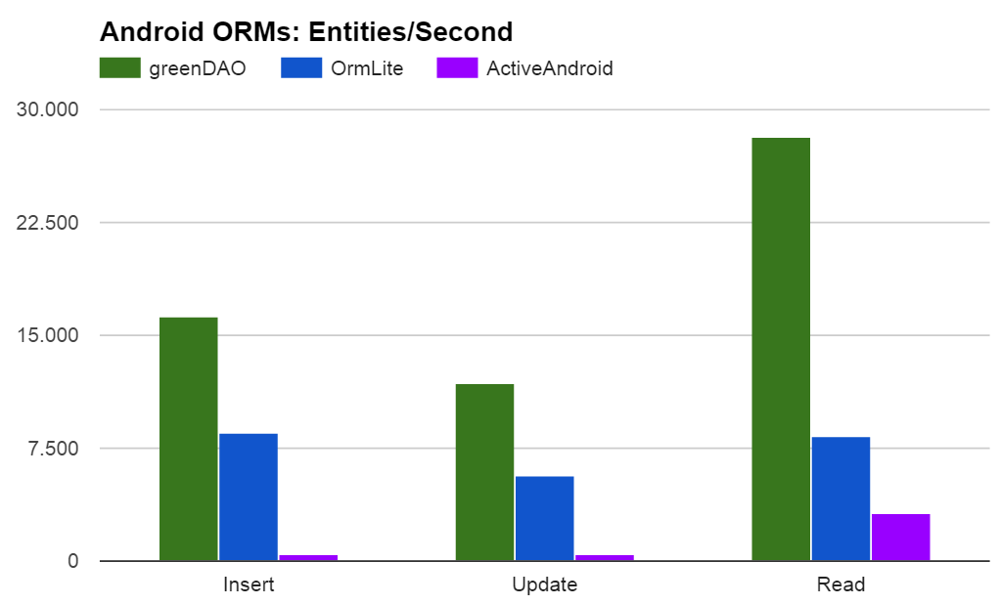

# GreenDao
Android 中常用的数据库ORM框架有：ORMLite、Greendao、ormdroid、androrm、ActiveAndroid、Room等。
greenDAO 是一个将对象映射到 SQLite 数据库中的轻量且快速的 ORM 解决方案。

## 用法
```java
//数据库初始化
//1
DaoMaster.DevOpenHelper devOpenHelper = new DaoMaster.DevOpenHelper(this, DB_NAME);
//2
Database db = devOpenHelper.getWritableDb();
//3
DaoMaster daoMaster = new DaoMaster(db);
//4
DaoSession daoSession = daoMaster.newSession();
//5
HistoryDataDao historyDataDao = daoSession.getHistoryDataDao();

// 增
historyDataDao.insert(historyData);
// 删
historyDataDao.delete(historyData);
// 改
historyDataDao.update(historyData);
// 查
List<HistoryData> historyDataList = historyDataDao.loadAll();
```
上面 DaoMaster 、DaoSession 和 HistoryDataDao 都是使用gralde插件'org.greenrobot.greendao'动态生成的类。

## 流程分析
### OpenHelper
```java
DaoMaster.DevOpenHelper devOpenHelper = new DaoMaster.DevOpenHelper(this, DB_NAME);
```
DevOpenHelper是DaoMaster的一个静态内部类。
```java
public static class DevOpenHelper extends OpenHelper {
        
        @Override
        public void onUpgrade(Database db, int oldVersion, int newVersion) {
            dropAllTables(db, true);
            onCreate(db);
        }
}
```
DevOpenHelper 继承自 OpenHelper，重写了onUpgrade方法，默认规则是在数据库升级时删除所有表，然后重建。
```java
public static abstract class OpenHelper extends DatabaseOpenHelper {
        
        @Override
        public void onCreate(Database db) {
            createAllTables(db, false);
        }
}
```
OpenHelper 继承自 DatabaseOpenHelper，重写了onCreate方法，调用创建表的方法。

```java
public abstract class DatabaseOpenHelper extends SQLiteOpenHelper {
    @Override
    public void onCreate(SQLiteDatabase db) {
        onCreate(wrap(db));
    }

    public void onCreate(Database db) {
        // Do nothing by default
    }

    @Override
    public void onUpgrade(SQLiteDatabase db, int oldVersion, int newVersion) {
        onUpgrade(wrap(db), oldVersion, newVersion);
    }

    public void onUpgrade(Database db, int oldVersion, int newVersion) {
        // Do nothing by default
    }

    protected Database wrap(SQLiteDatabase sqLiteDatabase) {
        //SQLiteDatabase 代理给 StandardDatabase
        return new StandardDatabase(sqLiteDatabase);
    }
}
```
DatabaseOpenHelper 继承自系统的 SQLiteOpenHelper，将默认的onXXX(SQLiteDatabase db)调用导向onXXX(Database db)，Database是一个接口类，是对数据库接口的一个抽象。
比如看上面的wrap方法，StandardDatabase 实现了 Database 接口，并作为SQLiteDatabase对象的一个代理。

这样看DevOpenHelper的逻辑还是比较简单的，就是实现了参数为Database的 onCreate 和 onUpgrade 等方法。

再来看下onCreate方法中 createAllTables 的具体逻辑，它也在DaoMaster类中。
```java
public static void createAllTables(Database db, boolean ifNotExists) {
    HistoryDataDao.createTable(db, ifNotExists);
}
```
前面说过整个DaoMaster的代码都是插件动态生成的，所以这里createAllTables的逻辑也是动态生成的，这里把数据库表创建的任务分发给每一个xxxDao的createTable去实现，由于我们例子中只有HistoryData这样一个表，所以这里只有一行代码，如果有多个表，会有多行xxxDao.createTable。

```java
public class HistoryDataDao extends AbstractDao<HistoryData, Long> {

    public static final String TABLENAME = "HISTORY_DATA";

    public static class Properties {
        public final static Property Id = new Property(0, Long.class, "id", true, "_id");
        public final static Property Time = new Property(1, long.class, "time", false, "TIME");
        public final static Property Data = new Property(2, String.class, "data", false, "DATA");
    }


    /** Creates the underlying database table. */
    public static void createTable(Database db, boolean ifNotExists) {
        String constraint = ifNotExists? "IF NOT EXISTS ": "";
        db.execSQL("CREATE TABLE " + constraint + "\"HISTORY_DATA\" (" + //
                "\"_id\" INTEGER PRIMARY KEY AUTOINCREMENT ," + // 0: id
                "\"TIME\" INTEGER NOT NULL ," + // 1: time
                "\"DATA\" TEXT);"); // 2: data
    }

     /** Drops the underlying database table. */
    public static void dropTable(Database db, boolean ifExists) {
        String sql = "DROP TABLE " + (ifExists ? "IF EXISTS " : "") + "\"HISTORY_DATA\"";
        db.execSQL(sql);
    }
    ...
}
```
HistoryDataDao 类中静态字段`TABLENAME`记录了表名，这个名字默认是从`HistoryData`这个类名推断出来的，你可以使用`Entity`注解来更改这个名字。  
比如：
```java
@Entity(nameInDb = "myData")
public class HistoryData {
}
```
另外静态内部类Properties记录了表中每一列的信息，如位置，数据类型，名称等。
createTable 和 dropTable 都是静态方法，这些代码自然都是插件自动生成的，具有特殊性。


### DaoMaster
接着看数据库初始化的第2行和第3行代码
```java
Database db = devOpenHelper.getWritableDb();
DaoMaster daoMaster = new DaoMaster(db);
```
调用getWritableDb从devOpenHelper获取Database对象，对于SQLITE数据库，我们知道这里返回的是一个代理了 SQLiteDatabase 的 StandardDatabase 对象，前面已经说过，所以本质上就是一个SQLiteDatabase对象。

有了db对象，然后构造DaoMaster
```java
public class DaoMaster extends AbstractDaoMaster {
    public DaoMaster(Database db) {
        super(db, SCHEMA_VERSION);
        registerDaoClass(HistoryDataDao.class);
    }
    ...
}

public abstract class AbstractDaoMaster {
        public AbstractDaoMaster(Database db, int schemaVersion) {
        this.db = db;
        this.schemaVersion = schemaVersion;
        daoConfigMap = new HashMap<Class<? extends AbstractDao<?, ?>>, DaoConfig>();
    }

    protected void registerDaoClass(Class<? extends AbstractDao<?, ?>> daoClass) {
        DaoConfig daoConfig = new DaoConfig(db, daoClass);
        daoConfigMap.put(daoClass, daoConfig);
    }
}
```
DaoMaster的构造函数也比较简单，记录了db对象和schemaVersion值（默认为1）。然后通过registerDaoClass向daoConfigMap插入一条记录。
```
key: HistoryDataDao.class
value: DaoConfig
```
DaoConfig 是对表的一个更具体的描述？看下构造函数。
```java
    public DaoConfig(Database db, Class<? extends AbstractDao<?, ?>> daoClass) {
        this.db = db;
        try {
            //反射获取HistoryDataDao中的 TABLENAME 字段，也就是表名。
            this.tablename = (String) daoClass.getField("TABLENAME").get(null);
            
            //读取HistoryDataDao中的properties中的property，也就是列信息。
            Property[] properties = reflectProperties(daoClass);
            this.properties = properties;

            allColumns = new String[properties.length];

            //解析主列
            List<String> pkColumnList = new ArrayList<String>();
            //解析非主列
            List<String> nonPkColumnList = new ArrayList<String>();
            Property lastPkProperty = null;
            for (int i = 0; i < properties.length; i++) {
                Property property = properties[i];
                String name = property.columnName;
                allColumns[i] = name;
                if (property.primaryKey) {
                    pkColumnList.add(name);
                    lastPkProperty = property;
                } else {
                    nonPkColumnList.add(name);
                }
            }
            String[] nonPkColumnsArray = new String[nonPkColumnList.size()];
            nonPkColumns = nonPkColumnList.toArray(nonPkColumnsArray);
            String[] pkColumnsArray = new String[pkColumnList.size()];
            pkColumns = pkColumnList.toArray(pkColumnsArray);

            pkProperty = pkColumns.length == 1 ? lastPkProperty : null;
            
            //生成statements
            statements = new TableStatements(db, tablename, allColumns, pkColumns);

            //判断主列key是否是数值类型
            if (pkProperty != null) {
                Class<?> type = pkProperty.type;
                keyIsNumeric = type.equals(long.class) || type.equals(Long.class) || type.equals(int.class)
                        || type.equals(Integer.class) || type.equals(short.class) || type.equals(Short.class)
                        || type.equals(byte.class) || type.equals(Byte.class);
            } else {
                keyIsNumeric = false;
            }

        } catch (Exception e) {
            throw new DaoException("Could not init DAOConfig", e);
        }
    }
```
可以看到DaoConfig从xxxDao中，解析出了表名、列名数组、主列，还有一个TableStatements。TableStatements是一个Helper类，用于生成SQL语句模板。

比如`getInsertStatement`可以获取插入SQL语句模板，这些模板语句是使用DatabaseStatement类封装起来的。
```java
//SQLiteProgram: INSERT INTO "HISTORY_DATA" ("_id","TIME","DATA") VALUES (?,?,?)
public class TableStatements {
    public DatabaseStatement getInsertStatement() {
        if (insertStatement == null) {
            //创建了插入的sql语句
            String sql = SqlUtils.createSqlInsert("INSERT INTO ", tablename, allColumns);
            //将sql语句编译
            DatabaseStatement newInsertStatement = db.compileStatement(sql);
            synchronized (this) {
                if (insertStatement == null) {
                    insertStatement = newInsertStatement;
                }
            }
            if (insertStatement != newInsertStatement) {
                newInsertStatement.close();
            }
        }
        return insertStatement;
    }
    ...
}
```
好了，DaoMaster的构造分析完了。

### DaoSession
接着看数据库初始化的第4行和第5行代码
```java
DaoSession daoSession = daoMaster.newSession();
HistoryDataDao historyDataDao = daoSession.getHistoryDataDao();
```
daoMaster有个newSession方法，Session只得是会话的意思，实际上每一个Session会单独开辟一片内存，用于缓存实体数据。
```java
public DaoSession newSession() {
    return new DaoSession(db, IdentityScopeType.Session, daoConfigMap);
}
```
```java
public class DaoSession extends AbstractDaoSession {
    private final DaoConfig historyDataDaoConfig;
    private final HistoryDataDao historyDataDao;

    public DaoSession(Database db, IdentityScopeType type, Map<Class<? extends AbstractDao<?, ?>>, DaoConfig>
            daoConfigMap) {
        super(db);

        //取出DaoConfig，注意这里是clone出来的。
        historyDataDaoConfig = daoConfigMap.get(HistoryDataDao.class).clone();
        //设置IdentityScope
        historyDataDaoConfig.initIdentityScope(type);

        //创建HistoryDataDao对象
        historyDataDao = new HistoryDataDao(historyDataDaoConfig, this);

        registerDao(HistoryData.class, historyDataDao);
    }

    public HistoryDataDao getHistoryDataDao() {
        //取出创建的HistoryDataDao对象
        return historyDataDao;
    }
    ...   
}
```
参数db和daoConfigMap前面已经讲过，这里又出来一个IdentityScopeType，他是个枚举，只有两个值 `Session` 和 `None`。  
来看下在设置IdentityScope时做了什么？
```java
public final class DaoConfig {
    ...
    public void initIdentityScope(IdentityScopeType type) {
        if (type == IdentityScopeType.None) {
            identityScope = null;
        } else if (type == IdentityScopeType.Session) {
            if (keyIsNumeric) {
                identityScope = new IdentityScopeLong();
            } else {
                identityScope = new IdentityScopeObject();
            }
        } else {
            throw new IllegalArgumentException("Unsupported type: " + type);
        }
    }
}
```
逻辑很简单，当type为IdentityScopeType.Session时，identityScope 为 IdentityScopeLong 或者 IdentityScopeObject，否则为null。

identityScope就是之前提到的Session中的实体缓存，用于缓存数据实体，大部分内存缓存使用了HashMap作为数据结构，这里也不例外。  
比如IdentityScopeObject类：
```java
public class IdentityScopeObject<K, T> implements IdentityScope<K, T> {
    private final HashMap<K, Reference<T>> map;
    private final ReentrantLock lock;

    public IdentityScopeObject() {
        map = new HashMap<K, Reference<T>>();
        lock = new ReentrantLock();
    }
    ...
}
```
IdentityScopeLong和IdentityScopeObject的却别是，IdentityScopeLong使用的key是Long型，而IdentityScopeObject的key使用的一般对象，这仅仅是一个针对Long型key的优化而已。

最后梳理下上面提到的各种对象的关系:



### 增删改查
数据库增删改查的相关接口都在AbstractDao类中，所以我们可以通过xxxDao来调用，下面分析下增和查的逻辑。
#### insert
```java
public long insert(T entity) {
    return executeInsert(entity, statements.getInsertStatement(), true);
}
```
getInsertStatement()用于获取插入操作的SQL模板。
```java
private long executeInsert(T entity, DatabaseStatement stmt, boolean setKeyAndAttach) {
        long rowId;
        //当前线程是否拥有db锁
        if (db.isDbLockedByCurrentThread()) {
            rowId = insertInsideTx(entity, stmt);
        } else {
            // Do TX to acquire a connection before locking the stmt to avoid deadlocks
            db.beginTransaction();
            try {
                rowId = insertInsideTx(entity, stmt);
                db.setTransactionSuccessful();
            } finally {
                db.endTransaction();
            }
        }
        if (setKeyAndAttach) {
            updateKeyAfterInsertAndAttach(entity, rowId, true);
        }
        return rowId;
}
```
这里首先是判断数据库是否被当前线程锁定，如果是，则直接插入数据，否则为了避免死锁，则开启一个数据库事务，再进行插入数据的操作。最后如果设置了主键，则在插入数据之后更新主键的值并将对应的实体缓存到相应的identityScope缓存中。

更新主键并且插入identityScope缓存的逻辑如下：
```java
protected void updateKeyAfterInsertAndAttach(T entity, long rowId, boolean lock) {
    if (rowId != -1) {
        K key = updateKeyAfterInsert(entity, rowId);
        attachEntity(key, entity, lock);
    } else {
       ...
    }
}

protected final void attachEntity(K key, T entity, boolean lock) {
    attachEntity(entity);
    if (identityScope != null && key != null) {
        if (lock) {
            identityScope.put(key, entity);
        } else {
            identityScope.putNoLock(key, entity);
        }
    }
}
```
接着看主流程insertInsideTx
```java
private long insertInsideTx(T entity, DatabaseStatement stmt) {
    synchronized (stmt) {
        if (isStandardSQLite) {//一般为true
            SQLiteStatement rawStmt = (SQLiteStatement) stmt.getRawStatement();
            bindValues(rawStmt, entity);
            return rawStmt.executeInsert();
        } else {
            bindValues(stmt, entity);
            return stmt.executeInsert();
        }
    }
}
```
如果db是Android标准数据库，则获取stmt这个SQL语句模板，进行实体字段值的绑定bindValue，然后执行插入操作executeInsert。其中bindValue和executeInsert都是SQLiteStatement中的方法，已经超出了GreenDao的范围，属于系统框架中的方法，这里忽略。

#### load
```java
public List<T> loadAll() {
    //直接执行SQL获得cursor
    Cursor cursor = db.rawQuery(statements.getSelectAll(), null);
    return loadAllAndCloseCursor(cursor);
}

//cursor转实体列表
protected List<T> loadAllAndCloseCursor(Cursor cursor) {
    try {
        return loadAllFromCursor(cursor);
    } finally {
        cursor.close();
    }
}

//cursor转实体列表
protected List<T> loadAllFromCursor(Cursor cursor) {
    int count = cursor.getCount();
    ...
    boolean useFastCursor = false;
    //跨进程cursor？
    if (cursor instanceof CrossProcessCursor) {
        window = ((CrossProcessCursor) cursor).getWindow();
        if (window != null) {  
            if (window.getNumRows() == count) {//行数匹配
                //使用FastCursor
                cursor = new FastCursor(window);
                useFastCursor = true;
            } else {
              ...
            }
        }
    }

    //从这开始了
    if (cursor.moveToFirst()) {
        ...
        try {
            if (!useFastCursor && window != null && identityScope != null) {
                loadAllUnlockOnWindowBounds(cursor, window, list);
            } else {
                do {
                    list.add(loadCurrent(cursor, 0, false));
                } while (cursor.moveToNext());
            }
        } finally {
            ...
        }
    }
    return list;
}

private void loadAllUnlockOnWindowBounds(Cursor cursor, CursorWindow window, List<T> list) {
        int windowEnd = window.getStartPosition() + window.getNumRows();
        for (int row = 0; ; row++) {
            list.add(loadCurrent(cursor, 0, false));
            row++;
            if (row >= windowEnd) {
                window = moveToNextUnlocked(cursor);
                if (window == null) {
                    break;
                }
                windowEnd = window.getStartPosition() + window.getNumRows();
            } else {
                if (!cursor.moveToNext()) {
                    break;
                }
            }
        }
}
```
如果当前的游标cursor是跨进程的cursor，则使用一个加快版的`FastCursor`进行游标遍历。接着，不管是执行loadAllUnlockOnWindowBounds这个方法还是直接加载当前的数据列表list.add(loadCurrent(cursor, 0, false))，最后都会调用到list.add(loadCurrent(cursor, 0, false))这行代码，很明显，loadCurrent方法就是加载数据的方法。

```java
final protected T loadCurrent(Cursor cursor, int offset, boolean lock) {
        //有缓存
        if (identityScopeLong != null) {
            if (offset != 0) {
                // Occurs with deep loads (left outer joins)
                if (cursor.isNull(pkOrdinal + offset)) {
                    return null;
                }
            }
            //主键值
            long key = cursor.getLong(pkOrdinal + offset);
            //先取出缓存
            T entity = lock ? identityScopeLong.get2(key) : identityScopeLong.get2NoLock(key);
            if (entity != null) {
                //有缓存直接返回
                return entity;
            } else {
                //从cursor中读
                entity = readEntity(cursor, offset);
                attachEntity(entity);
                //加入缓存
                if (lock) {
                    identityScopeLong.put2(key, entity);
                } else {
                    identityScopeLong.put2NoLock(key, entity);
                }
                return entity;
            }
        } else if (identityScope != null) {
            K key = readKey(cursor, offset);
            if (offset != 0 && key == null) {
                // Occurs with deep loads (left outer joins)
                return null;
            }
            T entity = lock ? identityScope.get(key) : identityScope.getNoLock(key);
            if (entity != null) {
                return entity;
            } else {
                entity = readEntity(cursor, offset);
                attachEntity(key, entity, lock);
                return entity;
            }
        } else {
            //无缓存
            // Check offset, assume a value !=0 indicating a potential outer join, so check PK
            if (offset != 0) {
                K key = readKey(cursor, offset);
                if (key == null) {
                    // Occurs with deep loads (left outer joins)
                    return null;
                }
            }
            T entity = readEntity(cursor, offset);
            attachEntity(entity);
            return entity;
        }
}
```
首先，如果有实体数据缓存identityScopeLong/identityScope，则先从缓存中取，如果缓存中没有，会从Cursor中取出数据实体，然后加入缓存，最后返回。

**注意：对于GreenDao缓存的特性，可能会出现没有拿到最新数据的bug**
比如，在开启缓存的情况下，如果直接修改查询出来的对象，而且没有及时同步到数据库中，那么就会导致下次查询结果错误与数据库不同步
```java
HistoryData entity = getHistoryDataDao().load(1L);
entity.setTime(0);
//更新值后没有写回数据库
...

//从数据库查询的跟数据库中的出现不一致。
HistoryData entity2 = getHistoryDataDao().load(1L);
assert entity.getTime() == 0;
```
因此，如果遇到这种情况，可以使用DaoSession的clear方法或者xxxDao的detachAll方法删除缓存，或者禁用GreenDao的缓存。

### 和Rx结合
AbstractDaoSession类中有2个和rx相关的成员，目前被标记为实验性的。
```java
    private volatile RxTransaction rxTxPlain;
    private volatile RxTransaction rxTxIo;

    @Experimental
    public RxTransaction rxTxPlain() {
        if (rxTxPlain == null) {
            rxTxPlain = new RxTransaction(this);
        }
        return rxTxPlain;
    }

    @Experimental
    public RxTransaction rxTx() {
        if (rxTxIo == null) {
            rxTxIo = new RxTransaction(this, Schedulers.io());
        }
        return rxTxIo;
    }
```
rxTx()创建了一个默认执行在IO线程的RxTransaction对象。rxTxPlain()则创建了一个在当前线程执行的RxTransaction对象。

```java
@Experimental
public class RxTransaction extends RxBase {
    private final AbstractDaoSession daoSession;

    public RxTransaction(AbstractDaoSession daoSession) {
        this.daoSession = daoSession;
    }

    public RxTransaction(AbstractDaoSession daoSession, Scheduler scheduler) {
        super(scheduler);
        this.daoSession = daoSession;
    }

    @Experimental
    public Observable<Void> run(final Runnable runnable) {
        return wrap(new Callable<Void>() {
            @Override
            public Void call() throws Exception {
                daoSession.runInTx(runnable);
                return null;
            }
        });
    }

    @Experimental
    public <T> Observable<T> call(final Callable<T> callable) {
        return wrap(new Callable<T>() {
            @Override
            public T call() throws Exception {
                return daoSession.callInTx(callable);
            }
        });
    }
}
```
RxTransaction类中的有run和call两个方法，分别可传入Runnable和Callable任务，最后返回一个rx.Observable对象，这样我们就可以写响应式代码了。

### 大对象支持/懒加载
针对于cursor大对象，greendao也提供了lazylist，这个lazylist其实就是一个list持有了一个cursor，只有在你使用lazylist的某个对象时它才会进行将cursor某个position进行转换并且加载到内存中。这样既避免了第一次加载大对象消耗过多时间，也会在后续的使用中避免二次加载消耗时间。
```java
public LazyList<T> listLazy() {
    checkThread();
    Cursor cursor = dao.getDatabase().rawQuery(sql, parameters);
    return new LazyList<T>(daoAccess, cursor, true);
}
```

## 总结
首先GreenDao通过使用自身的插件配套相应的freemarker模板生成所需的静态代码，避免了反射等消耗性能的操作。其次，它内部提供了实体数据的映射缓存机制，能够进一步加快查询速度。对于不同数据库对应的SQL语句，也使用了不同的DataBaseStatement实现类结合代理模式进行了封装，屏蔽了数据库操作等繁琐的细节。最后，它使用了sqlcipher提供了加密数据库的功能，在一定程度确保了安全性，同时，结合RxJava，我们便能更简洁地实现异步的数据库操作。

放一张官方的性能对比图：


为什么Room和GreenDao在写入的速度上会比传统SQLite API快这么多？  
首先来看一下每次传统SQLite API在写入时执行的几个步骤：  
* 组装ContentValues
* 拼接SQL语句
* 将ContentValues转换为数组
* 创建SQLiteStatement
* 将SQLiteStatement与第3步的数组绑定
* 执行写入操作

而Room和GreenDao只需要两步：  
* 将SQLiteStatement与要插入的数据绑定
* 执行写入操作

这就是Room和GreenDao比传统SQLite API快的原因。通过缓存SQLiteStatement，避免了每写一行都需要重新拼接SQL语句、创建SQLiteStatement这些重复操作。同时由于掌握了SQLiteStatement，可以直接绑定数据，不再需要依赖ContentValues，避免了组装和反组装的耗时。

GreenDao的优势可总结为：
* 避免使用运行时注解和反射(相比ORMLite、ActiveAndroid)
* 一些方法基于提前编译的SQLiteStatement实现的(比原生的execSQL方法快一点)
* 最终执行时开启了事务(tx)
* 支持异步查询和回调(rx)
* 查询缓存机制(scope)

不过Greendao毕竟是基于原生SqLite的接口，所以原生用法经过类似优化，也不会比GreenDao慢。