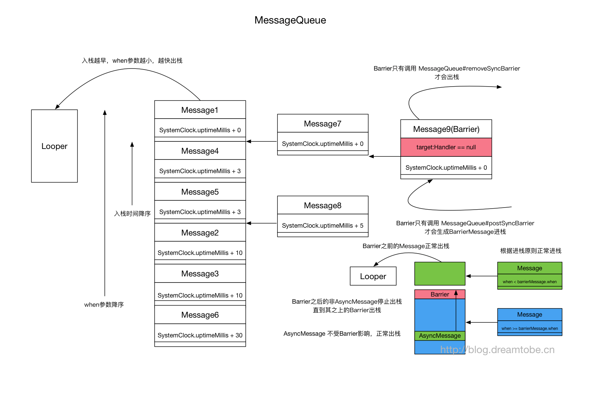

# Handler总结

## MessageQueue 中底层是采用的队列？
是单链表，不是队列，链表顺序按消息计划执行时间排列

## Handler如何实现延迟处理消息
sendEmptyMessageDelayed(int what, long delayMillis) —>  
sendMessageDelayed(Message msg, long delayMillis) —>  
sendMessageAtTime(Message msg, long uptimeMillis) —>  
enqueueMessage(MessageQueue queue, Message msg, long uptimeMillis) ->  
MessageQueue#enqueueMessage(Message msg, long when)

```java
boolean enqueueMessage(Message msg, long when) {
        //...
        synchronized (this) {
            //...

            msg.markInUse();
            msg.when = when;
            Message p = mMessages;
            boolean needWake;
            // 当消息队列中没有消息，或者是按时间来说是该排第一个
            if (p == null || when == 0 || when < p.when) {
                // New head, wake up the event queue if blocked.
                msg.next = p;
                mMessages = msg;
                needWake = mBlocked; //如果当前在阻塞状态，需要wake，即立即停止阻塞
            } else {
                needWake = mBlocked && p.target == null && msg.isAsynchronous();
                Message prev;
                // 以时间为顺序，插入到链表队列中间
                for (;;) {
                    prev = p;
                    p = p.next;
                    if (p == null || when < p.when) {
                        break;
                    }
                    if (needWake && p.isAsynchronous()) {
                        needWake = false;
                    }
                }
                msg.next = p; // invariant: p == prev.next
                prev.next = msg;
            }

            // We can assume mPtr != 0 because mQuitting is false.
            if (needWake) {
                nativeWake(mPtr); //唤醒线程阻塞状态
            }
        }
        return true;
    }
```
从以上代码可以看出该类的作用是把消息按时间顺序排序，并且控制线程的唤醒。

再看看next()

```java
Message next() {
        //...
        int pendingIdleHandlerCount = -1;
        int nextPollTimeoutMillis = 0; // 阻塞的时间
        for (;;) {
            if (nextPollTimeoutMillis != 0) {
                Binder.flushPendingCommands();
            }
            // 阻塞操作
            nativePollOnce(ptr, nextPollTimeoutMillis);

            synchronized (this) {
                // 获取系统启动后，到现在的时间
                final long now = SystemClock.uptimeMillis();
                Message prevMsg = null;
                Message msg = mMessages;
                if (msg != null && msg.target == null) {//当遇到同步屏障以后
                    // 查找下一条异步消息
                    do {
                        prevMsg = msg;
                        msg = msg.next;
                    } while (msg != null && !msg.isAsynchronous());
                }

                if (msg != null) {
                    if (now < msg.when) {
                        // 如果时间未到，设置下一轮需要阻塞等待的时间
                        nextPollTimeoutMillis = (int) Math.min(msg.when - now, Integer.MAX_VALUE);
                    } else {
                        // 得到消息
                        mBlocked = false;
                        if (prevMsg != null) {
                            prevMsg.next = msg.next;
                        } else {
                            mMessages = msg.next;
                        }
                        msg.next = null;
                        msg.markInUse();
                        return msg;
                    }
                } else {
                    // 没有消息
                    nextPollTimeoutMillis = -1;
                }
            //...
        }
    }
```

Handler获取时间的方式是调用SystemClock.uptimeMillis()，并用它和消息的里包含的时间进行对比。

综上所述：
1. 如果sendEmptyMessageDelayed发送了消息A，延时为500ms，这时消息进入队列，触发了nativePollOnce，Looper阻塞，等待下一个消息，或者是Delayed时间结束，自动唤醒；
2. 在1的前提下，紧接着又sendEmptyMessage了消息B，消息进入队列，但这时A的阻塞时间还没有到，于是把B插入到A的前面，然后调用nativeWake()方法唤醒线程
3. 唤醒之后，会重新取队列，这是B在A前面，又不需要等待，于是直接返回给Looper
4. Looper处理完该消息后，会再次调用next()方法，如果发现now大于msg.when则返回A消息，否则计算下一次该等待的时间

注意：SystemClock.uptimeMillis()，Handler是通过它来获取时间的，但uptimeMillis()是不包括休眠的时间的，所以手机如果在休眠状态下，那时间就一直不变，所以使用Handler并不能准确的延迟执行，因为它不计算休眠时间。

## Handler同步屏障
Handler中的Message可以分为两类：同步消息、异步消息。消息类型可以通过以下函数得知
```java
//Message.java
public boolean isAsynchronous() {
    return (flags & FLAG_ASYNCHRONOUS) != 0;
}
```
一般情况下这两种消息的处理方式没什么区别，只有在设置了同步屏障时才会出现差异。  
通常我们使用Handler发消息时，这些消息都是**同步消息**，如果我们想发送异步消息，那么在创建Handler时使用以下构造函数中的其中一种(async传true)
```java
public Handler(boolean async);
public Handler(Callback callback, boolean async);
public Handler(Looper looper, Callback callback, boolean async);
//Message.java
public void setAsynchronous(boolean async);
```
然后通过该Handler发送的所有消息都会变成异步消息。

同步屏障可以通过MessageQueue.postSyncBarrier函数来设置。
```java
@hide
public int postSyncBarrier() {
    return postSyncBarrier(SystemClock.uptimeMillis());
}

private int postSyncBarrier(long when) {
    // Enqueue a new sync barrier token.
    // We don't need to wake the queue because the purpose of a barrier is to stall it.
    synchronized (this) {
        final int token = mNextBarrierToken++;
        final Message msg = Message.obtain();
        msg.markInUse();
        msg.when = when;
        msg.arg1 = token;

        Message prev = null;
        Message p = mMessages;
        if (when != 0) {
            while (p != null && p.when <= when) {
                prev = p;
                p = p.next;
            }
        }
        if (prev != null) { // invariant: p == prev.next
            msg.next = p;
            prev.next = msg;
        } else {
            msg.next = p;
            mMessages = msg;
        }
        return token;
    }
}
```
可以看到同步屏障也是一个消息，该函数仅仅是创建了一个Message对象并加入到了消息链表中。乍一看好像没什么特别的，但是这里面有一个很大的不同点是该Message没有target，这是同步屏障的重要特征，所以从代码层面上来讲，同步屏障就是一个Message，一个target字段为空的Message。

同步屏障只在Looper死循环获取待处理消息时才会起作用，也就是说同步屏障在MessageQueue.next函数中发挥着作用。
```java
Message next() {
    //...
    int pendingIdleHandlerCount = -1; // -1 only during first iteration
    int nextPollTimeoutMillis = 0;
    for (;;) {
        //...
        synchronized (this) {
            // Try to retrieve the next message.  Return if found.
            final long now = SystemClock.uptimeMillis();
            Message prevMsg = null;
            Message msg = mMessages;
            if (msg != null && msg.target == null) {//碰到同步屏障
                // Stalled by a barrier.  Find the next asynchronous message in the queue.
                // do while循环遍历消息链表
                // 跳出循环时，msg指向离表头最近的一个异步消息
                do {
                    prevMsg = msg;
                    msg = msg.next;
                } while (msg != null && !msg.isAsynchronous());
            }
        /...
        }
    }
}
```
可以看到，当设置了同步屏障之后，next函数将会忽略所有的同步消息，优先返回异步消息。换句话说就是，设置了同步屏障之后，Handler只会处理异步消息。再换句话说，同步屏障为Handler消息机制增加了一种简单的优先级机制，异步消息的优先级要高于同步消息。

设置同步屏障消息后，如不清楚，它将一直呆在消息队列中起作用。清除同步屏障可以通过MessageQueue.removeSyncBarrier函数来设置。
```java
public void removeSyncBarrier(int token);
```

Android应用框架中为了更快的响应UI刷新事件在ViewRootImpl.scheduleTraversals中使用了同步屏障。为了让mTraversalRunnable尽快被执行，在发消息之前调用MessageQueue.postSyncBarrier设置了同步屏障。
```java
void scheduleTraversals() {
    if (!mTraversalScheduled) {
        mTraversalScheduled = true;
        //设置同步障碍，确保mTraversalRunnable优先被执行
        mTraversalBarrier = mHandler.getLooper().getQueue().postSyncBarrier();
        //内部通过Handler发送了一个异步消息
        mChoreographer.postCallback(
                Choreographer.CALLBACK_TRAVERSAL, mTraversalRunnable, null);
        if (!mUnbufferedInputDispatch) {
            scheduleConsumeBatchedInput();
        }
        notifyRendererOfFramePending();
        pokeDrawLockIfNeeded();
    }
}

void doTraversal() {
    if (mTraversalScheduled) {
        mTraversalScheduled = false;
        mHandler.getLooper().getQueue().removeSyncBarrier(mTraversalBarrier);//清除同步屏障
        performTraversals();
    }
}
```



* MessageQueue 从栈底到栈顶按Message.when降序排列(相同Message.when的先进栈的离栈顶更近)的后进先出的栈(MessageQueue#enqueueMessage MessageQueue#next)
* barrier的Message与普通Message的差别是target(类型是Handler)为null，只能通过MessageQueue#postSyncBarrier创建 barrier Message
* barrier的Message与普通Message以同样的规则进栈，但是却只能通过 MessageQueue#removeSyncBarrier出栈
* 每个barrier使用独立的token(记录在Message#arg1)进行区分
* 所有的异步消息如果在barrier之后，都会被延后执行，直到调用MessageQueue#removeSyncBarrier通过其token将该barrier清除。
* 当barrier在栈顶时，栈中的异步消息照常出栈不受影响

注意：Handler中的对应构造函数被隐藏，但是可以通过调用Message#setAsynchronous指定对应的Message为asynchronous的Message。  
值得一提的是，部署barrier(MessageQueue#postSyncBarrier)与清除barrier(MessageQueue#removeSyncBarrier)的相关方法都是目前还是非公开API。


## Handler的内存泄漏原因
1. 非静态Handler
```java
private Handler mHandler = new Handler() {
    @Override
    public void handleMessage(Message msg) {
        //匿名内部类隐式持有外部类的this，即activity
    }
};
```
当通过Handler发送消息时，消息的target字段将引用Handler实例对象，进入消息队列，这就相当于消息间接引用了activity，如果不能在acitivity销毁前处理完，将导致内存泄漏。
```java
 private boolean enqueueMessage(MessageQueue queue, Message msg, long uptimeMillis) {
        msg.target = this;//taget=handler
        if (mAsynchronous) {
            msg.setAsynchronous(true);
        }
        return queue.enqueueMessage(msg, uptimeMillis);
}
```

2. 匿名内部类runnable。
```java
 mHandler.postDelayed(new Runnable() {
            @Override
            public void run() {
                //匿名内部类隐式持有外部类的this，即activity
            }
        },1000);
```

消息的callback字段将引用Runnable，而Runnable引用外部activity，也可能导致内存泄漏。
```java
 private static Message getPostMessage(Runnable r) {
        Message m = Message.obtain();
        m.callback = r;
        return m;
    }
```

解决办法：
1. 静态Handler，匿名内部类将无法引用外部activity，通过在Handler的构造方法中加入activity弱引用，以实现对activity的访问。  
2. activity销毁时，移除Handler所发送的所有未处理消息。mHandler.removeCallbacksAndMessages(null);


## Looper如何退出
Looper 的退出方法是调用 quit() 或 quitSafely()，有什么区别?  
quit() 和 quitSafely() 的本质就是让 MessageQueue 的 next() 返回 null，以此来退出Looper的for循环。
```java
//Looper
    public void quit() {
        mQueue.quit(false);
    }

    public void quitSafely() {
        mQueue.quit(true);
    }

    void quit(boolean safe) {
        //特殊逻辑，主线程不允许退出
        if (!mQuitAllowed)  throw new IllegalStateException("Main thread not allowed to quit.");
        synchronized (this) {
            if (mQuitting) return;
            mQuitting = true;
            if (safe)  removeAllFutureMessagesLocked(); // 把所有延迟的消息清空
            else       removeAllMessagesLocked();  // 直接把消息队列里面的所有消息清空
            nativeWake(mPtr);//唤醒阻塞，Looper将退出。
        }
    }
```
```java
//MessageQueue#next()
    // Process the quit message now that all pending messages have been handled.
    if (mQuitting) {
        dispose();
        eturn null;
    }
```
```java
//Looper#loop()
    for (;;) {
        Message msg = queue.next(); // might block
        if (msg == null) {
            // No message indicates that the message queue is quitting.
            return;
        }
        //...
```

quitSafely() 会清空 MessageQueue 中的所有延迟消息(即所有 when > SystemClock.uptimeMillis() 的消息)，未处理的消息都等待处理后再终止Looper，所有禁止新的消息再放进MessageQueue。而quit() 则直接清除所有未处理消息，Looper立即退出。

## Looper阻塞是否占用CPU性能
Message的入列和出列其实是一个很典型的**生产者-消费者模型**,其中使用了`epoll管道机制`，当没有消息的时候会进行阻塞，Linux底层会`释放CPU时间片`避免死循环造成性能的浪费。虽然是不断循环取出头结点的Message进行分发处理，但是如果没有消息时它是阻塞在 `nativePollOnce` 这个native方法中的，当我们enqueue插入Message时会触发 `nativeWake` 这个方法去唤醒，从而 nativePollOnce 阻塞解除，继续遍历MessageQueue取出头结点去处理。
```java
    int pendingIdleHandlerCount = -1; // for循环迭代的首次为-1
    //阻塞操作，当等待nextPollTimeoutMillis时长，或者消息队列被唤醒，都会返回
    //nextPollTimeoutMillis 为-1，一直阻塞，在调用nativeWake（enqueue Message或Looper.quit()退出Looper）时会被唤醒解除阻塞
    //nextPollTimeoutMillis 为0，不阻塞
    //nextPollTimeoutMillis 为>0，阻塞到对应时间后解除，如为10_000则阻塞十秒后解除，用于处理延迟消息
    nativePollOnce(ptr, nextPollTimeoutMillis);
```

## 一个Looper对应一个MessageQueue吗？
Looper.loop()在一个线程中调用next()不断的取出消息，另外一个线程则通过enqueueMessage向队列中插入消息，所以在这两个方法中使用了synchronized 同步块，其中this为MessageQueue对象，不管在哪个线程，这个对象都是同一个，因为Handler中的mQueue指向的是Looper中的mQueue(mQueue是Looper创建的)，这样防止了多个线程对同一个队列的同时操作。


## 一个线程只有一个Looper吗？
要创建Looper，需要调用 Looper.prepare 和 Looper.loop。
```java
private static void prepare(boolean quitAllowed) {
    //看当前线程是否已通过TL绑定对应的实例, 有的话抛异常, 所以prepare方法只允许调用一次
    if (sThreadLocal.get() != null) {
        throw new RuntimeException("Only one Looper may be created per thread");
    }
    //创建Looper对象，并通过TL建立与线程的绑定关系
    sThreadLocal.set(new Looper(quitAllowed));
}
```
可知Looper.prepare()在每个线程只允许执行一次，该方法给当前线程通过TL绑定一个线程所属的唯一一个实例。

## IdleHandler 是什么
IdleHandler接口表示当MessageQueue发现当前没有更多消息可以处理的时候, 则顺便干点别的事情的callback函数(即如果发现idle了，那就找点别的事干)。callback函数有个boolean的返回值, 表示是否keep. 如果返回false, 则它会在调用完毕之后从mIdleHandlers中移除。  
IdleHandler 可以用来提升提升性能，主要用在我们希望能够在当前线程消息队列空闲时做些事情（譬如UI线程在显示完成后，如果线程空闲我们就可以提前准备其他内容）的情况下，不过最好不要做耗时操作，否则影响Looper循环性能。
