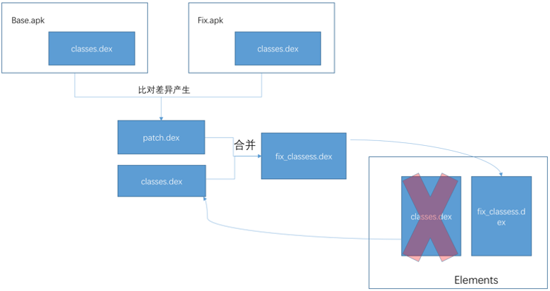

## multidex类加载方案
multidex类加载方案是要求应用重启后，优先加载补丁包中的类，从而达到修复的目的，为什么要求重启呢？因为在java中类是无法卸载的，如果要重新加载类，只能重启jvm，因此这类修复方案的特点是`不能即时生效`，需要冷启动。

我们从ClassLoader类加载的逻辑([ClassLoader](./classloader.md))中可知，在android中，classLoader在第一次加载类的时候其实是按顺序遍历dexElements数组，从每一个DexFile中尝试加载类，如果找到了，下次就不会重复加载了，而是从已加载的类中直接查找。

因此我们可以将补丁类打包成patch.dex，放到dexElement数组的第一个元素，这样虚拟机在加载类的时候会先找到我们补丁包patch.dex中已经修复的类，而有问题的类因为排在后面的dex中，就也没有机会被加载。  


### 实践
1、修改需要修复的类
```java
package com.test.fix;

public class Test() {

    public void test(){
        //sout("出bug了");
        fix();
    }

    public void fix(){
        sout("修复了");
    }

}
```

2、编译并找到补丁class，生成补丁包
```bash
##生成jar
jar  cvf class.jar com/test/fix/Test.class
##生成dex文件，在patchDex.jar中
dx --dex --output=patchDex.jar class.jar 
```

3、下发patch到终端进行修复
```java
public class MyApplication extends Application {

    @Override
    public void onCreate() {
        super.onCreate();

        String dexPath = Environment.getExternalStorageDirectory().getAbsolutePath().concat("/patchDex.jar");
        File file = new File(dexPath);
        //如果补丁存在就执行修复
        if (file.exists()) {
            inject(dexPath);
        }
    }

    private void inject(String dexFile) {
        try {
            // 获取主classes的dexElements
            Class<?> cl = Class.forName("dalvik.system.BaseDexClassLoader");
            Object pathList = getField(cl, "pathList", getClassLoader());
            Object baseElements = getField(pathList.getClass(), "dexElements", pathList);


            //使用dexClassLoader加载patch.dex
            String dexopt = getCacheDir().getAbsolutePath();
            DexClassLoader dexClassLoader = new DexClassLoader(dexFile, dexopt, dexopt, getClassLoader());
            //获取patch.dex的dexElements
            Object obj = getField(cl, "pathList", dexClassLoader);
            Object patchDexElements = getField(obj.getClass(), "dexElements", obj);

            //合并两个dexElements, patchDexElements放前面
            Object combineElements = combineArray(patchDexElements, baseElements);

            //将合并后的Element数组重新赋值给app的classLoader
            setField(pathList.getClass(), "dexElements", pathList, combineElements);
        } catch (ClassNotFoundException e) {
            e.printStackTrace();
        } catch (IllegalAccessException e) {
            e.printStackTrace();
        } catch (NoSuchFieldException e) {
            e.printStackTrace();
        }
    }

 
    private Object getField(Class<?> cl, String fieldName, Object object) throws NoSuchFieldException, IllegalAccessException {
        Field field = cl.getDeclaredField(fieldName);
        field.setAccessible(true);
        return field.get(object);
    }

  
    private void setField(Class<?> cl, String fieldName, Object object, Object value) throws NoSuchFieldException, IllegalAccessException {
        Field field = cl.getDeclaredField(fieldName);
        field.setAccessible(true);
        field.set(object, value);
    }

   
    private Object combineArray(Object firstArr, Object secondArr) {
        int firstLength = Array.getLength(firstArr);
        int secondLength = Array.getLength(secondArr);
        int length = firstLength + secondLength;

        Class<?> componentType = firstArr.getClass().getComponentType();
        Object newArr = Array.newInstance(componentType, length);
        for (int i = 0; i < length; i++) {
            if (i < firstLength) {
                Array.set(newArr, i, Array.get(firstArr, i));
            } else {
                Array.set(newArr, i, Array.get(secondArr, i - firstLength));
            }
        }
        return newArr;
    }

}
```

该方案在android 4.x版本上会出现一个异常：
```bash
java.lang.IllegalAccessError: 
    Class ref in pre-verified class resolved to unexpected implementation
```
原因是：  
1、在apk安装的时候，Dalvik虚拟机会将dex优化成odex后才拿去执行，在这个过程中会对所有class一个校验。  
2、校验方式：假设A该类在它的static方法，private方法，构造函数，override方法中直接引用到B类。如果A类和B类在同一个dex中，那么A类就会被打上`CLASS_ISPREVERIFIED`标记，反之只要在static方法，构造方法，private方法，override方法中直接引用了其他dex中的类，那么这个类就不会被打上`CLASS_ISPREVERIFIED`标记。
3、被打上这个标记的类就不能再引用其他dex中的类，否则就会报上面的错误。

在我们的实践中，Test类和调用Test类的MainActivity(比如)本身是在同一个dex中的，所以MainActivity被打上了`CLASS_ISPREVERIFIED`标记，而我们修复bug的时候却引用了另外一个dex中的Test，所以这里就报错了。

QFix为解决这个问题，采取了编译时插桩的做法。

具体来说就是:
在所有类的构造函数中插入一段代码：`System.out.println(AntilazyLoad.class);` 
这样当安装apk的时候，classes.dex内的类都会引用一个在不相同dex中的AntilazyLoad类，这样就防止了类被打上`CLASS_ISPREVERIFIED`的标志了，只要没被打上这个标志的类都可以进行打补丁操作。

**优点：**
* 不需要考虑对dalvik虚拟机和art虚拟机做适配
* 代码是非侵入式的，对apk体积影响不大

**缺点：**
* 需要下次启动才会生效
* 性能损耗，即Dalvik平台为防止类打上CLASS_ISPREVERIFIED标志，插桩导致的性能损耗，Art平台由于地址偏移问题导致补丁包可能过大的问题


## Dex替换方案
如果QFix没有上面的缺陷，也可能就不会有微信的Tinker方案了。微信tinker采用将新旧apk做diff，得到diff.dex，然后下发diff.dex给终端手机，然后在运行时将diff.dex和手机中旧的classes.dex做合并，生成新的classes.dex，最后仍然采用上面的类加载方法，在启动时将新的classes.dex安排到dexElement数组的第一个元素。由于不需要代码插桩，性能比QFix有很大提高。



具体参考：<https://github.com/Tencent/tinker>

**优点：**
* 克服了QFix的性能缺陷
* 支持替换So库以及资源

**缺点：**
* 需要下次启动才会生效
* 实现复杂
Tinker性能痛点：
* Dex合并内存消耗在vm head上，容易OOM，最后导致合并失败。
* 如果本身app占用内存已经比较高，可能容易导致app本系统杀掉。

## Instant Run热插拔方案
在[Instant Run](./instantRun.md)文中可以了解Instant Run的大致原理。
美团Robust插件借鉴了Instant Run原理，对每个业务代码的每个函数都在编译打包阶段自动插入了一段代码，同时给每个class都增加了一个类型为ChangeQuickRedirect的静态成员，而在每个方法前都插入了使用changeQuickRedirect相关的逻辑，当 changeQuickRedirect不为null时，就会执行到accessDispatch从而替换掉之前老的逻辑，达到修复的目的。插入过程对业务开发是完全透明的。

```java
public long getIndex() {
      return 100;
}
 ```
 以上代码经过Robust框架注入后会被处理成:
```java
public static ChangeQuickRedirect changeQuickRedirect;
public long getIndex() {
     if(changeQuickRedirect != null) {
         if(PatchProxy.isSupport(new Object[0], this, changeQuickRedirect, false)) {
             return ((Long)PatchProxy.accessDispatch(new Object[0], this, changeQuickRedirect, false)).longValue();
         }
     }
     return 100L;
 }
```
当有补丁的时候changeQuickRedirect的值就不再是空，所以执行到需要热修的方法时就会走到补丁的方法实现而不是原逻辑达到修复目的


每个补丁包的结构
PatchesInfoImpl：补丁包说明类，可以获取所有补丁对象；每个对象包含被修复类名及该类对应的补丁类。
```java
public class PatchesInfoImpl implements PatchesInfo
 {
  public List getPatchedClassesInfo()
   {
     ArrayList localArrayList = new ArrayList();
     localArrayList.add(new  PatchedClassInfo("com.xxx.android.robustdemo.MainActivity", "com.bytedance.robust.patch.MainActivityPatchControl"));
     com.meituan.robust.utils.EnhancedRobustUtils.isThrowable = false;
     return localArrayList;
   }
  }
```

PatchesInfoImpl：补丁包说明类，可以获取所有补丁对象；每个对象包含被修复类名及该类对应的补丁类。
```java
public class MainActivityPatchControl implements ChangeQuickRedirect{
  ...
  //1.方法是否支持热修
  public boolean isSupport(String paramString, Object[] paramArrayOfObject)
  {
    Log.d("robust", "arrivied in isSupport " + paramString + " paramArrayOfObject  " + paramArrayOfObject);
    String str = paramString.split(":")[3];
    Log.d("robust", "in isSupport assemble method number  is  " + str);
    Log.d("robust", "arrivied in isSupport " + paramString + " paramArrayOfObject  " + paramArrayOfObject + " isSupport result is " + ":2:".contains(new StringBuffer().append(":").append(str).append(":").toString()));
    return ":2:".contains(":" + str + ":");
  }
  //2.调用补丁的热修逻辑
  public Object accessDispatch(String paramString, Object[] paramArrayOfObject)
  {
    for (;;)
    {
    try
      {
        Object localObject = new java/lang/StringBuffer;
        ((StringBuffer)localObject).<init>();
        if (!paramString.split(":")[2].equals("false")) {
            continue;
          }
        if (keyToValueRelation.get(paramArrayOfObject[(paramArrayOfObject.length - 1)]) != null) {
        continue;
      }
      localObject = new com/bytedance/robust/patch/MainActivityPatch;
      ((MainActivityPatch)localObject).<init>(paramArrayOfObject[(paramArrayOfObject.length - 1)]);
      keyToValueRelation.put(paramArrayOfObject[(paramArrayOfObject.length - 1)], null);
      paramArrayOfObject = (Object[])localObject;
      localObject = paramString.split(":")[3];
      paramString = new java/lang/StringBuffer;
      paramString.<init>();
       if (!"2".equals(localObject)) {
          continue;
        }
       paramString = paramArrayOfObject.RobustPublicgetShowText();
     }catch (Throwable paramString){ ...}
     return paramString;
     paramArrayOfObject = (MainActivityPatch)keyToValueRelation.get(paramArrayOfObject[(paramArrayOfObject.length - 1)]);
     continue;
     //具体实现逻辑在Patch中
     paramArrayOfObject = new MainActivityPatch(null);
   }
  }
 }
```
Patch：具体补丁方法的实现。该类中包含被修复类中需要热修的方法。
```java
public class MainActivityPatch
  {
   MainActivity originClass;
   public MainActivityPatch(Object paramObject)
   {
     this.originClass = ((MainActivity)paramObject);
    }
    //热修的方法具体实现
    private String getShowText()
    {
     Object localObject = getRealParameter(new Object[] { "Error Text" });
     localObject = (String)EnhancedRobustUtils.invokeReflectConstruct("java.lang.String", (Object[])localObject, new Class[] { String.class });
     localObject = getRealParameter(new Object[] { "Fixed Text" });
     return (String)EnhancedRobustUtils.invokeReflectConstruct("java.lang.String", (Object[])localObject, new Class[] { String.class });
     }
   }
```

优点：
几乎不会影响性能（方法调用，冷启动）
支持Android2.3-8.x版本
高兼容性（Robust只是在正常的使用DexClassLoader）、高稳定性，修复成功率高达99.9%
补丁实时生效，不需要重新启动
支持方法级别的修复，包括静态方法
支持增加方法和类
支持ProGuard的混淆、内联、优化等操作
缺点：
代码是侵入式的，会在原有的类中加入相关代码
so和资源的替换暂时不支持
会增大apk的体积，平均一个函数会比原来增加17.47个字节，10万个函数会增加1.67M。
会增加少量方法数，使用了Robust插件后，原来能被ProGuard内联的函数不能被内联了

## 底层方法替换方案
