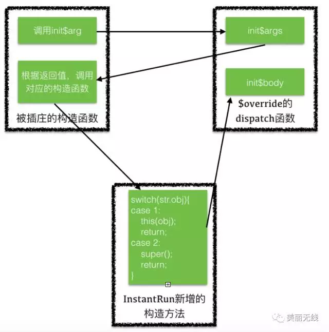
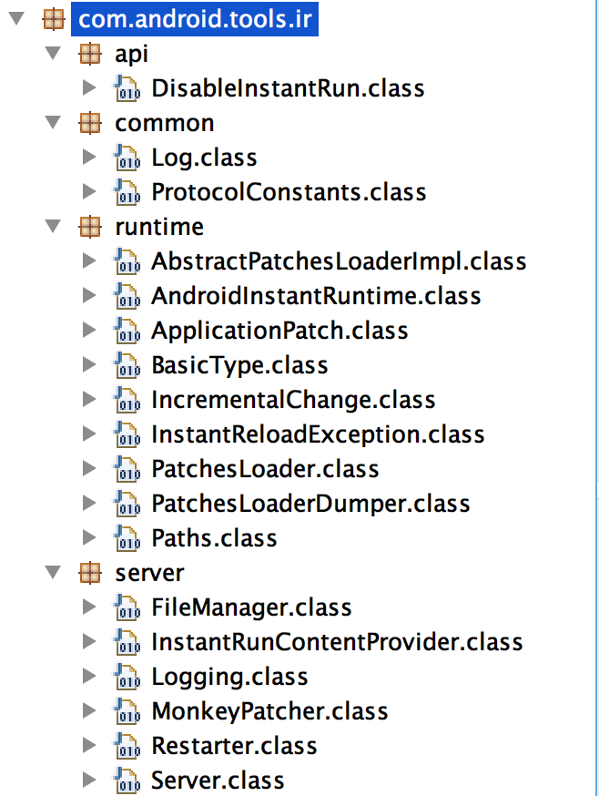
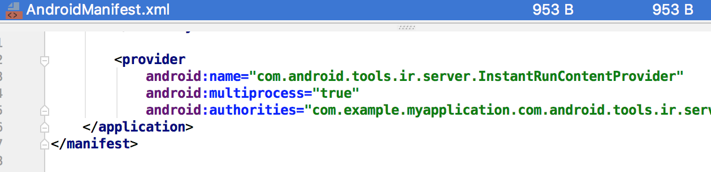

## 介绍
Instant Run是android studio2.0新增的一个运行机制，在你编码开发、测试或debug的时候，它都能显著减少你对当前应用的构建和部署的时间。它的一个重要特点是即时生效，一般不需要重启。
## 三种方式
instant-run加载更新代码有三种方式：hotswap、coldswap、warmswap。
* hotswap  
如果只是改动现有方法的逻辑，instant-run会自动应用hotswap，**不需要任何重启**就可以看到实际改动
* warmswap  
当改变的不止是代码，还涉及到资源文件的变动，就做不到像hotswap一样在不影响当前Activity的情况下应用变动了。AS会生成一个新的resources._ap推到设备上，然后**重启当前Activity**来使新的资源生效。
* coldswap  
如果不符合上面hotswap和warmswap的条件，比如说增加或者删减了方法、修改了类的集成关系、修改了AndroidManifest等，就会应用coldswap。也就是把改动部分推送到设备上，然后会**重启整个app**才能看到变动。

## hotswap分析
Instant Run在第一次构建apk时，会在每一个方法进行插桩
```java
//源代码
public class MainActivity extends AppCompatActivity {
    private TextView mTv;
    private int count;
    public int count2;

    @Override
    protected void onCreate(Bundle savedInstanceState) {
        super.onCreate(savedInstanceState);
        setContentView(R.layout.activity_main);
        mTv = findViewById(R.id.textView);
        mTv.setText("hello world");
    }

    private void toBeFix() {
        Toast.makeText(this, "I'm a bug", Toast.LENGTH_SHORT).show();
        testPublic();
        testPrivate();
    }

    public void testPrivate() {
        count = 2;
    }

    public void testPublic() {
        count2 = 3;
    }
}
```
instant run插桩后的代码
```java
public class MainActivity extends AppCompatActivity {
    private TextView mTv;
    private int count;
    public int count2;

    public static final long serialVersionUID = -754549888626914089L;
    public static volatile transient com.android.tools.ir.runtime.IncrementalChange $change;

    //原有的构造函数
    public MainActivity() {
        IncrementalChange var1 = $change;
        if (var1 != null) {
            Object[] var10001 = (Object[])var1.access$dispatch("init$args.([Lcom/example/myapplication/MainActivity;[Ljava/lang/Object;)Ljava/lang/Object;", new Object[]{null, new Object[0]});
            Object[] var2 = (Object[])var10001[0];
            this(var10001, (InstantReloadException)null);
            var2[0] = this;
            var1.access$dispatch("init$body.(Lcom/example/myapplication/MainActivity;[Ljava/lang/Object;)V", var2);
        } else {
            super();
            this.count = 0;
        }
    }

    public void onCreate(Bundle savedInstanceState) {
        IncrementalChange var2 = $change;
        if (var2 != null) {
            var2.access$dispatch("onCreate.(Landroid/os/Bundle;)V", new Object[]{this, savedInstanceState});
        } else {
            super.onCreate(savedInstanceState);
            this.setContentView(R.layout.main);
            this.mTv = (TextView)this.findViewById(R.id.textView);
            this.mTv.setText("hello world");
        }
    }

    private void toBeFix() {
        IncrementalChange var1 = $change;
        if (var1 != null) {
            var1.access$dispatch("toBeFix.()V", new Object[]{this});
        } else {
            Toast.makeText(this, "I'm a bug", 0).show();
            this.testPublic();
            this.testPrivate();
        }
    }

    public void testPrivate() {
        IncrementalChange var1 = $change;
        if (var1 != null) {
            var1.access$dispatch("testPublic.()V", new Object[]{this});
        } else {
            this.count = 2;
        }
    }

    public void testPublic() {
        IncrementalChange var1 = $change;
        if (var1 != null) {
            var1.access$dispatch("testPrivate.()V", new Object[]{this});
        } else {
            this.count2 = 3;
        }
    }

    //instant run增加的构造方法，为了要调用父类的构造函数以及本类的其他构造函数
    MainActivity(Object[] var1, InstantReloadException var2) {
        String var3 = (String)var1[1];
        switch(var3.hashCode()) {
        case -212194855:
            super();
            return;
        case 69102765:
            this();
            return;
        case 2011923530:
            super(((Number)var1[2]).intValue());
            return;
        default:
            throw new InstantReloadException(String.format("String switch could not find '%s' with hashcode %s in %s", var3, var3.hashCode(), "com/example/myapplication/MainActivity"));
        }
    }
}
```
`$change`初始值为null，这时方法的行为被没有被修改。当`$change`不为null时，MainActivity的所有方法都被代理到了`$change`的`access$dispatch`方法上，从而有了修复原有逻辑的基础，就是让原有逻辑短路，直接跳到另外一个地方执行新的逻辑。

`$change`是`IncrementalChange`接口类型，里面只定义了一个`access$dispatch`方法。
```java
package com.android.tools.ir.runtime;
public interface IncrementalChange {
    Object access$dispatch(String var1, Object... var2);
}
```

`$change`的具体实现，可以在`app/intermediates/transforms/transforms/instantRun`目录下找到  
原类名 + $override，实现`IncrementalChange`接口。该类包含被修复的逻辑，取名$override，意思是要取代原有类。
```java
public class MainActivity$override implements IncrementalChange {
    public MainActivity$override() {
    }

    public static Object init$args(MainActivity[] var0, Object[] var1) {
        Object[] var2 = new Object[]{new Object[]{var0, new Object[0]}, "androidx/appcompat/app/AppCompatActivity.()V"};
        return var2;
    }

    public static void init$body(MainActivity $this, Object[] var1) {
        AndroidInstantRuntime.setPrivateField($this, new Integer(1), MainActivity.class, "count");
    }

    public static void onCreate(MainActivity $this, Bundle savedInstanceState) {
        Object[] var2 = new Object[]{savedInstanceState};
        MainActivity.access$super($this, "onCreate.(Landroid/os/Bundle;)V", var2);
        $this.setContentView(R.layout.main);
        AndroidInstantRuntime.setPrivateField($this, (TextView)$this.findViewById(R.id.textView), MainActivity.class, "mTv");
        ((TextView)AndroidInstantRuntime.getPrivateField($this, MainActivity.class, "mTv")).setText("hello world");
    }

    public static void toBeFix(MainActivity $this) {
        Toast.makeText($this, "I'm fixed", 0).show();
        $this.testPublic();
        $this.testPrivate();
    }

    public static void testPrivate(MainActivity $this) {
        AndroidInstantRuntime.setPrivateField($this, new Integer(2), MainActivity.class, "count");
    }

    public static void testPublic(MainActivity $this) {
        $this.count2 = 3;
    }

    @override
    public Object access$dispatch(String var1, Object... var2) {
        //根据方法名hashCode，分发调用对应的方法
        switch(var1.hashCode()) {
        case 1189276834:
            testPublic((MainActivity)var2[0]);
            return null;
        case 1310942360:
            testPrivate((MainActivity)var2[0]);
            return null;
        case -909773794:
            toBeFix((MainActivity)var2[0]);
            return null;
        case -641568046:
            onCreate((MainActivity)var2[0], (Bundle)var2[1]);
            return null;
        case 707796331:
            init$body((MainActivity)var2[0], (Object[])var2[1]);
            return null;
        case 1546073223:
            return init$args((MainActivity[])var2[0], (Object[])var2[1]);
        default:
            throw new InstantReloadException(String.format("String switch could not find '%s' with hashcode %s in %s", var1, var1.hashCode(), "com/example/myapplication/MainActivity"));
        }
    }
}
```
### 构造方法问题
Instant Run为了在`xxx$override`类中调用原有类的`super()`方法和 `this()`方法，会在原有类中增加一个构造方法。然后在`xxx$override`类中会生成两个方法`args`和`bodys`，args返回一个字符串，代表要调用哪个this或super方法，bodys中则是原来构造函数中的除this或super调用的其他逻辑。当一个类的构造方法被HotFix时，在它的构造方法中会先调用`xxx$override`类的`args`，将`args`返回的字符串传递给新生成的构造方法，在新生成的构造方法里会根据字符串决定要调用哪个函数，之后再调用body方法初始化其他逻辑。


### 权限问题
因为要在xxx$override类的对象中去访问原有类的属性、方法，所以必定会涉及到访问权限问题。
1、Instant Run会在编译期间将原有类所有的非public访问权限的方法改为public。
1、对于非public访问权限的成员变量，Instant Run通过运行时反射访问原类的成员变量。

## patch文件如何上传到app里的？
apk第一次编译时，编译器会把instant-run.jar打包到主dex中
instant-run.jar在`app/build/intermediates/incremental-runtime-classes/debug`目录下可以找到，主要包含了2个方面的代码：
* App Server，接收patch推送
* 修复逻辑


Instant run在Gradle 2.0 ~ 2.3 ~ 3.0版本都有不同的改动，但核心逻辑没变，这里以Gralde3.x版本为例。
找到构建完的apk，发现manifest.xml中多了一个provider组件

可以在instant-run.jar中找到这个组件的代码
```java
public final class InstantRunContentProvider extends ContentProvider {
  public boolean onCreate() {
    if (isMainProcess()) {
      Log.i("InstantRun", "starting instant run server: is main process");
      Server.create(getContext());
    } else {
      Log.i("InstantRun", "not starting instant run server: not main process");
    } 
    return true;
  }
  //...其他没有营养的逻辑
```
我们知道ContentProvider的`onCreate`的调用时机介于Application的`attachBaseContext`和`onCreate`之间，也就是说，provider的`onCreate`会在应用启动时自动被调用。
InstantRunContentProvider在其`onCreate`方法中就做了一件事，就是启动一个server。

```java
public class Server{
    public static Server create(Context context) { 
        return new Server(context.getPackageName(), context); 
    }

    private Server(String packageName, Context context) {
        this.context = context;
        try {
            //以packageName作为名字新建LocalServerSocket
            this.serverSocket = new LocalServerSocket(packageName);
        } catch (IOException e) {
            Log.e("InstantRun", "IO Error creating local socket at " + packageName, e);
            return;
        }
        //启动server
        startServer();
    }

    private void startServer() {
        try {
            Thread socketServerThread = new Thread(new SocketServerThread(this, null));
            //在独立线程中启动socket，并处理相应socket请求。
            socketServerThread.start();
        } catch (Throwable e) {
        }
    }

    //...

    //处理socket请求数据
    private void handle(DataInputStream input, DataOutputStream output) throws IOException {
      int message;
      
      int version = input.readInt();
      output.writeInt(4);
      if (version != 4) {
        Log.w("InstantRun", "Mismatched protocol versions; app is using 
            version 4 and tool is using version " + version);
        return;
      }

      while (true) {
        //...
        List<ApplicationPatch> changes;
        message = input.readInt();
        switch (message) {
            case 1:
                //从socket读出changes列表
                changes = ApplicationPatch.read(input);
                hasResources = Server.hasResources(changes);
                updateMode = input.readInt();
                //处理changes
                updateMode = Server.this.handlePatches(changes, hasResources, updateMode);
                //根据updateMode(更新方式)，比如重启当前activity或重启app
                Server.this.restart(updateMode, hasResources, showToast);
                continue;
            //其他case
        }
      }
    }

    //处理patch
    private int handlePatches(List<ApplicationPatch> changes, boolean hasResources, int updateMode) {
        if (hasResources) {
            FileManager.startUpdate();
        }
        
        for (ApplicationPatch change : changes) {
            String path = change.getPath();
            if (path.equals("classes.dex.3")) {
                //处理热交换patch
                updateMode = handleHotSwapPatch(updateMode, change); continue;
            }  if (isResourcePath(path)) {
                //处理资源patch
                updateMode = handleResourcePatch(updateMode, change, path);
            }
        }
        if (hasResources) {
            FileManager.finishUpdate(true);
        }
        return updateMode;
    }

    private int handleHotSwapPatch(int updateMode, ApplicationPatch patch) {
        try {
            //把patch数据写入dex文件
            String dexFile = FileManager.writeTempDexFile(patch.getBytes());
            String nativeLibraryPath = FileManager.getNativeLibraryFolder().getPath();
            //使用DexClassLoader加载patch(dex)
            DexClassLoader dexClassLoader = new DexClassLoader(dexFile, 
                this.context.getCacheDir().getPath(), 
                nativeLibraryPath, getClass().getClassLoader());

            //加载类AppPatchesLoaderImpl
            Class<?> aClass = Class.forName("com.android.tools.ir.runtime.AppPatchesLoaderImpl",
                 true, dexClassLoader);

            try {
                if (Log.isLoggable("InstantRun", 2)) {
                    Log.v("InstantRun", "Got the patcher class " + aClass);
                }
                //实例化AppPatchesLoaderImpl
                PatchesLoader loader = (PatchesLoader) aClass.newInstance();
                
                //调用AppPatchesLoaderImpl的load()方法，加载热修复逻辑
                if (!loader.load()) {
                    updateMode = 3;
                }
            } catch (Exception e) {
                e.printStackTrace();
                updateMode = 3;
            }
        } catch (Throwable e) {
            updateMode = 3;
        }
        return updateMode;
    }
   
    //其他逻辑
}
```
从上面的代码可知，AppPatchesLoaderImpl类是靠加载patch的classLoader加载的。实际推送到设备上的patch为`app/intermediates/reload-dex/classes.dex`，里面有两个类，一个类是上面已经说过的MainActivity$override，另一个类就是AppPatchesLoaderImpl，作用是指明哪些类需要patch。
```java
public class AppPatchesLoaderImpl extends AbstractPatchesLoaderImpl {
    public static final long BUILD_ID = 1571577597897L;

    public AppPatchesLoaderImpl() {
    }

    public String[] getPatchedClasses() {
        //罗列哪些类需要被patch
        return new String[]{"com.example.myapplication.MainActivity"};
    }
}
```
看来load方法是在其父类AbstractPatchesLoaderImpl中，我们在instant-run.jar的runtime下找到了。
```java
public abstract class AbstractPatchesLoaderImpl implements PatchesLoader {
    private final Method get = java.util.concurrent.atomic.AtomicReference.class.getMethod("get", new Class[0]);
    private final Method set = java.util.concurrent.atomic.AtomicReference.class.getMethod("set", new Class[]{Object.class});

    public abstract String[] getPatchedClasses();

    public boolean load() {
        //遍历需要修复的类
        for (String className : getPatchedClasses()) {
            try {
                ClassLoader cl = getClass().getClassLoader();
                //加载对应被修复的$override类
                Class<?> aClass = cl.loadClass(className + "$override");
                //实例化
                Object o = aClass.newInstance();

                //加载原类class
                Class<?> originalClass = cl.loadClass(className);
                //定位原类的静态成员$change
                Field changeField = originalClass.getDeclaredField("$change");
                changeField.setAccessible(true);
                //将实例化的$override赋值给$change，这里根据原类是是否是接口，逻辑有点不同
                Object previous = originalClass.isInterface() ? 
                    patchInterface(changeField, o) : patchClass(changeField, o);

                //...
            } catch (Exception e) {
                //...
                return false;
            }
        }
        return true;
    }

    private Object patchInterface(Field changeField, Object patch) {
        Object atomicReference = changeField.get(null);
        Object previous = this.get.invoke(atomicReference, new Object[0]);
        this.set.invoke(atomicReference, new Object[]{patch});
        return previous;
    }

    private Object patchClass(Field changeField, Object patch) {
        Object previous = changeField.get(null);
        changeField.set(null, patch);
        return previous;
    }
}
```
到这里，看到$change变量被赋值为$change对象，我们就知道热修复逻辑完成了。

## 总结
完整的过程可以概述为：

1. 在第一次完整编译的时候给所有的类插桩，使它们的方法能被代理
2. app启动时启动一个AppServer，等待Android Studio推送增量包
3. 代码改动后的增量编译中，通过gradle插件生成包含了改动代码的代理类$change
4. Android Studio将patch推送到app中，然后给被改动的类的`$change`字段赋值，这样所有方法都转发到了代理类
---

//todo 资源修复