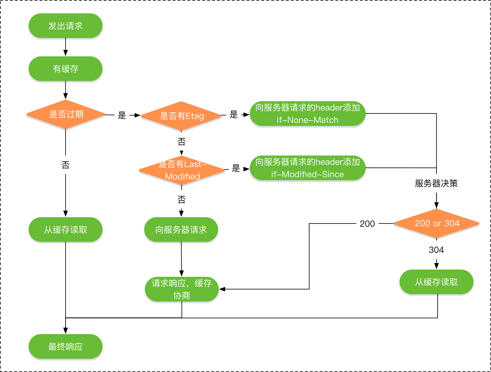

# HTTP vs HTTPS
https协议需要到ca申请证书。http是超文本传输协议，信息是明文传输，https 则是具有安全性的ssl加密传输协议。http和https使用的是完全不同的连接方式，用的端口也不一样，前者是**80**,后者是**443**。http的连接很简单，是无状态的。HTTPS协议是由SSL+HTTP协议构建的可进行加密传输、身份认证的网络协议。要比http协议安全。

HTTPS解决的问题：  
1. 信任主机的问题. 采用https 的server 必须从CA 申请一个用于证明服务器用途类型的证书。改证书只有用于对应的server的时候,客户度才信任次主机
2. 防止通讯过程中的数据的泄密和被窜改

## HTTP1.0和HTTP1.1的一些区别
HTTP1.0最早在网页中使用是在1996年，那个时候只是使用一些较为简单的网页上和网络请求上，而HTTP1.1则在1999年才开始广泛应用于现在的各大浏览器网络请求中，同时HTTP1.1也是当前使用最为广泛的HTTP协议。 主要区别主要体现在：

1、**缓存处理**，在HTTP1.0中主要使用header里的If-Modified-Since,Expires来做为缓存判断的标准，HTTP1.1则引入了更多的缓存控制策略例如Entity tag，If-Unmodified-Since, If-Match, If-None-Match等更多可供选择的缓存头来控制缓存策略。

2、**带宽优化及网络连接的使用**，HTTP1.0中，存在一些浪费带宽的现象，例如客户端只是需要某个对象的一部分，而服务器却将整个对象送过来了，并且不支持断点续传功能，HTTP1.1则在请求头引入了range头域，它允许只请求资源的某个部分，即返回码是206（Partial Content），这样就方便了开发者自由的选择以便于充分利用带宽和连接。

3、**错误通知的管理**，在HTTP1.1中新增了24个错误状态响应码，如409（Conflict）表示请求的资源与资源的当前状态发生冲突；410（Gone）表示服务器上的某个资源被永久性的删除。

4、**Host头处理**，在HTTP1.0中认为每台服务器都绑定一个唯一的IP地址，因此，请求消息中的URL并没有传递主机名（hostname）。但随着虚拟主机技术的发展，在一台物理服务器上可以存在多个虚拟主机（Multi-homed Web Servers），并且它们共享一个IP地址。HTTP1.1的请求消息和响应消息都应支持Host头域，且请求消息中如果没有Host头域会报告一个错误（400 Bad Request）。

5、**长连接**，HTTP 1.1支持长连接（PersistentConnection）和请求的流水线（Pipelining）处理，在一个TCP连接上可以传送多个HTTP请求和响应，减少了建立和关闭连接的消耗和延迟，在HTTP1.1中默认开启Connection： keep-alive，一定程度上弥补了HTTP1.0每次请求都要创建连接的缺点。

Http1.0是短连接，HTTP1.1默认是长连接，也就是默认Connection的值就是keep-alive。但是长连接实质是指的TCP连接，而不是HTTP连接。TCP连接是一个双向的通道，它是可以保持一段时间不关闭的，因此TCP连接才有真正的长连接和短连接这一说。

## HTTP2.0和HTTP1.X相比的新特性
**新的二进制格式**（Binary Format），HTTP1.x的解析是基于文本。基于文本协议的格式解析存在天然缺陷，文本的表现形式有多样性，要做到健壮性考虑的场景必然很多，二进制则不同，只认0和1的组合。基于这种考虑HTTP2.0的协议解析决定采用二进制格式，实现方便且健壮。

**多路复用**（MultiPlexing），即连接共享，即每一个request都是是用作连接共享机制的。一个request对应一个id，这样一个连接上可以有多个request，每个连接的request可以随机的混杂在一起，接收方可以根据request的 id将request再归属到各自不同的服务端请求里面。

**header压缩**，如上文中所言，对前面提到过HTTP1.x的header带有大量信息，而且每次都要重复发送，HTTP2.0使用encoder来减少需要传输的header大小，通讯双方各自cache一份header fields表，既避免了重复header的传输，又减小了需要传输的大小。

**服务端推送**（server push），同SPDY一样，HTTP2.0也具有server push功能。

## HTTP2.0的多路复用和HTTP1.X中的长连接复用有什么区别？
HTTP/1.* 一次请求-响应，建立一个连接，用完关闭；每一个请求都要建立一个连接；

HTTP/1.1 Pipeling解决方式为，若干个请求排队串行化单线程处理，后面的请求等待前面请求的返回才能获得执行机会，一旦有某请求超时等，后续请求只能被阻塞，毫无办法，也就是人们常说的线头阻塞；

HTTP/2多个请求可同时在一个连接上并行执行。某个请求任务耗时严重，不会影响到其它连接的正常执行；具体如图：

## http缓存
HTTP的缓存机制也是依赖于请求和响应header里的参数类实现的，最终响应式从缓存中去，还是从服务端重新拉取，HTTP的缓存机制的流程如下所示：

1、socket断线重连怎么实现，心跳机制又是怎样实现？
socket概念
套接字（socket）是通信的基石，是支持TCP/IP协议的网络通信的基本操作单元。它是网络通信过程中端点的抽象表示，包含进行网络通信必须的五种信息：连接使用的协议，本地主机的IP地址，本地进程的协议端口，远地主机的IP地址，远地进程的协议端口。

为了区别不同的应用程序进程和连接，许多计算机操作系统为应用程序与TCP／IP协议交互提供了套接字(Socket)接口。应 用层可以和传输层通过Socket接口，区分来自不同应用程序进程或网络连接的通信，实现数据传输的并发服务。

建立socket连接
建立Socket连接至少需要一对套接字，其中一个运行于客户端，称为ClientSocket ，另一个运行于服务器端，称为ServerSocket 。

套接字之间的连接过程分为三个步骤：服务器监听，客户端请求，连接确认。

服务器监听：服务器端套接字并不定位具体的客户端套接字，而是处于等待连接的状态，实时监控网络状态，等待客户端的连接请求。
客户端请求：指客户端的套接字提出连接请求，要连接的目标是服务器端的套接字。为此，客户端的套接字必须首先描述它要连接的服务器的套接字，指出服务器端- - 套接字的地址和端口号，然后就向服务器端套接字提出连接请求。 连接确认：当服务器端套接字监听到或者说接收到客户端套接字的连接请求时，就响应客户端套接字的请求，建立一个新的线程，把服务器端套接字的描述发 给客户端，一旦客户端确认了此描述，双方就正式建立连接。而服务器端套接字继续处于监听状态，继续接收其他客户端套接字的连接请求。
SOCKET连接与TCP连接
创建Socket连接时，可以指定使用的传输层协议，Socket可以支持不同的传输层协议（TCP或UDP），当使用TCP协议进行连接时，该Socket连接就是一个TCP连接。

Socket连接与HTTP连接
由于通常情况下Socket连接就是TCP连接，因此Socket连接一旦建立，通信双方即可开始相互发送数据内容，直到双方连接断开。但在实际网 络应用中，客户端到服务器之间的通信往往需要穿越多个中间节点，例如路由器、网关、防火墙等，大部分防火墙默认会关闭长时间处于非活跃状态的连接而导致 Socket 连接断连，因此需要通过轮询告诉网络，该连接处于活跃状态。

而HTTP连接使用的是“请求—响应”的方式，不仅在请求时需要先建立连接，而且需要客户端向服务器发出请求后，服务器端才能回复数据。

很多情况下，需要服务器端主动向客户端推送数据，保持客户端与服务器数据的实时与同步。此时若双方建立的是Socket连接，服务器就可以直接将数 据传送给客户端；若双方建立的是HTTP连接，则服务器需要等到客户端发送一次请求后才能将数据传回给客户端，因此，客户端定时向服务器端发送连接请求， 不仅可以保持在线，同时也是在“询问”服务器是否有新的数据，如果有就将数据传给客户端。TCP(Transmission Control Protocol)　传输控制协议

socket断线重连实现
正常连接断开客户端会给服务端发送一个fin包，服务端收到fin包后才会知道连接断开。 而断网断电时客户端无法发送fin包给服务端，所以服务端没办法检测到客户端已经短线。 为了缓解这个问题，服务端需要有个心跳逻辑，就是服务端检测到某个客户端多久没发送任何数据过来就认为客户端已经断开， 这需要客户端定时向服务端发送心跳数据维持连接。

心跳机制实现
长连接的实现：心跳机制，应用层协议大多都有HeartBeat机制，通常是客户端每隔一小段时间向服务器发送一个数据包，通知服务器自己仍然在线。并传输一些可能必要的数据。使用心跳包的典型协议是IM，比如QQ/MSN/飞信等协议

1、在TCP的机制里面，本身是存在有心跳包的机制的，也就是TCP的选项：SO_KEEPALIVE。 系统默认是设置的2小时的心跳频率。但是它检查不到机器断电、网线拔出、防火墙这些断线。 而且逻辑层处理断线可能也不是那么好处理。一般，如果只是用于保活还是可以的。通过使用TCP的KeepAlive机制（修改那个time参数），可以让连接每隔一小段时间就产生一些ack包，以降低被踢掉的风险，当然，这样的代价是额外的网络和CPU负担。

2、应用层心跳机制实现。