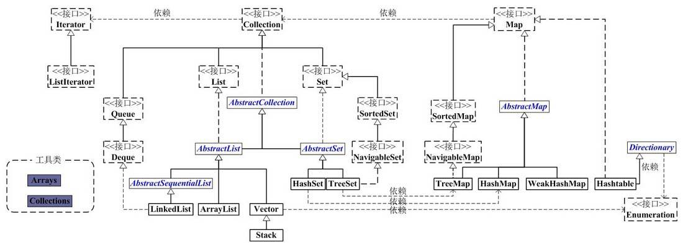

## 概览
Java容器工具包框架图:



两个基本主体，即Collection和Map。

* Collection是一个`接口`，是高度抽象出来的集合，它包含了集合的基本操作和属性。Collection包含了List、Set和Queue三大分支。

* List是一个有序的队列，每一个元素都有它的索引。List的实现类有LinkedList, ArrayList, Vector, Stack。 

* Set是一个不允许有重复元素的集合。 Set的实现类有HastSet和TreeSet。HashSet依赖于HashMap，它实际上是通过HashMap实现的；TreeSet依赖于TreeMap，它实际上是通过TreeMap实现的。

* Queue是一个队列接口，先进先出，Deque接口继承自Queue，实现双端队列，即支持从两个端点方向检索和插入元素。LinkedList既可以作为List来用，也可以作为Deque来用。

* Map是一个映射接口，即key-value键值对。

* AbstractMap是个抽象类，它实现了Map接口中的大部分API。而HashMap，TreeMap，WeakHashMap都是继承于AbstractMap。 Hashtable虽然继承于Dictionary，但它实现了Map接口。

* Iterator是遍历集合的工具。我们说Collection依赖于Iterator，是因为Collection的实现类都要实现iterator()函数，返回一个Iterator对象。ListIterator是专门为遍历List而存在的。

* Enumeration的作用和Iterator一样，也是遍历集合，但是Enumeration的功能要比Iterator少。在上面的框图中，Enumeration只能在Hashtable, Vector/Stack中使用。

* Arrays和Collections分别是操作数组、集合的两个工具类。

## ArrayList
ArrayList是一个动态数组，它允许任何符合规则的元素插入甚至**包括null**。每一个ArrayList都有一个初始容量：

    static final int DEFAULT_CAPACITY = 10;

随着容器中的元素不断增加，容器的大小也会随着增加。在每次向容器中增加元素的同时都会进行容量检查，当快溢出时，就会进行扩容操作。所以如果我们明确所插入元素的多少，最好指定一个初始容量值，避免过多的进行扩容操作而浪费时间、效率。
ArrayList擅长于随机访问，但ArrayList是非同步的。

## LinkedList
LinkedList是一个双向链表，链表不能随机访问，它所有的操作都是要按照双端链表的需要执行。在列表中索引的操作将从开头或结尾遍历列表。链表的好处就是可以通过较低的代价在List中进行插入和删除操作。

与ArrayList一样，LinkedList也是非同步的。如果多个线程同时访问一个List，则必须自己实现访问同步。一种解决方法是使用Collections中的synchronizedList方法将LinkedList转换为一个同步的List。
```java
List list = Collections.synchronizedList(new LinkedList(…))
```

## Vector
与ArrayList相似，但是Vector是同步的。

## Stack
Stack继承自Vector，实现一个后进先出的堆栈。Stack提供几个额外的方法使得Vector得以被当作`堆栈`使用。基本的push和pop方法，还有peek方法得到栈顶的元素，search方法检测一个元素在堆栈中的位置，Stack刚创建后是空栈。

## HashSet
HashSet内部是以HashCode来实现的。集合元素可以是null, 但只能放入一个null。它内部元素的顺序是由哈希码来决定的，所以它不保证set的迭代顺序，特别是它不保证该顺序恒久不变。

## TreeSet
TreeSet是二叉树实现的，内部以TreeMap来实现，不允许放入null值。它是使用元素的自然顺序对元素进行排序。

## LinkedHashSet
LinkedHashSet集合同样是根据元素的hashCode值来决定元素的存储位置，但是它同时使用链表维护元素的次序。这样使得元素看起 来像是以插入顺序保存的，也就是说，当遍历该集合时候，LinkedHashSet将会以元素的添加顺序访问集合的元素。

## HashMap
以哈希表数据结构实现，查找对象时通过哈希函数计算其位置，它是为快速查询而设计的，其内部定义了一个hash表数组（Entry[] table），元素会通过哈希转换函数将元素的哈希地址转换成数组中存放的索引，如果有冲突，则使用散列链表的形式将所有相同哈希地址的元素串起来。
HashMap中，null可以作为键，这样的键只有一个；可以有一个或多个键所对应的value为null。
初始化大小：16
HashMap是非线程安全的，只是用于单线程环境下，多线程环境下可以采用concurrent并发包下的concurrentHashMap。

## HashTable
Hashtable和HashMap比较相似，Hashtable是线程安全的，能用于多线程环境中。Hashtable中，key和value都不允许出现null值。因为和Map实现方式不一样，Hashtable使用Enumeration来遍历。初始化大小：11。

## TreeMap
有序散列表，实现SortedMap接口，底层通过红黑树实现。

## WeakHashMap
以弱键实现的基于哈希表的Map。在 WeakHashMap 中，当某个键不再正常使用时，将自动移除其条目。
像大多数集合类一样，该类是不同步的。

|Class|初始大小|加载因子|扩容倍数|底层实现|是否线程安全|
|---|---|---|---|---|---|
|ArrayList|10|1|1.5倍+1|Object数组|不安全|
|Vector|10|1|2倍|Object数组|安全|
|HashSet|16|0.75f|2倍|HashMap<E,Object>|不安全|
|HashMap|16|0.75f|2倍|Map.Entry|不安全|
|Hashtable|11|0.75f|2倍+1|Hashtable.Entry数组|安全|