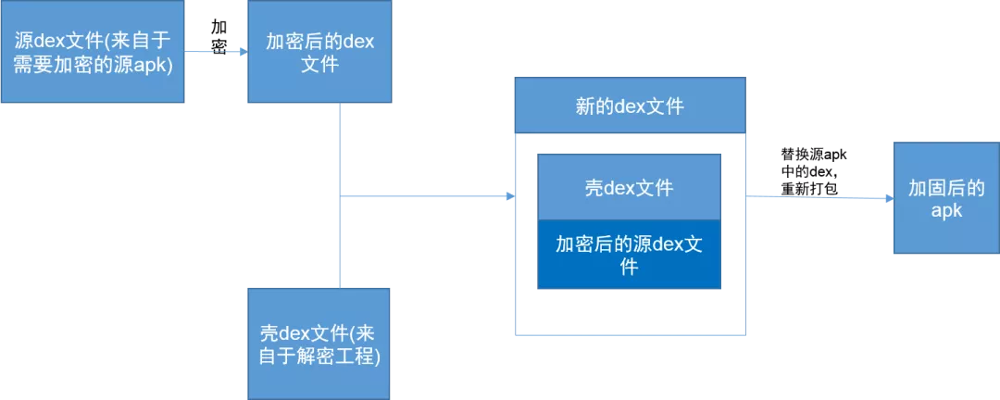
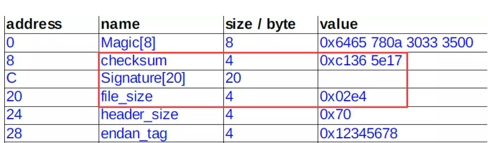
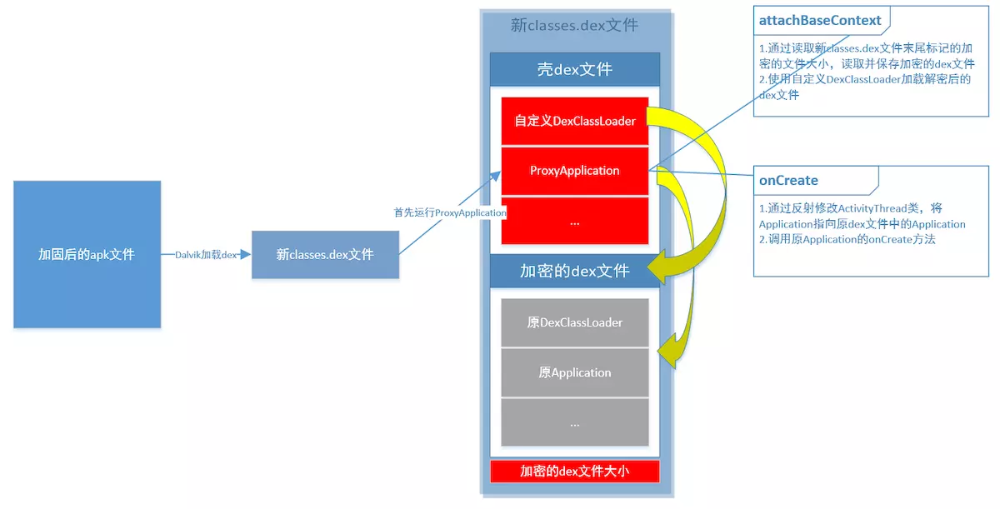
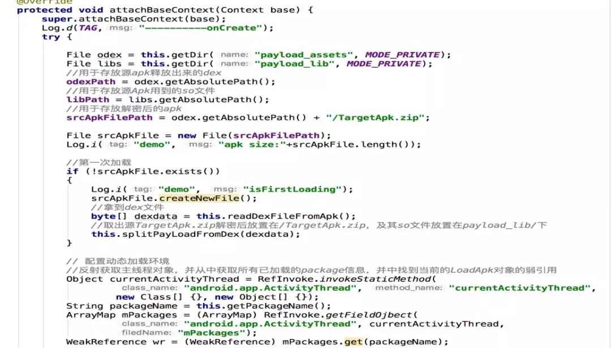
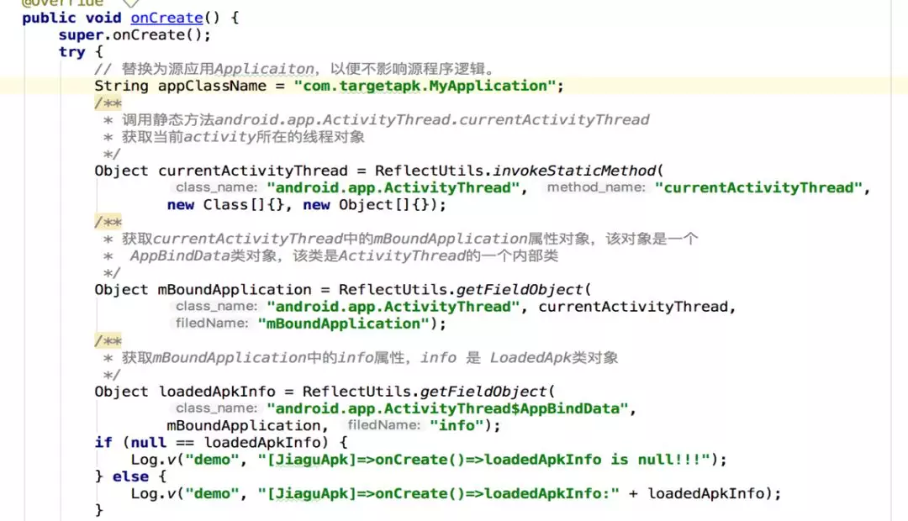

# Dex加固原理

将加密后的原dex追加在壳dex之后，形成新的Dex，其中壳Dex是未加密的，重新签名形成最终apk。

修改Dex，需要同步修改Dex文件头（Header），Dex文件格式如下：

其中Header中三个字段需要注意：

* checksum

    校验码占4bytes，主要用来检查从该字段（不包含checksum字段，也就是从12bytes开始算起）开始到文件末尾的完整性校验。它使用alder32算法。

* signature

    SHA-1签名占20bytes，作用跟checksum一样，也是做完整性校验。之所以有两个完整性校验字段，是由于先使用checksum字段校验可以先快速检查出错的dex文件，然后才使用第二个计算量更大的校验码进行计算检查。

* fileSize

    文件大小占4bytes，保存dex文件总长度

这3个字段当我们修改dex文件的时候，这3个字段的值是需要更新的，否则在加载到虚拟机的时候会报错。

当虚拟机加载经过修改的新的classes.dex文件时，最先运行ProxyApplication类。在这个类里面，有2个关键的方法：attachBaseContext和onCreate方法。

ProxyApplication主要做以下几个工作：

1. 读取classes.dex文件末尾记录加密dex文件大小的数值，则加密dex文件在新classes.dex文件中的位置为：len(新classes.dex文件) – len(加密dex文件大小)。然后将加密的dex文件读取出来，加密并保存到资源目录下。

2. 使用自定义的DexClassLoader加载解密后的原dex文件

3. 通过反射修改ActivityThread类，并将Application指向原dex文件中的Application，创建原Application对象，并调用原Application的onCreate方法启动原程序。

## 核心代码
1. 加固Apk关键代码

2. 壳工程关键代码

attachBaseContext方法，主要作用是程序apk中dex拷贝、解密出源dex放在data/data目录下；设置dex加载目录映射
    

onCreate方法，主要作用替换源应用dex的application，使解密出的源dex正确加载；保证源入口正确，保证原项目正确加载。

## 缺陷
1）首次打开加载慢的问题  
    加固后的工程首次打开会有延时，延时时间会跟源工程的dex大小有关。

（2）安全性问题  
    源dex文件还是会落地，在工程的data/data目录下面，越狱的手机可以直接看到。拿到dex资源，一样可以通过反编译拿到java代码。