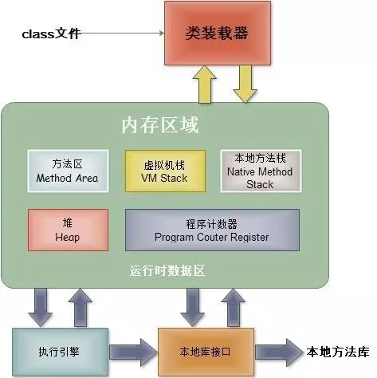
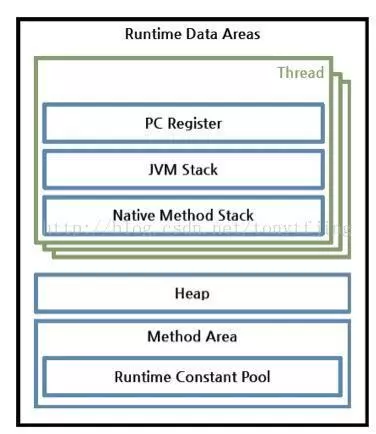
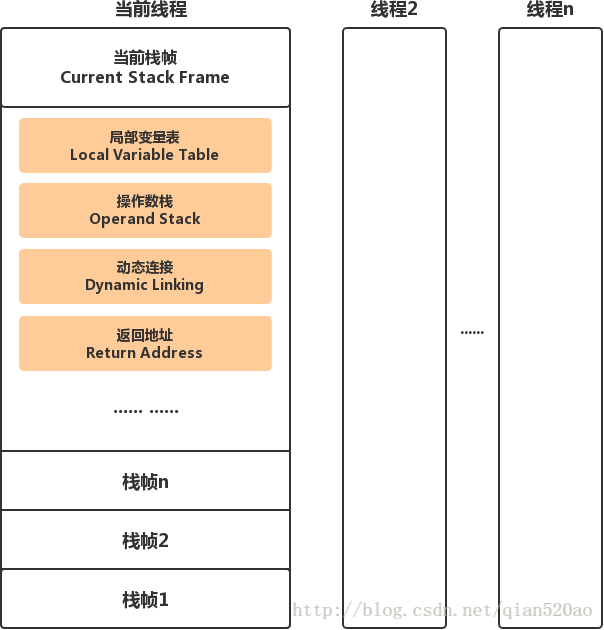

http://guofeng007.com/2018/03/19/jvm/

## JAVA内存模型


1. 类加载器（ClassLoader)  
在JVM启动时或者在类运行时将需要的class加载到JVM中

2. 执行引擎  
负责执行class文件中包含的字节码指令

3. 本地接口  
主要是调用C或C++实现的本地方法

4. 内存区  
内存区主要包含5个部分：  
    * 方法区：存储类结构信息的地方，包括常量池、静态变量、构造函数等，是各个线程共享的内存区域，注意方法区包含一个运行时常量池。

    * Java堆：也叫动态内存，通常使用new来申请分配一个内存，存储java实例或者对象的地方，这块是GC的主要区域。

    * Java栈：java栈总是和线程关联在一起，每当创建一个线程时，JVM就会为这个线程创建一个对应的java栈。在这个java栈中又会包含多个`栈帧`，每运行一个方法就创建一个栈帧，用于存储局部变量表、操作栈、方法返回值等。每一个方法从调用直至执行完成的过程，就对应一个`栈帧`在java栈中入栈到出栈的过程。

    * 本地方法栈：和java栈的作用差不多，只不过是为JVM使用到的native方法服务的
    
    * 程序计数器：用于保存当前线程执行的内存地址。由于JVM程序是多线程执行的（线程轮流切换），所以为了保证线程切换回来后，还能恢复到原先状态，就需要一个独立的计数器，记录之前中断的地方，程序计数器也是线程私有的。因为使用很小的内存空间，它是唯一一个在Java虚拟机规范中没有规定任何OutOfMemoryError情况的区域。



一个栈帧需要分配多少内存是在编译期间就完成分配的，栈帧的数据结构主要分为四个部分：
* 局部变量表  
当方法被调用时，参数会传递到从0开始的连续的局部变量表的索引位置上。栈帧中局部变量表的长度存储在类或接口的二进制表示中。阅读Class文件会找到Code属性，所以能知道local variables的最大长度是在编译期间决定的。一个局部变量表的占用了`32位`的存储空间，所以可以存储一个boolean、byte、char、short、float、int、refrence和returnAdress数据，`long和double需要2个连续的局部变量`表来保存，通过较小位置的索引来获取。如果被调用的是实例方法，那么第0个位置存储"this"关键字代表当前实例对象的引用。
* 操作数栈  
操作数栈同局部变量表一样，也是编译期间就能决定了其存储空间（最大的单位长度），通过 Code属性存储在类或接口的字节流中。操作数栈也是个LIFO栈。操作数栈是在JVM字节码执行一些指令时创建的，主要是把局部变量表中的变量压入操作数栈，在操作数栈中进行字节码指令的操作，再将变量出操作数栈，结果入操作数栈。同局部变量表，除了long和double，其他类型数据都只占用一个栈的单位深度。
* 动态链接  
每个栈帧指向运行时常量池中该栈帧所属的方法的引用，也就是字节码的发放调用的引用。动态链接就是将符号引用所表示的方法，转换成方法的直接引用。
* 方法返回地址  
方法正常退出，JVM执行引擎会恢复上层方法局部变量表操作数栈并把返回值压入调用者的栈帧的操作数栈，PC计数器的值就会调整到方法调用指令后面的一条指令。这样使得当前的栈帧能够和调用者连接起来，并且让调用者的栈帧的操作数栈继续往下执行。方法的异常调用完成，主要是JVM抛出的异常，如果异常没有被捕获住，或者遇到athrow字节码指令显示抛出，那么就没有返回值给调用者。




## 垃圾回收
JVM通过GC机制（内存垃圾回收）来释放回收堆和方法区中的内存，这个过程是自动执行的。GC会从根节点（GC Roots）开始对堆内存进行遍历，没有直接或者间接引用到根节点的就是需要回收的垃圾，会被GC回收掉。


哪些对象可以作为GC Roots呢？

* 栈帧（第一章的名词）中的引用对象。（栈中的）
* 静态属性引用的对象。（方法区中的）
* 常量引用的对象。（方法区中的）
* 本地方法栈中JNI引用的对象。（本地方法栈中的）
* 运行中的线程

虚拟机采用两次标记来判定对象最终是否需要被回收。

第一次标记所有不可达对象，同时筛选出一部分对象，筛选条件是这部分对象重写了`finalize`方法，且该方法还没有被执行，筛选出来的这部分对象会被加入F-Queue中，稍后进行第二轮标记，剩下未被帅选出来的，则直接判定为可回收。

第二轮标记由一个虚拟机自己建立的低优先级的 `Finalizer` 线程去执行，它会首先逐一执行 F-Queue 中每个对象的 `finalize()` 方法，然后再进行一轮标记，如果对象未能在`finalize()`方法中拯救自己，则经过这轮标记后，对象也就被判定为可回收。

垃圾回收算法

* 标记-清除算法

  先标记需要回收的对象，然后原地清除标记的对象，缺点：产生大量不连续的内存碎片

* 复制算法

  将可用内存化为两块，每次只用其中一块，当要回收的时候，把可用的对象复制到另外一块，然后把原先那块一次性清理掉，可以说在效率上大大的提高，但有个致命的缺点就是可用内存减半。广泛用于新生代内存，因为存活的对象通常比较少，复制算法效率高。

* 标记整理算法

  将存活的对象整理移动到内存的一端，使他们紧凑排列，不留空白，是标记-清除算法的一种改进，因为该算法复制的次数较少，广泛应用在老年代中。

* 分代收集算法

  新生代分为一个 Eden区和两个Survivor区。一个对象new出来后会在Eden Space（伊甸园），直到GC后如果还存活着就会被移到Survivor Space（幸存者区），如果是大对象，Survivor Space区存放不了，就直接进入老年区。

  Survivor Space有两个区，一个是from Survivor（生活区）,一个是to Survivor（无人区）。GC每次扫描from Survivor区后会将存活对象移入to Survivor区，此时from Survivor变为无人区，to Survivor变为生活区，(两者功能交换了)，如此反复，经历过15次(假设)GC仍还存活的对象，会被晋升到老年区。


`Minor GC`是指新生代的垃圾收集，当`Eden`区被对象填满时，就会执行`Minor GC`, 主要采用`标记 - 复制算法`。

`Old GC`是指老年代GC，主要采用`标记整理算法`。

`Full GC`是针对整个新生代、老生代的全局范围的GC，采用`分代收集算法`。

## Dalvik中GC的原理
在Dalvik虚拟机中定义了四种触发GC的条件（参看Heap.h）：  
> * GC_CONCURRENT，当Heap的使用率达到某一阈值时自动触发。
> * GC_FOR_MALLOC，当Heap没有足够的空间用于容下新创建的对象时。
> * GC_EXPLICIT，用户主动调用GC时。
> * GC_BEFORE_OOM，当要发生OOM时系统尝试进行最后GC的努力。

GC_CONCURRENT 和 GC_EXPLICIT 是并行的，GC过程中应用不会被暂停，只在GC开始和结束时会暂停应用，每次暂停的时间比较短，一般只有3~4ms。  
GC_FOR_MALLOC是非并行的，GC过程中应用被暂停，耗时比较长，可能几十毫秒也可能几百毫秒。在应用向Dalvik申请内存时，Dalvik先检查当前Heap中有无足够的空余空间用来安排对象，当发现没有足够的空间的时候会先进行 GC_FOR_MALLOC 以试图释放垃圾对象来获取新的空间，如果发现空间还不够则进行Heap的增长。  
在每次成功分配完新的空间后，Dalvik会检查当前Heap的使用情况，如果使用空间超过一定的阈值的时候，GC_CONCURRENT就会触发。

## Art中GC的原理
与Dalvik不同，ART不会log非显式（隐式）请求的GC，GC只会在被判定为很慢时输出信息。更准确地，条件是GC停顿超过5ms，或者GC耗时超过100ms。如果app不是处于一种可察觉的停顿状态，那么GC不会就被判定为很慢，而显式GC会被log出来

引起GC原因:  
* `Concurrent`  
    并发GC，不会使App的线程暂停，该 GC 是在后台线程运行的，并不会阻止内存分配。   
* `Alloc`  
    当堆内存已满时，App尝试分配内存而引起的GC，这个GC会发生在正在分配内存的线程。  
* `Explicit`  
    App显示的请求垃圾收集，例如调用System.gc()。与Dalvik一样，最佳做法是应该信任GC并避免显示的请求GC，显示的请求GC会阻止分配线程并引起不必要的 CPU 周期。如果显式的请求GC导致其他线程被抢占，那么显式GC会导致jank。  
    P.S.jank是指第n帧绘制过后，本该绘制第n+1帧，但因为CPU被抢占，数据没有准备好，只好再显示一次第n帧，下一次绘制时显示第n+1帧。  
* `NativeAlloc`  
    Native内存分配时，比如为Bitmap或者RenderScript分配对象，这会导致Native内存压力，从而触发GC。  
* `CollectorTransition`  
    由堆转换引起的回收，这是运行时切换GC而引起的。收集器转换包括将所有对象从空闲列表空间复制到碰撞指针空间（反之亦然）。当前，收集器转换仅在以下情况下出现：在内存较小的设备上，App将进程状态从可察觉的暂停状态变更为可察觉的非暂停状态（反之亦然）。  
* `HomogeneousSpaceCompact`  
    齐性空间压缩是指空闲列表到压缩的空闲列表空间，通常发生在当App已经移动到可察觉的暂停进程状态。这样做的主要原因是减少了内存使用并对堆内存进行碎片整理。  
* `DisableMovingGc`  
    不是真正的触发GC原因，发生并发堆压缩时，由于使用了 GetPrimitiveArrayCritical，收集会被阻塞。一般情况下，强烈建议不要使用。  
* `HeapTrim`  
    不是触发GC原因，但是请注意，收集会一直被阻塞，直到堆内存整理完毕。  

GC_Name指的是垃圾收集器名称，有以下几种：

* `Concurrent mark sweep (CMS)`  
    CMS收集器是一种以获取最短收集暂停时间为目标收集器，采用了标记-清除算法（Mark-Sweep）实现。 它是完整的堆垃圾收集器，能释放除了Image Space之外的所有的空间。
* `Concurrent partial mark sweep`
    部分完整的堆垃圾收集器，能释放除了Image Space和Zygote Spaces之外的所有空间。
* `Concurrent sticky mark sweep`
    分代收集器，它只能释放自上次GC以来分配的对象。这个垃圾收集器比一个完整的或部分完整的垃圾收集器扫描的更频繁，因为它更快并且有更短的暂停时间。
* `Marksweep + semispace`  
    非并发的，复制堆过渡和homogeneous space compaction（用来整理heap碎片）使用的GC。

其他信息: 
* `Objects freed`  
    本次GC从非Large Object Space中回收的对象的数量。
* `Size_freed`  
    本次GC从非Large Object Space中回收的字节数。
* `Large objects freed`  
    本次GC从Large Object Space中回收的对象的数量。
* `Large object size freed`  
    本次GC从Large Object Space中回收的字节数。
* `Heap stats`  
    堆的空闲内存百分比 （已用内存）/（堆的总内存）。
* `Pause times`  
    暂停时间，暂停时间与在GC运行时修改的对象引用的数量成比例。目前，ART的CMS收集器仅有一次暂停，它出现GC的结尾附近。移动的垃圾收集器暂停时间会很长，会在大部分垃圾回收期间持续出现。

```
Explicit concurrent mark sweep GC freed 104710(7MB) AllocSpace objects, 21(416KB) LOS objects, 33% free, 25MB/38MB, paused 1.230ms total 67.216ms
```
这个GC日志的含义为：引起GC原因是Explicit；垃圾收集器为CMS收集器；释放对象的数量为104710个，释放字节数为7MB；释放大对象的数量为21个，释放大对象字节数为416KB；堆的空闲内存百分比为33%，已用内存为25MB，堆的总内存为38MB；GC暂停时长为1.230ms，GC总时长为67.216ms。

如果在logcat看到一堆GC信息，找到heap stats（例子中是25MB/38MB），如果持续增长从不减小，就可能存在内存泄漏。如果看到GC的原因是Alloc，那么说明heap已经要满了，快OOM了。

## Android虚拟机有分代GC吗？
Android Q开始google才为ART虚拟机添加分代收集机制。
https://zhuanlan.zhihu.com/p/24835977
http://www.cnxiaocheng.top/tag/Android-Q-%E6%94%B9%E8%BF%9B%E4%BA%86ART/
https://www.jianshu.com/p/c0450ce6d3a6


其他GC文档：<https://cruise1008.github.io/2016/03/30/Android-GC-%E4%BB%8Edalvik%E5%88%B0ART%E7%9A%84%E6%94%B9%E8%BF%9B%E5%88%86%E6%9E%90/>