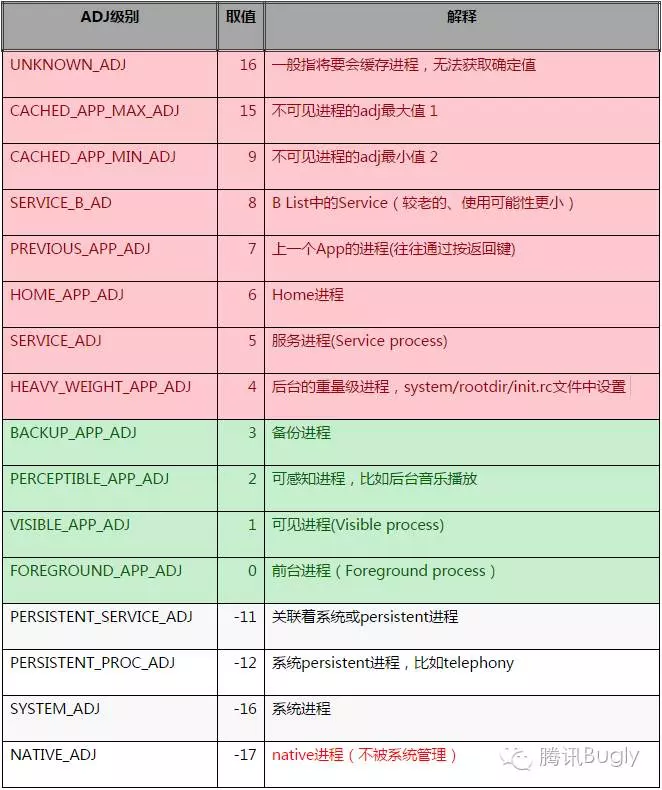

## OOM_ADJ
系统的LowMemoryKiller杀死应用的策略会参考应用的 oom_adj 值和 oom_score ，oom_adj 代表了应用进程的优先级，数值越小，oom_adj 值越小，优先级越高，进程越不轻易被杀死。当 oom_adj 的值大于等于4时是比较容易被杀死的进程，0-3表示不容易被杀死的进程，小于0的为非Android进程（纯 Linux 进程）尤其是-17的 Native 进程不受系统管理不会被系统杀死。
oom_score 这个值来最终决定哪个进程被Kill的，这个值是系统综合进程的内存消耗量、CPU时间、存活时间和oom_adj计算出的，消耗内存越多分越高，存活时间越长分越低。

使用一下命令，可以观察应用的oom_adj值和oom_score值
```
cat /proc/<进程id>/oom_adj
cat proc/<进程id>/oom_score
```
oom参考值


## 目的
应用保活涉及两个方向：
* 如何保证不被杀死
* 如何在被杀死后拉活

## 保命
1. 灭屏后，启动1像素activity到前台；搞小动作
2. 开启前台服务，startForground，使用系统漏洞可在4.3 ~ 7.0上实现无通知；有限制
3. 让用户手动把应用加白名单，微信这种默认在白名单；一劳永逸
4. 双服务守护，双向bind，一个服务被杀时，另一个服务立即救起；难兄难弟
5. 空音频，循环播放一段无声的音乐；容易被看出来

## 复活
1. 使用粘性服务，onStartCommand返回START_STICKY，意外被杀时，系统会计划重启当前service，具体时间不定
2. Jobscheduler，每隔一段时间拉活自身进程
3. 使用账号同步机制，一般每隔15分钟，系统会启动一次账号同步，会拉活应用账号服务
4. 系统广播唤醒/第三方应用已知广播(如友盟、个推SDK)唤醒/全家桶相互唤醒，高版本上限制越来越多，可利用广播很少
5. 系统推送服务保活，使用透传模式
6. Native守护进程，使用Linux系统fork出一个进程，观察主进程(可使用文件锁机制或socket)，主进程被杀时，使用am命令拉活，只适用于于5.0版本以下，5.0之上，守护进程也会被杀。


