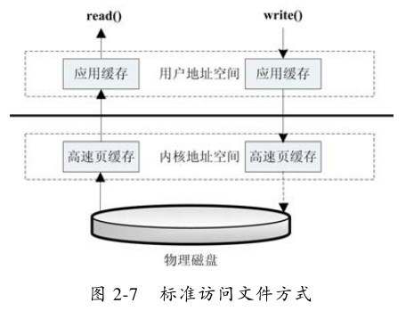
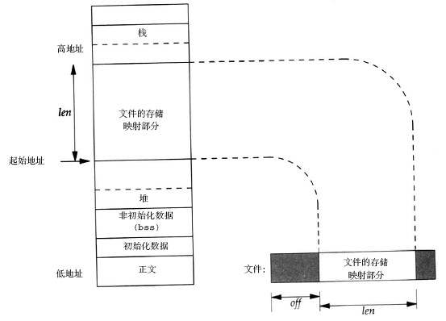

# 概念：
mmap即内存映射，mmap可以将文件的部分或全部映射到内存地址空间，操作系统负责获取页面请求和写入文件，应用程序就只需要处理内存数据，这样的文件称之为“内存映射文件”。简而言之就是通过mmap，对文件的读写操作直接变成了对内存的读写操作。

# 优点：
1、高效IO：内存映射文件比通过普通的IO来访问文件要快的多(主要针对大文件)。

2、可靠性：内存与文件之间的同步是由操作系统完成的，即操作系统负责真正的文件读写，即使你的程序在刚刚写入内存后就挂了，操作系统仍然会将内存中的数据写入文件系统。

3、共享内存：在进程间提供共享内存，内存映射文件可以被多个进程同时访问。

# 优点解释：
1、高效IO

标准文件操作为了提高读写效率和保护磁盘，使用了页缓存机制。读文件时需要先将文件页从磁盘拷贝到页缓存中，由于页缓存处在内核空间，不能被用户进程直接寻址，所以还需要将页缓存中数据页再次拷贝到内存对应的用户空间中。这样，通过了两次数据拷贝过程，才能完成进程对文件内容的获取任务。写操作也是一样，待写入的buffer在内核空间不能直接访问，必须要先拷贝至内核空间对应的主存，再写回磁盘中，也是需要两次数据拷贝。


而使用mmap操作文件中，操作系统将物理内存中的某一块区域与磁盘中的文件关联起来，当要访问内存中的一段数据时，转换为访问文件的某一段数据。这种方式的目的是减少了数据从内核空间缓存到用户空间缓存的数据复制操作，因为这两个空间的数据是共享的。即使发现内存中并无数据而发生缺页异常，通过已经建立好的映射关系，也只使用一次数据拷贝就从磁盘中将数据传入内存的用户空间中。因此对于内核空间 <----> 用户空间两者之间需要大量数据传输等操作的话效率是非常高的。


以下是一个把普遍文件映射到用户空间的虚拟内存区域的示意图：


实质上用户空间和内核空间的数据指向的是同一块物理内存区域，如下图：


2、可靠性

根据官方文档描述，mmap的数据写回主要有如下时机：

* 系统内存不足时
* 进程crash时
* 主动调用msync时
* 用户修改了内存映射空间，相关页会自动标记为脏数据，随后会刷新到磁盘。

从这一点看采用mmap的方式相比常规IO操作也有更强的可靠性。

3、共享内存：

用于内存映射文件的虚拟内存在Java的堆栈空间以外，由于不同进程的文件缓冲区映射为同一块内核文件存储空间，因此多个进程可以实现内存共享。  


# 应用场景：
1、进程间通信

由于mmap可以实现共享内存，因此不同进程可以对同一块内存进行读写，可以通过特殊文件提供匿名内存映射来实现进程间的数据传输。

2、文件的高效读写

数据的持久化可以使用数据库，也可以使用普通文件。使用数据库可以享受到结构化存储、事物、数据迁移、回滚等服务 ，如果对这些没要求，那么对那些不太重要的、但是访问量又很大、读写操作多且需要持久化功能的数据最适合使用mmap功能的，最常见的比如日志。

# 代码
## 1、C实现

mmap用于内存映射，接口声明如下：
```c++
#include <sys/mman.h>
void *mmap(void *start, size_t length, int prot, int flags, int fd, off_t offset);
```
具体参数含义

* `start`： 映射区的开始地址，通常设为 NULL，代表让系统自动选定地址，映射成功后返回该地址。
* `length`： 映射区的长度。
* `port`：  映射区域的保护方式，可以为以下几种方式的组合：

        PROT_EXEC ：页内容可以被执行
        PROT_READ ：页内容可以被读取
        PROT_WRITE ：页可以被写入
        PROT_NONE ：页不可访问

* `flags`：  指定映射对象的类型，映射选项和映射页是否可以共享，它的值可以是一个或者多个以下位的组合体，使用时必须要指定MAP_SHARED或MAP_PRIVATE。

        MAP_FIXED 如果参数start所指的地址无法成功建立映射时，则放弃映射，不对地址做修正。通常不鼓励用此旗标。
        MAP_SHARED 对映射区域的写入数据会复制回文件内，而且允许其他映射该文件的进程共享。
        MAP_PRIVATE 对映射区域的写入操作会产生一个映射文件的复制，即私有的“写入时复制”（copy on write）对此区域作的任何修改都不会写回原来的文件内容。
        MAP_ANONYMOUS 建立匿名映射。此时会忽略参数fd，不涉及文件，而且映射区域无法和其他进程共享。
        MAP_DENYWRITE 只允许对映射区域的写入操作，其他对文件直接写入的操作将会被拒绝。
        MAP_LOCKED 将映射区域锁定住，这表示该区域不会被置换（swap）。

* `fd`：  要映射到内存中的文件描述符。如果使用匿名内存映射时，即flags中设置了MAP_ANONYMOUS，为了兼容问题，fd应设为-1。有些系统不支持匿名内存映射，则可以使用fopen打开/dev/zero文件，然后对该文件进行映射，可以同样达到匿名内存映射的效果。

* `offset`：文件映射的偏移量，通常设置为0，代表从文件最前方开始对应，offset必须是PAGE_SIZE的整数倍。

* 返回值：若映射成功则返回映射区的内存起始地址，否则返回MAP_FAILED(－1)，错误原因存于errno 中。

用户层的调用很简单，其具体功能就是直接将物理内存直接映射到用户虚拟内存，使用户空间可以直接对物理空间操作。

`munmap`用于解除映射，接口声明如下：
```c++
int munmap( void * addr, size_t len )
```
* `addr`是调用mmap()时返回的地址
* `len`是映射区的大小

成功执行时，munmap()返回0。失败时，munmap返回-1，error返回标志和mmap一致；

`msync`用于强制同步，接口声明如下：
```c++
int msync( void *addr, size_t len, int flags )
```
一般说来，进程在映射空间的对共享内容的改变并不直接写回到磁盘文件中，往往在调用munmap()后才执行该操作。使用过程中可以通过调用msync()实现磁盘上文件内容与共享内存区的内容一致。

* `addr`：文件映射到进程空间的地址；
* `len`：映射空间的大小；
* `flags`：刷新的参数设置，可以取值MS_ASYNC/ MS_SYNC/ MS_INVALIDATE

        MS_ASYNC（异步）：调用会立即返回，不等到更新的完成；
        MS_SYNC（同步）：调用会等到更新完成之后返回；
        MS_INVALIDATE（通知使用该共享区域的进程，数据已经改变）：在共享内容更改之后，使得文件的其他映射失效，从而使得共享该文件的其他进程去重新获取最新值；

* 返回值 成功则返回0，失败则返回-1  


代码举例:
```c++
#include <iostream>
#include <sys/mman.h>
#include <unistd.h>
#include <stdlib.h>
#include <stdio.h>
 
int main(int argc, const char * argv[]) {
    //申请内存
    int* arr = static_cast<int*>(
      					mmap(NULL,                   //分配的首地址
                    getpagesize(),          //分配内存大小(必须是页的整数倍, 32位1页=4k)
                    PROT_READ | PROT_WRITE, //映射区域保护权限：读|写
                    MAP_ANONYMOUS | MAP_SHARED,  //匿名映射(不涉及文件)
                    -1,                      //要映射到内存中的文件描述符
                    0                       //文件映射的偏移量，通常设置为0，必须是页的整数倍
                ));
    printf("申请内存大小=%dk\n", sizeof(arr));
    
    //写入内存
    *arr = 10;
    *(arr + 1) = 20;
    *(arr + 2) = 30;
    
    printf("arr[2]=%d\n", arr[2]);
    
    //释放指针arr指向的内存区域，并制定释放的内存大小
    munmap(arr, getpagesize());
    return 0;
}
```

## 2、Java实现
MappedByteBuffer是java nio引入的文件内存映射方案。

FileChannel提供了map方法来把文件映射为内存映像文件，可以把文件的从position开始的size大小的区域映射为内存映像文件，mode指出了可访问该内存映像文件的方式。
```java
MappedByteBuffer map(int mode, long position, long size); 
```
mode有三种取值：

* READ_ONLY（只读）： 试图修改得到的缓冲区将导致抛出异常ReadOnlyBufferException.(MapMode.READ_ONLY)。

* READ_WRITE（读/写）： 对得到的缓冲区的更改最终将传播到文件；该更改对映射到同一文件的其他程序不一定是可见的。

* PRIVATE（专用）： 对得到的缓冲区的更改不会传播到文件，并且该更改对映射到同一文件的其他程序也不是可见的；相反，会创建缓冲区已修改部分的专用副本。

代码举例：
```java
public static void main(String[] args) throws Exception {
        RandomAccessFile raf = new RandomAccessFile(new File("/Users/qylk/Downloads/test2.apk"), "rw");
        FileChannel fc = raf.getChannel();
        MappedByteBuffer mbb = fc.map(FileChannel.MapMode.READ_WRITE, 0, fc.size());//内存映射
        byte[] buf = new byte[(int) fc.size()];
        mbb.get(buf);//全部读取
  			
  			//改写前128个字节
        for (int i = 0; i < 128; i++) {
            buf[i] = (byte) i;
        }
        mbb.position(0);//文件指针回到原点
        mbb.put(buf);//写回文件
        fc.close();
}
```