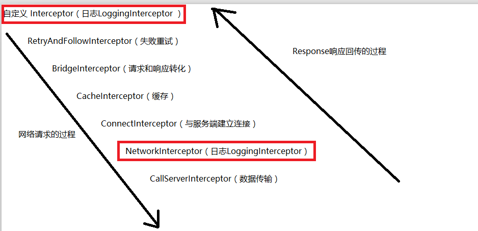
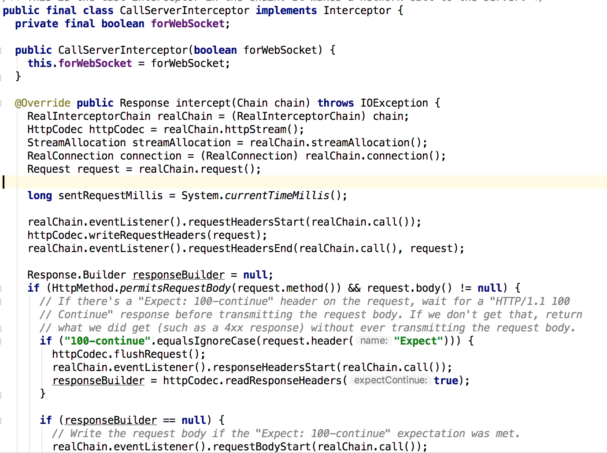

## 关键流程
```java
Response getResponseWithInterceptorChain() throws IOException {
    // Build a full stack of interceptors.
    List<Interceptor> interceptors = new ArrayList<>();
    // 在配置 OkHttpClient 时设置的 interceptors；
    interceptors.addAll(client.interceptors());
    // 负责失败重试以及重定向
    interceptors.add(retryAndFollowUpInterceptor);
    // 请求时，对必要的Header进行一些添加，接收响应时，移除必要的Header
    interceptors.add(new BridgeInterceptor(client.cookieJar()));
    // 负责读取缓存直接返回、更新缓存
    interceptors.add(new CacheInterceptor(client.internalCache()));
    // 负责和服务器建立连接
    interceptors.add(new ConnectInterceptor(client));
    if (!forWebSocket) {
        // 配置 OkHttpClient 时设置的 networkInterceptors
        interceptors.addAll(client.networkInterceptors());
    }
    // 负责向服务器发送请求数据、从服务器读取响应数据
    interceptors.add(new CallServerInterceptor(forWebSocket));

    Interceptor.Chain chain = new RealInterceptorChain(interceptors, null, null, null, 0,
        originalRequest, this, eventListener, client.connectTimeoutMillis(),
        client.readTimeoutMillis(), client.writeTimeoutMillis());

    // 使用责任链模式开启链式调用
    return chain.proceed(originalRequest);
}

// StreamAllocation 对象，它相当于一个管理类，维护了服务器连接、并发流
// 和请求之间的关系，该类还会初始化一个 Socket 连接对象，获取输入/输出流对象。
public Response proceed(Request request, StreamAllocation streamAllocation, HttpCodec httpCodec,
  RealConnection connection) throws IOException {
    ...

    // Call the next interceptor in the chain.
    // 实例化下一个拦截器对应的RealIterceptorChain对象
    RealInterceptorChain next = new RealInterceptorChain(interceptors, streamAllocation, httpCodec,
        connection, index + 1, request, call, eventListener, connectTimeout, readTimeout,
        writeTimeout);
    // 得到当前的拦截器
    Interceptor interceptor = interceptors.get(index);
    // 调用当前拦截器的intercept()方法，并将下一个拦截器的RealIterceptorChain对象传递下去,最后得到响应
    Response response = interceptor.intercept(next);

    ...

    return response;
}
```



interceptors和networkInterces在责任链中的位置不同，他们能做的事情也就不同了。比如，如果我们要对服务端返回的数据做自定义缓存就应该在interceptors中处理，而如果我们想控制网络请求的创建连接等就应该在networkInterceptor中处理了。

最后一个关键的Interceptor是CallServerInterceptor，真正完成对服务端的请求。



HTTP协议的构建和解析由HttpCodec完成。HttpCodec的实现类有Http1Codec和Http2Codec，分别代表HTTP1.1和HTTP1.2协议的实现。

HTTP信息流传输是最终是靠socket实现的。

<https://jsonchao.github.io/2018/12/01/Android%E4%B8%BB%E6%B5%81%E4%B8%89%E6%96%B9%E5%BA%93%E6%BA%90%E7%A0%81%E5%88%86%E6%9E%90%EF%BC%88%E4%B8%80%E3%80%81%E6%B7%B1%E5%85%A5%E7%90%86%E8%A7%A3OKHttp%E6%BA%90%E7%A0%81%EF%BC%89/>


## 连接池复用
频繁的进行建立Sokcet连接（TCP三次握手）和断开Socket（TCP四次分手）是非常消耗网络资源和浪费时间的，HTTP中的keepalive连接对于 降低延迟和提升速度有非常重要的作用。复用连接就需要对连接进行管理，这里就引入了连接池的概念。Okhttp支持5个并发KeepAlive，默认链路生命为5分钟(链路空闲后，保持存活的时间)，连接池有ConectionPool实现，对连接进行回收和管理。

在timeout空闲时间内，连接不会关闭，相同重复的request将复用原先的connection，减少握手的次数，大幅提高效率。
> 并非keep-alive的timeout设置时间越长，就越能提升性能。长久不关闭会造成过多的僵尸连接和泄露连接出现。
```java
    //默认每个地址的最大连接数是5个
    //默认每个连接的存活时间为5分钟
    public ConnectionPool() {
        this(/*maxIdleConnections*/5, /*keepAliveDuration*/5, TimeUnit.MINUTES);
    }
```
参考：<https://sufushi.github.io/2018/01/26/OkHttp%E6%A1%86%E6%9E%B6%E6%BA%90%E7%A0%81%E8%A7%A3%E6%9E%90%EF%BC%88%E4%BA%94%EF%BC%89/>


