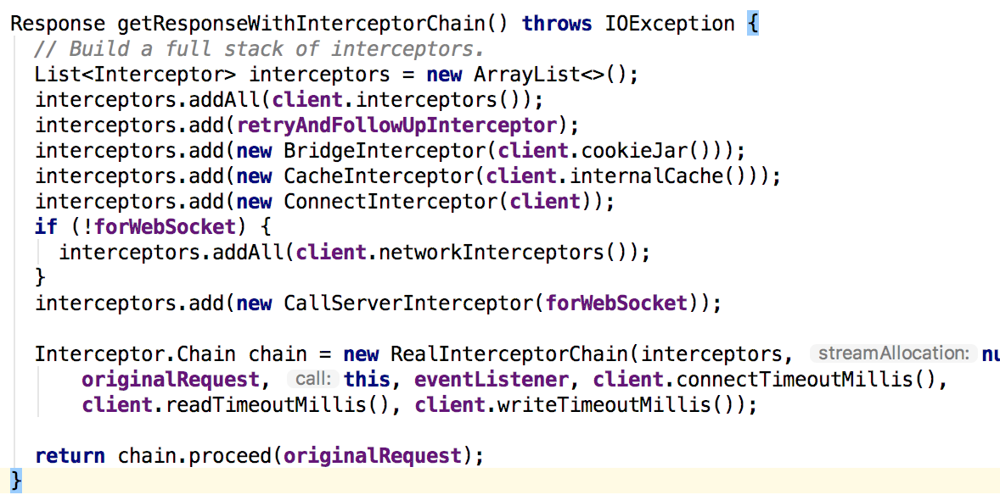

## 关键流程

interceptors和networkInterces在责任链中的位置不同，他们能做的事情也就不同了。比如，如果我们要对服务端返回的数据做自定义缓存就应该在interceptors中处理，而如果我们想控制网络请求的创建连接等就应该在networkInterceptor中处理了。

最后一个关键的Interceptor是CallServerInterceptor，真正完成对服务端的请求。

HTTP协议的构建和解析由HttpCodec完成。HttpCodec的实现类有Http1Codec和Http2Codec，分别代表HTTP1.1和HTTP1.2协议的实现。

HTTP信息流传输是最终是靠socket实现的。