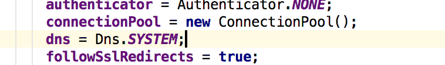
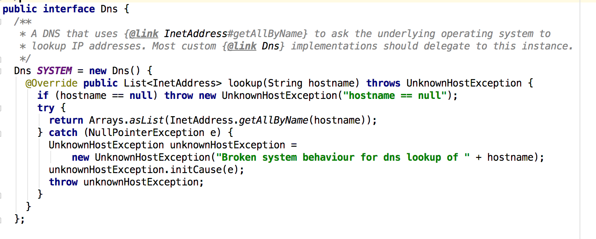

## HTTP DNS
HTTP DNS通过将域名查询请求放入HTTP中的一种域名解析方式，而不用系统自带的libc库去查询运营商的DNS服务器，有较大的自由度。

HTTP DNS的主要优点：

* 能够准确地将站点解析到离用户最近的CDN站点，方便进行流量调度
* 解决部分运营商DNS无法解析国外站点的问题
* TCP在一定程度可以防止UDP无校验导致的DNS欺诈（比如墙，运营商广告，404导航站）

## OKHTTP-DNS
OkHttp默认使用系统DNS接口查找ip




可见是使用的是InetAddress.getAllByName的系统接口。

Android DNS 核心代码都在bionic/libc/netbsd中
> NetBSD是一个完全开放源代码的类UNIX系统，Android挪用了其中DNS相关的代码。

Android下native DNS查询过程

    //JDK层调用
    InetAddress.lookupHostByName()(InetAddress.java);
    Libcore.os.android_getaddrinfo(InetAddress.java)
    //framework下调用
    libcore.io.ForwardingOs.getaddrinfo(ForwardingOs.java)
    //framework层
    libcore.io.Posix.getaddrinfo(Posix.java)
    //JNI层，此方法为java的代理
    Posix_android_getaddrinfo(Posic.cpp)
    //调用BIONIC的libc标准库
    android_getaddrinfofornet(getaddinfo.c)
    android_getaddrinfofornetcontext(getaddinfo.c)
    ...

    发送socket包...

## DNSPod
使用HTTP DNS可防止DNS遭运营商劫持，比如鹅厂dnsPod 服务：
```
http://119.29.29.29/d?dn=www.dnspod.cn
```
请求以上地址，就会直接返回www.dnspod.cn的ip地址。

我们可以给OKHTTP自定义DNS查询接口，实现Dns接口
```java
static Dns HTTP_DNS =  new Dns(){
  @Override public List<InetAddress> lookup(String hostname) throws UnknownHostException {
    if (hostname == null) throw new UnknownHostException("hostname == null");
    //dnspod提供的dns服务
    HttpUrl httpUrl = new HttpUrl.Builder().scheme("http")
        .host("119.29.29.29")
        .addPathSegment("d")
        .addQueryParameter("dn", hostname)
        .build();
    Request dnsRequest = new Request.Builder().url(httpUrl).get().build();
    try {
      String s = getHTTPDnsClient().newCall(dnsRequest).execute().body().string();
      //避免服务器挂了却无法查询DNS
      if (!s.matches("\\b(?:\\d{1,3}\\.){3}\\d{1,3}\\b")) {
        return Dns.SYSTEM.lookup(hostname);
      }
      return Arrays.asList(InetAddress.getAllByName(s));
    } catch (IOException e) {
      return Dns.SYSTEM.lookup(hostname);
    }
  }
}
```

针对以上DNS请求单独维护一个最简单HttpClient，DNSPod在返回的Header中，没有设置缓存，并主动断开了Socket连接，这样的话每次进行lookup时都会进行一个GET请求。DNS默认的TTL时间一般是 `600s` ，如果远程DNS服务没有返回缓存设置(header)，可通过在返回的response中加入`Cache-Control`的Header就可以实现再第二次lookup时避免再次访问网络。

```java
public OkHttpClient getHTTPDnsClient() {
  if (httpDnsclient == null) {
    final File cacheDir = getExternalCacheDir();
    httpDnsclient = new OkHttpClient.Builder()
        .addNetworkInterceptor(new Interceptor() {
          @Override public Response intercept(Chain chain) throws IOException {
            Response originalResponse = chain.proceed(chain.request());
            return originalResponse.newBuilder()
                //在返回header中加入缓存消息，下次将不再发送请求
                .header("Cache-Control", "max-age=600").build();
          }
        })
        .cache(new Cache(new File(cacheDir, "httpdns"), 5 * 1024 * 1024))//5MB的文件缓存
        .build();
  }
  return httpDnsclient;
}
```
构建OkHttpClient时对DNS进行配置就ok了。
```java
//真正的调用客户端，供Retrofit与Picasso使用
static public synchronized OkHttpClient getClient() {
  if (client == null) {
    final File cacheDir = GlobalContext.getInstance().getExternalCacheDir();
    client = new OkHttpClient.Builder()
        .cache(new Cache(new File(cacheDir, "okhttp"), 60 * 1024 * 1024))
        //配置DNS查询实现
        .dns(HTTP_DNS)
        .build();
  }
  return client;
}
```
