优点：链式调用，保持代码清晰整洁

要素：

* 被观察者（Observable）
* 观察者（Observer）
* 订阅（subscribe）

参考书籍：

1. RxJava Essentials 中文翻译（适合入门看，简单易懂）
2. 给 Android 开发者的 RxJava 详解（入门级，文风幽默）
3. ReactiveX文档中文翻译（文档级，适合当参考）
4. Interactive diagrams of Rx Observables（Rx序列操作可视化示意图）


## 源码分析：
下面分三个部分对RxJava进行分析：  
1、创建被观察者过程。  
2、订阅过程。  
3、线程切换。  

1.创建被观察者  
```java
Observable.create(newObservableOnSubscribe<String>() {
    @Override
    public void subscribe(ObservableEmitter<String>emitter) throws Exception {
        emitter.onNext("1");
        emitter.onNext("2");
        emitter.onNext("3");
        emitter.onComplete();
    }
}).subscribe(new Observer<String>() {
    @Override
    public void onSubscribe(Disposable d) {
        Log.d(TAG, "onSubscribe");
    }
    @Override
    public void onNext(String s) {
        Log.d(TAG, "onNext : " + s);
    }
    @Override
    public void onError(Throwable e) {
        Log.d(TAG, "onError : " + e.toString());
    }
    @Override
    public void onComplete() {
        Log.d(TAG, "onComplete");
    }
});
```
1.1、Observable#create()
```java
public static <T> Observable<T> create(ObservableOnSubscribe<T> source) {
    return RxJavaPlugins.onAssembly(new ObservableCreate<T>(source));
}
```
其中RxJavaPlugins.onAssembly方法属于hook，默认将原参返回，可忽略。  
在Observable的create()里面实际上是创建了一个新的ObservableCreate对象，同时，把我们定义好的ObservableOnSubscribe对象传入了ObservableCreate对象中。

1.2、ObservableCreate()
```java
public final class ObservableCreate<T> extends Observable<T> {

    final ObservableOnSubscribe<T> source;

    public ObservableCreate(ObservableOnSubscribe<T> source) {
        this.source = source;
    }

    ...
}
```
ObservableCreate将我们自定义的ObservableOnSubscribe对象重新包装成了一个ObservableCreate对象。

2.订阅过程
2.1、Observable#subscribe()
```java
    public final void subscribe(Observer<? super T> observer) {
        try {
            subscribeActual(observer);
        } catch (NullPointerException e) {
            throw e;
        } catch (Throwable e) {
            throw npe;
        }
    }
```
subscribeActual是一个抽象的方法，很明显，它对应的具体实现就是我们在第一步创建的ObservableCreate类。

2.2、ObservableCreate#subscribeActual()
```java
@Override
protected void subscribeActual(Observer<? super T> observer) {
    //1
    CreateEmitter<T> parent = new CreateEmitter<T>(observer);
    //2
    observer.onSubscribe(parent);

    try {
        //3
        source.subscribe(parent);
    } catch (Throwable ex) {
        parent.onError(ex);
    }
}
```
注释1处，将observer包装成CreateEmitter, CreateEmitter 实现了 Disposable 接口，使得原observer可以dispose。  
注释2处，调用observer的onSubscribe回调，这是一个生命周期回调方法。告诉观察者已经成功订阅了被观察者。
注释3处，source就是我们定义`被观察者`，调用其subscribe方法。
```java
Observable.create(new ObservableOnSubscribe<String>() {
    @Override
    public void subscribe(ObservableEmitter<String> emitter) throws Exception {
        emitter.onNext("1");
        emitter.onNext("2");
        emitter.onNext("3");
        emitter.onComplete();
    }
});
```
这里面使用到了ObservableEmitter的onNext()方法将事件流发送出去，最后调用了onComplete()方法完成了订阅过程。ObservableEmitter是一个抽象类，实现类就是CreateEmitter对象，接下来我们看看CreateEmitter的onNext()方法和onComplete()方法的处理。

```java
static final class CreateEmitter<T> extends AtomicReference<Disposable> 
            implements ObservableEmitter<T>, Disposable {
    
    @Override
    public void onNext(T t) {
        if (!isDisposed()) {
            //调用观察者的onNext()
            observer.onNext(t);
        }
    }

    @Override
    public void onComplete() {
        if (!isDisposed()) {
            try {
                observer.onComplete();
            } finally {
                dispose();
            }
        }
    }
}
```
在CreateEmitter的onNext和onComplete方法中首先都要经过一个isDisposed的判断，作用就是判断当前的事件流是否被切断/废弃掉了，默认是不切断的，如果想要切断，可以调用Disposable的dispose()方法将此状态设置为切断/废弃状态。

```java
@Override
public void onError(Throwable t) {
    if (!isDisposed()) {
        try {
            observer.onError(t);
        } finally {
            dispose();
        }
    } else {
        RxJavaPlugins.onError(t);
    }
}

@Override
public void onComplete() {
    if (!isDisposed()) {
        try {
            observer.onComplete();
        } finally {
            dispose();
        }
    }
}
```
onComplete和onError方法中，处理完后状态都是Disposed，所以onError()和onComplete()只能调用一个。
onError方法中，如果判断出已经Disposed了，将调用RxJavaPlugins.onError(t)抛出异常，可能导致程序崩溃，所以onComplete之后不能再调onError。

3. 线程切换
```java
Observable.create(new ObservableOnSubscribe<String>() {
    @Override
    public voidsubscribe(ObservableEmitter<String>emitter) throws Exception {
        emitter.onNext("1");
        emitter.onNext("2");
        emitter.onNext("3");
        emitter.onComplete();
    }
}) 
    .subscribeOn(Schedulers.io())
    .observeOn(AndroidSchedulers.mainThread())
    .subscribe(new Observer<String>() {
        @Override
        public void onSubscribe(Disposable d) {
            Log.d(TAG, "onSubscribe");
        }
        @Override
        public void onNext(String s) {
            Log.d(TAG, "onNext : " + s);
        }
        @Override
        public void onError(Throwable e) {
            Log.d(TAG, "onError : " +e.toString());
        }
        @Override
        public void onComplete() {
            Log.d(TAG, "onComplete");
        }
});
```
线程切换分为subscribeOn()和observeOn()方法，其中subscribeOn指定了`被观察者`的执行线程，observeOn指定`观察者`的执行线程。

3.1、subscribeOn(Schedulers.io())
```java
public final Observable<T> subscribeOn(Scheduler scheduler) {
    return RxJavaPlugins.onAssembly(new ObservableSubscribeOn<T>(this, scheduler));
}
```
Schedulers.io()是一个Scheduler(调度器)，具体来说是一个适合IO操作的线程池实现的调度器，同时还是一个单例对象。
subscribeOn方法中将当前observable和scheduler包装进ObservableSubscribeOn对象中。

3.2 ObservableSubscribeOn
```java
public final class ObservableSubscribeOn<T> extends AbstractObservableWithUpstream<T, T> {
    final Scheduler scheduler;

    public ObservableSubscribeOn(ObservableSource<T> source, Scheduler scheduler) {
        super(source);
        this.scheduler = scheduler;
    }

    @Override
    public void subscribeActual(final Observer<? super T> observer) {
        // 1
        final SubscribeOnObserver<T> parent = new SubscribeOnObserver<T>(observer);

        // 2
        observer.onSubscribe(parent);

        // 3
        Disposable disposable = scheduler.scheduleDirect(new SubscribeTask(parent))
        parent.setDisposable(disposable);
    }


    final class SubscribeTask implements Runnable {
        private final SubscribeOnObserver<T> parent;

        SubscribeTask(SubscribeOnObserver<T> parent) {
            this.parent = parent;
        }

        @Override
        public void run() {
            source.subscribe(parent);
        }
    }
}
```
仍然看subscribeActual方法，该方法是观察者的订阅逻辑，前面已经见过。  
注释1处，将订阅者Observer包装成SubscribeOnObserver对象，同样是为了Disposable而封装。
注释2处，调用onSubscribe，属于生命周期回调，注意此时还没用到scheduler，所以此时线程是在订阅线程。  
注释3处，SubscribeTask将source.subscribe(parent)这一订阅过程封装成Runnable，然后交给scheduler去执行，所以这里订阅过程在向上传递的过程中发生了线程切换。这时候的subscribeActual方法都将运行在scheduler所指定的线程中。  
下图显示了订阅过程和线程切换。


3.3 observeOn(AndroidSchedulers.mainThread())
AndroidSchedulers.mainThread()是Android主线程，内部通过Looper来调度和执行任务。
```java
public final Observable<T> observeOn(Scheduler scheduler) {
    return observeOn(scheduler, false, BUFFER_SIZE);
}

public final Observable<T> observeOn(Scheduler scheduler, boolean delayError, int bufferSize) {
    return RxJavaPlugins.onAssembly(new ObservableObserveOn<T>(this, scheduler, delayError, bufferSize));
}
```
前面subscribeOn是封装成ObservableSubscribeOn，这里observeOn则是封装成ObservableObserveOn。

```java
public final class ObservableObserveOn<T> extends AbstractObservableWithUpstream<T, T> {
    final Scheduler scheduler;
    final boolean delayError;
    final int bufferSize;
    public ObservableObserveOn(ObservableSource<T> source, Scheduler scheduler, boolean delayError, int bufferSize) {
        super(source);
        this.scheduler = scheduler;
        this.delayError = delayError;
        this.bufferSize = bufferSize;
    }

    @Override
    protected void subscribeActual(Observer<? super T> observer) {
        if (scheduler instanceof TrampolineScheduler) {
            source.subscribe(observer);
        } else {
            //1
            Scheduler.Worker w = scheduler.createWorker();
            //2
            source.subscribe(new ObserveOnObserver<T>(observer, w, delayError, bufferSize));
        }
    }
}
```
又见到subscribeActual方法，首先判断scheduler是否是TrampolineScheduler，如果是则直接执行source.subscribe(observer)，虽然TrampolineScheduler的文档表明其是一个异步任务调度器(在当前线程)，但是从这里的代码看，似乎现在还没用到这个异步特性，我们先忽略。

接下来，注释1处从scheduler创建了Worker对象。注释2处，将worker和observer封装成ObserveOnObserver，你应该将ObserveOnObserver看成observer的一个代理类，本质上它还是个observer。最后还是调用source.subscribe完成订阅过程。

可以看到这里的scheduler跟订阅过程无关，而是作用在被观察过程中，也就是事件流发出以后，observer在哪个线程响应事件流。所以我们看ObserveOnObserver类。

3.4 ObserveOnObserver
```java
        @Override
        public void onNext(T t) {
            if (done) {
                return;
            }

            if (sourceMode != QueueDisposable.ASYNC) {
                queue.offer(t);
            }
            schedule();
        }

        @Override
        public void onError(Throwable t) {
            if (done) {
                RxJavaPlugins.onError(t);
                return;
            }
            error = t;
            done = true;
            schedule();
        }

        @Override
        public void onComplete() {
            if (done) {
                return;
            }
            done = true;
            schedule();
        }

        void schedule() {
            if (getAndIncrement() == 0) {
                worker.schedule(this);
            }
        }
```
可以看到无论是onNext、onError还是onComplete，都会调用schedule()，继而通过worker调度来继续传递事件流。这里就发生了线程切换。  
可以看到worker调度的任务是this，说明ObserveOnObserver是个Runnable对象，看下run方法。
```java
@Override
public void run() {
    //1
    if (outputFused) {
        drainFused();
    } else {
        drainNormal();
    }
}

void drainNormal() {
    int missed = 1;

    final SimpleQueue<T> q = queue;
    final Observer<? super T> a = actual;

    for (;;) {
        if (checkTerminated(done, q.isEmpty(), a)) {
            return;
        }

        for (;;) {
            boolean d = done;
            T v;
            try {
                v = q.poll();
            } catch (Throwable ex) {
                Exceptions.throwIfFatal(ex);
                s.dispose();
                q.clear();
                a.onError(ex);
                worker.dispose();
                return;
            }
            boolean empty = v == null;
            if (checkTerminated(d, empty, a)) {
                return;
            }
            if (empty) {
                break;
            }
            a.onNext(v);
         }
        missed = addAndGet(-missed);
        if (missed == 0) {
            break;
        }
    }
}
```
在注释1处会先判断outputFused这个标志位，它表示事件流是否被融化掉，默认是false，先不管，所以会执行到drainNormal()方法。
drainNormal方法较长，大体结构为：
```java
void drainNormal() {
    
    final SimpleQueue<T> q = queue;
    // 1
    final Observer<? super T> a = actual;

    ...
    // 2
    v = q.poll();

    ...
    //3
    checkTerminated();

    ...
    // 4
    a.onNext(v);

    ...
}
```
注释1处actual是我们定义的Observer对象。  
注释2处从queue取出事件值v，因为前面在onNext方法中调用了queue.offer(t)，存入了事件值t。  
注释3处判断事件流是否结束，会在checkTerminated中调用onComplete方法和错误相关的onError方法。  
注释4处调用onNext传递事件流。

最后附上完成的流程图：


**总结下，Rxjava就是一个从下往向上看，再从上往下看的过程。**

## QA
1. 为什么多次执行subscribeOn()，只有第一次有效？
从上面的分析，我们可以很容易了解到订阅过程是从最外面的一层（ObservableSubscribeOn）通知到里面的一层（ObservableOnSubscribe），通知的过程就是不断调用source.subscribe(parent)，这期间如果涉及到线程切换，相应的source.subscribe(parent)就在指定的线程中执行，所以最内层的ObservableOnSubscribe实际上是运行在最内层指定的线程中，也就是第一次的subscribeOn指定的线程。

那么写多个subscribeOn()是不是完全没有意义呢？实际上subscribeActual方法中除了source.subscribe(parent)，还有observer.onSubscribe(parent)，也就是生命周期方法onSubscribe，这个回调是运行在前一次指定的线程中。  
比如：
```java
Observable.create(new ObservableOnSubscribe<Long>() {
            @Override
            public void subscribe(ObservableEmitter<Long> e) throws Exception {
                e.onNext(1L);
                e.onNext(2L);
                e.onNext(3L);
                e.onComplete();
            }
        })
                .doOnSubscribe(new Consumer<Disposable>() {
                    @Override
                    public void accept(Disposable disposable) throws Exception {
                        //运行在Schedulers.io()线程
                    }
                })
                .subscribeOn(Schedulers.io())
                .doOnSubscribe(new Consumer<Disposable>() {
                    @Override
                    public void accept(Disposable disposable) throws Exception {
                        //运行在Schedulers.computation()线程
                    }
                })
                .subscribeOn(Schedulers.computation())
                .doOnSubscribe(new Consumer<Disposable>() {
                    @Override
                    public void accept(Disposable disposable) throws Exception {
                        //运行在Android主线程
                    }
                })
                .observeOn(AndroidSchedulers.mainThread())
                .subscribe();
```