# 线程池

## 常用线程池
常用的线程池都是直接或间接通过配置ThreadPoolExecutor来实现不同特性的线程池。

比较最常见的四类具有不同特性的线程池分别为：

1. FixedThreadPool  
```java
public static ExecutorService newFixedThreadPool(int nThreads) {
        return new ThreadPoolExecutor(nThreads, nThreads,
                                      0L, TimeUnit.MILLISECONDS,
                                      new LinkedBlockingQueue<Runnable>());
    }
```
只有核心线程，并且数量固定的，也不会被回收，所有线程都活动时，因为队列没有限制大小，新任务会等待执行。   
优点:更快的响应外界请求。

2. SingleThreadPool  
只有一个核心线程，相当于FixedThreadPool(1)

3. CachedThreadPool  
```java
public static ExecutorService newCachedThreadPool() {
        return new ThreadPoolExecutor(0, Integer.MAX_VALUE,
                                      60L, TimeUnit.SECONDS,
                                      new SynchronousQueue<Runnable>());
    }
```
核心线程数0，只有非核心线程，最大线程数非常大，所有线程都活动时，会为新任务创建新线程，否则会利用空闲线程(60s空闲时间，过了就会被回收，所以线程池中有0个线程的可能)处理任务。   
优点: 任何任务都会被立即执行(任务队列SynchronousQueue相当于一个空集合); 比较适合执行大量的耗时较少的任务。

4. ScheduledThreadPool  
```java
public ScheduledThreadPoolExecutor(int corePoolSize) {
        super(corePoolSize, Integer.MAX_VALUE,
              10, MILLISECONDS,
              new DelayedWorkQueue());
}
```
核心线程数固定，非核心线程(闲着没活干会被立即回收)数没有限制。   
优点: 适合执行定时任务以及有固定周期的重复任务


## 源码分析

### 状态定义
```java
    //用一个integer记录状态和线程数
    private final AtomicInteger ctl = new AtomicInteger(ctlOf(RUNNING, 0));
    //高3位作为状态，低29位作为线程计数
    private static final int COUNT_BITS = Integer.SIZE - 3;
    //最大线程数承受容量，低29位全部为1
    private static final int CAPACITY   = (1 << COUNT_BITS) - 1;

    //线程池状态定义
    private static final int RUNNING    = -1 << COUNT_BITS;
    private static final int SHUTDOWN   =  0 << COUNT_BITS;
    private static final int STOP       =  1 << COUNT_BITS;
    private static final int TIDYING    =  2 << COUNT_BITS;
    private static final int TERMINATED =  3 << COUNT_BITS;

    //获取状态
    private static int runStateOf(int c)     { return c & ~CAPACITY; }
    //获取线程数
    private static int workerCountOf(int c)  { return c & CAPACITY; }
    //设置状态和线程数
    private static int ctlOf(int rs, int wc) { return rs | wc; }
```

线程池内部定义了线程池的状态和线程数量， ThreadPoolExecutor 使用AtomicInteger类型的`ctl`来综合表示线程池状态及线程数量，其中线程池状态用高`3`位表示，线程数量用低`29`位表示。

线程池状态可通过数字大小进行比较，另外状态是单调递增变化，不保证所有状态都会经历。     

线程池状态包括以下几种：
* RUNNING  
    可接收新任务，且可执行队列里的任务
* SHUTDOWN  
    调用shutdown()，不接收新任务，但仍执行队列里的任务
* STOP  
    调用shutdownNow()，不接收新任务，且不执行队列里的任务，且会中断正在执行的任务
* TIDYING  
    所有任务都已结束，线程池数量为0，线程转换到该状态时会调用terminated()方法
* TERMINATED  
    terminated()方法执行结束

### 关键参数
* corePoolSize  
    线程池核心线程数量
* maximumPoolSize  
    线程池允许最大线程数量
* keepAliveTime  
    超出线程池核心数量之外的空闲线程存活时间
* workQueue  
    任务阻塞队列

### 提交任务   
```java
public void execute(Runnable command) {
        if (command == null)
            throw new NullPointerException();

        // 提交任务，考虑三个因素：线程池运行状态 当前活跃线程数量 任务队列
        int c = ctl.get();
        //当前活跃线程数量少于核心线程数，直接创建核心线程任务执行
        if (workerCountOf(c) < corePoolSize) {
            if (addWorker(command, true))
                return;
            c = ctl.get();
        }
        // 执行到这里说明线程池数量超过核心线程数量，或前面创建核心线程已失败
        // 如果线程池在运行，添加到队列
        if (isRunning(c) && workQueue.offer(command)) {
            // 由于多线程问题，比如线程池可能已关闭，那么这个任务是不应该入队的
            int recheck = ctl.get();
            // 这里在将任务添加到队列后，重新检查 线程池运行状态 以及 当前活跃线程数量
            // 线程池不是Running，尝试从队列移除刚添加的任务，如果返回true，则说明移除成功，返回false则说明任务已不在队列
            if (! isRunning(recheck) && remove(command))
                //从队列移除，走饱和策略处理
                reject(command);
            else if (workerCountOf(recheck) == 0)
                // 线程池处于Running，可能由于线程执行任务抛出异常，导致线程数量为0，那么此时需要重新创建线程
                addWorker(null, false);
        }
        //队列里添加不了，直接创建非核心线程执行
        else if (!addWorker(command, false))
            reject(command);
    }
```


从图可以看出，线程池执行所提交的任务过程主要有这样几个阶段：

1. 先判断核心线程池是否已满(当前运行线程数 >= corePoolSie)。如果不是，则新创建一个线程执行刚提交的任务，否则进入第2步；
2. 判断当前阻塞队列是否已满，如果未满，则将提交的任务放置在阻塞队列中等待；否则，则进入第3步；
3. 判断线程池中是否已满(当前运行线程数 == maxCorePoolSie)，如果没有，则创建一个新的线程来执行任务，否则，最后交给饱和策略进行处理。

## 线程池饱和策略
* AbortPolicy  
为java线程池默认的阻塞策略，不执行此任务，而且直接抛出一个运行时异常，切记ThreadPoolExecutor.execute需要try catch，否则程序会直接退出。
* DiscardPolicy  
直接抛弃，任务不执行，空方法
* DiscardOldestPolicy  
从队列里面抛弃head的一个任务，并再次执行此task。
* CallerRunsPolicy   
在调用execute的线程里面执行此command，会阻塞入口
* 用户自定义拒绝策略   
实现RejectedExecutionHandler，并自己定义策略模式


### 创建线程任务
```java
   private boolean addWorker(Runnable firstTask, boolean core) {
        retry:
        for (;;) {
            int c = ctl.get();
            int rs = runStateOf(c);

            //如果是SHUTDOWN之后的状态，则不会接受新任务
            //如果是SHUTDOWN状态，但是队列还有任务没执行，则还需要执行，否则也是返回false
            if (rs >= SHUTDOWN &&
                ! (rs == SHUTDOWN &&
                   firstTask == null &&
                   ! workQueue.isEmpty()))
                return false;

            // 乐观锁，确保线程数量+1
            for (;;) {
                int wc = workerCountOf(c);
                if (wc >= CAPACITY ||
                    wc >= (core ? corePoolSize : maximumPoolSize))
                    return false;
                if (compareAndIncrementWorkerCount(c))//线程数+1
                    break retry;//跳出外层for循环
                c = ctl.get();  
                if (runStateOf(c) != rs)
                    //状态不对？继续外层for循环
                    continue retry;
            }
        }

        // 以上部分只是增加了线程数量，但并未创建真正的线程，下面才是真正的创建线程
        boolean workerStarted = false;
        boolean workerAdded = false;
        Worker w = null;
        try {
            //创建worker，创建新线程，但是该线程仍是孤立的线程，没有加入线程池中，没法被线程池调度
            w = new Worker(firstTask);
            final Thread t = w.thread;
            if (t != null) {
                //考虑到多线程并发问题，刚才增加完线程数量后，线程池状态可能已经发生了变化
                //因此，接下来对代码进行加锁，避免多线程问题，然后重新检查线程状态是否满足条件
                final ReentrantLock mainLock = this.mainLock;
                mainLock.lock();
                try {
                    // Recheck while holding lock.
                    // Back out on ThreadFactory failure or if
                    // shut down before lock acquired.
                    int rs = runStateOf(ctl.get());

                    if (rs < SHUTDOWN ||
                        (rs == SHUTDOWN && firstTask == null)) {
                        if (t.isAlive()) // precheck that t is startable
                            throw new IllegalThreadStateException();
                        workers.add(w);//加入线程池
                        int s = workers.size();
                        if (s > largestPoolSize)
                            largestPoolSize = s;
                        workerAdded = true;
                    }
                } finally {
                    mainLock.unlock();
                }
                // 如果线程添加到线程池成功，就start该线程
                if (workerAdded) {
                    t.start();
                    workerStarted = true;
                }
            }
        } finally {  
            // 如果线程添加到线程池失败，就回滚刚才增加的线程池线程数量
            if (! workerStarted)
                addWorkerFailed(w);
        }
        return workerStarted;
    }

    private void addWorkerFailed(Worker w) {
        final ReentrantLock mainLock = this.mainLock;
        mainLock.lock();
        try {
            if (w != null)
                workers.remove(w);//移出线程池
            decrementWorkerCount();//线程数-1
            tryTerminate();
        } finally {
            mainLock.unlock();
        }
    }
```

### 线程执行
当线程（内部 Worker类）被成功添加到线程池后，会开始执行线程，worker类实现了Runnable
```java
    private final class Worker extends AbstractQueuedSynchronizer implements Runnable

    Worker(Runnable firstTask) {
        setState(-1); // inhibit interrupts until runWorker
        this.firstTask = firstTask;
        //注意newThread传参this，也就是线程会执行当前worker的run方法。
        this.thread = getThreadFactory().newThread(this);
    }

    /** Delegates main run loop to outer runWorker. */
    public void run() {
        //线程运行从这里开始
        runWorker(this);
    }

    final void runWorker(Worker w) {
        Thread wt = Thread.currentThread();
        //实际的线程任务为task
        Runnable task = w.firstTask;
        w.firstTask = null;
        w.unlock(); // allow interrupts
        boolean completedAbruptly = true;
        try {
            //一个worker线程通过while死循环不断获取新的任务来执行
            while (task != null || (task = getTask()) != null) {
                w.lock();
                // If pool is stopping, ensure thread is interrupted;
                // if not, ensure thread is not interrupted.  This
                // requires a recheck in second case to deal with
                // shutdownNow race while clearing interrupt
                if ((runStateAtLeast(ctl.get(), STOP) ||
                     (Thread.interrupted() &&
                      runStateAtLeast(ctl.get(), STOP))) &&
                    !wt.isInterrupted())
                    wt.interrupt();
                try {
                    beforeExecute(wt, task);
                    Throwable thrown = null;
                    try {
                        task.run();//真正执行线程池任务
                    } catch (RuntimeException x) {
                        thrown = x; throw x;
                    } catch (Error x) {
                        thrown = x; throw x;
                    } catch (Throwable x) {
                        thrown = x; throw new Error(x);
                    } finally {
                        afterExecute(task, thrown);
                    }
                } finally {
                    task = null;
                    w.completedTasks++;
                    w.unlock();
                }
            }
            completedAbruptly = false;
        } finally {
            //处理任务完成
            processWorkerExit(w, completedAbruptly);
        }
    }
```


### 获取队列任务
```java
    private Runnable getTask() {
        boolean timedOut = false; // Did the last poll() time out?

        for (;;) {
            int c = ctl.get();
            int rs = runStateOf(c);

            // 以下两种情况直接返回，并且结束该worker线程（返回null）
            // - 线程池处于SHUTDOWN状态且任务队列为空
            // - 线程池处于STOP之后的状态
            if (rs >= SHUTDOWN && (rs >= STOP || workQueue.isEmpty())) {
                decrementWorkerCount();
                return null;
            }

            int wc = workerCountOf(c);

            // 线程数量超过最大线程数量，或者超过核心线程数量，或者允许核心线程获取任务超时
            // 这种情况下，获取阻塞队列中的任务，需要指定最大等待时间，即keepAliveTime
            boolean timed = allowCoreThreadTimeOut || wc > corePoolSize;

            if ((wc > maximumPoolSize || (timed && timedOut))
                && (wc > 1 || workQueue.isEmpty())) {
                // 由于线程池数量可能动态变化，所以，尝试减少线程数并最终结束该线程
                if (compareAndDecrementWorkerCount(c))
                    return null;
                continue;
            }

            try {
                //从阻塞队列获取任务，注意poll和take都是阻塞式获取，其中poll可以指定最大阻塞时间，而take可以一直阻塞。
                Runnable r = timed ?
                    workQueue.poll(keepAliveTime, TimeUnit.NANOSECONDS) :
                    workQueue.take();
                if (r != null)
                    return r;
                timedOut = true;
            } catch (InterruptedException retry) {
                //等待超时了，进入下一个循环，之后可能将退出线程。
                timedOut = false;
            }
        }
    }
```

### 线程清理
```java
    private void processWorkerExit(Worker w, boolean completedAbruptly) {
        if (completedAbruptly) // If abrupt, then workerCount wasn't adjusted
            decrementWorkerCount();

        final ReentrantLock mainLock = this.mainLock;
        mainLock.lock();
        try {
            completedTaskCount += w.completedTasks;
            workers.remove(w);
        } finally {
            mainLock.unlock();
        }

        tryTerminate();

        int c = ctl.get();
        if (runStateLessThan(c, STOP)) {
            if (!completedAbruptly) {
                int min = allowCoreThreadTimeOut ? 0 : corePoolSize;
                if (min == 0 && ! workQueue.isEmpty())
                    min = 1;
                if (workerCountOf(c) >= min)
                    return; // replacement not needed
            }
            // 异常关闭线程 或 线程数量不满足最小值时创建线程，以防止线程全部异常结束时，任务队列里的其他任务没法继续执行
            addWorker(null, false);
        }
    }
```

## 阻塞队列
CachedThreadPool 中使用 SynchronousQueue 作为阻塞队列

    take() & put() //这是阻塞的，会阻塞操作线程
    poll() & offer() //这是非阻塞的（在不设置超时时间的前提下）

synchronousQueue是一个`没有数据缓冲`的阻塞队列（也就是排队数不超过1），生产者线程对其的插入操作put()必须等待消费者的移除操作take()，反过来也一样。

对于使用 synchronousQueue 的线程池，在第一次execute任务的时候offer()返回false，因为线程池中还没有线程，所以没有消费者在等待，所以就会直接创建线程进行执行任务，而不能加入队列。

当一个worker线程执行完成后，使用take或pool获取下一个队列任务时，相当于有一个消费者在等待，这时再次调用execute的任务，就可以加入队列(offer成功)，这样就达到了cachedThreadPool线程复用的目的。

简单的说还是使用synchronousQueue的线程池，队列中最多存只有一个任务，且立马会被取出执行(worker线程复用)，否则都是创建新的worker线程执行新任务。