1、主要事件类型：

|事件|触发|次数|
|---|---|---|
| MotionEvent.ACTION_DOWN | 按下View（所有事件的开始）|发生一次 |
| MotionEvent.ACTION_UP | 抬起View（与DOWN对应）|发生一次 |
| MotionEvent.ACTION_MOVE | 滑动View|发生多次 |
| MotionEvent.ACTION_CANCEL | 结束事件（非人为原因）|发生一次 |

2、事件分发过程由哪些方法协作完成？

|方法|作用|调用时机|
|---|---|---|
|dispatchTouchEvent|逐层分发事件|事件被传递到时调用|
|onInterceptTouchEvent|判断是否要拦截某个事件，`只在ViewGroup中存在`|在ViewGroup的|dispatchTouchEvent中调用|
|onTouchEvent|处理事件|

3、流程图



4、源码简析
第一层：Activity
```java
#Activity
public boolean dispatchTouchEvent(MotionEvent ev) {
            // 一般事件列开始都是DOWN事件，故此处基本是true
            if (ev.getAction() == MotionEvent.ACTION_DOWN) {
                onUserInteraction();
                // ->>分析1
            }
            // ->>分析2
            if (getWindow().superDispatchTouchEvent(ev)) {
                return true;
                // 若getWindow().superDispatchTouchEvent(ev)的返回true
                // 事件分发过程结束。
            }
            // 如果上一步返回false，最后调用Activity#onTouchEvent来处理事件
  					// ->>分析3
            return onTouchEvent(ev);
}
```
```java
#Activity
// ->>分析1
public void onUserInteraction() {
//该方法默认为空方法，一般可用来实现屏保功能，当用户和屏幕有交互时，此方法被调用
}
```
```java
#Window
// ->>分析2
@Override
public boolean superDispatchTouchEvent(MotionEvent event) {
  	//调到DecorView中
    return mDecor.superDispatchTouchEvent(event);
}

#DecorView
public boolean superDispatchTouchEvent(MotionEvent event) {
		// 调用父类的方法 = ViewGroup的dispatchTouchEvent
    // 即将事件传递到ViewGroup去处理
    // ->>分析4
    return super.dispatchTouchEvent(event);
}
```
```java
#Activity
// ->>分析3
//事件最后的处理者
public boolean onTouchEvent(MotionEvent event) {
        // ->> 分析5
  			//shouldCloseOnTouch时结束activity
        if (mWindow.shouldCloseOnTouch(this, event)) {
            finish();
            return true;
        }
        
        return false;//默认不处理，返回false
    }

public boolean shouldCloseOnTouch(Context context, MotionEvent event) {
    // 主要是对于处理window边界外点击事件的判断
    if (mCloseOnTouchOutside && event.getAction() == MotionEvent.ACTION_DOWN
            && isOutOfBounds(context, event) && peekDecorView() != null) {
        return true;
    }
    return false;
}
```


第二层：ViewGroup
```java
public boolean dispatchTouchEvent(MotionEvent ev) {
        //对DOWN事件特殊对待？
        if (action == MotionEvent.ACTION_DOWN) {
            if (disallowIntercept || !onInterceptTouchEvent(ev)) {
                // 判断值1：disallowIntercept=是否禁用事件拦截的功能(默认是false)，可通过调用requestDisallowInterceptTouchEvent修改
                // 判断值2：调用onInterceptTouchEvent判断是否拦截此事件
                final View[] children = mChildren;
                final int count = mChildrenCount;

              	//遍历child
                for (int i = count - 1; i >= 0; i--) {
                    final View child = children[i];
                    //判读child可见性
                    if ((child.mViewFlags & VISIBILITY_MASK) == VISIBLE
                            || child.getAnimation() != null) {
                        //判断点击位置是否在child覆盖范围内
                        if (frame.contains(scrolledXInt, scrolledYInt)) {
                            //让child做事件分发
                            if (child.dispatchTouchEvent(ev)) {
                                //找到消费掉事件的那个child了，记录下来后，
                                //后续事件都直接发给它，不再给其他child机会了
                                mMotionTarget = child;
                                return true;
                            }
                        }
                    }
                }
            }
        }
      
        final View target = mMotionTarget;

        if (target == null) {//如果之前没有child对事件感兴趣
            ev.setLocation(xf, yf);
          	//调用View的dispatchTouchEvent方法
            return super.dispatchTouchEvent(ev);
        }

      	//到这里，表示之前有一个View对触摸事件感兴趣
      
        //是否是要结束的事件
        boolean isUpOrCancel = (action == MotionEvent.ACTION_UP) ||
                (action == MotionEvent.ACTION_CANCEL);

        // if have a target, see if we're allowed to and want to intercept its
        // events
        if (!disallowIntercept && onInterceptTouchEvent(ev)) {
            //事件直接交给target处理
            if (!target.dispatchTouchEvent(ev)) {
                
            }
            // clear the target
            mMotionTarget = null;
           //结束事件分发
            return true;
        }

        if (isUpOrCancel) {
            mMotionTarget = null;
        }
        //事件还是直接交给target处理
        return target.dispatchTouchEvent(ev);
}

public boolean onInterceptTouchEvent(MotionEvent ev) {
        //默认不拦截
     return false;
}
```
第三层：View
这里View既可以是第二层的ViewGroup，也可以是ViewGroup中的Child
```java
public boolean dispatchTouchEvent(MotionEvent event) {
    if (mOnTouchListener != null && (mViewFlags & ENABLED_MASK) == ENABLED &&
            mOnTouchListener.onTouch(this, event)) {
        return true;
    }
  	//先给TouchListener处理的机会，然后才轮到自身的onTouchEvent
    return onTouchEvent(event);
}
```

**onInterceptTouchEvent：**

* 如果返回值是true，代表事件在当前的viewGroup中会被处理，向下传递之路被截断，同时把事件传递给当前的控件的onTouchEvent()继续进行传递或处理。

* 如果返回值是false，即不拦截当前传递来的事件，会继续向下传递，把事件交给子控件的onInterceptTouchEvent()。

**onTouchEvent：**

* 如果返回值是true，表示消费(consume)了这个事件。以ACTION_DOWN为例，如果某个控件的onTouchEvent返回值为true，则后续的n个ACTION_MOVE与1个ACTION_UP都会逐层传递到这个控件的onTouchEvent进行处理。

* 如果返回值是false，则会将ACTION_DOWN传递给其父ViewGroup的onTouchEvent进行处理，直到由哪一层ViewGroup消费了ACTION_DOWN事件为止。

