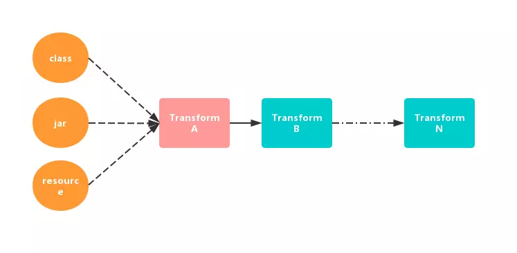

# Transform
## 介绍
gradle从1.5开始，gradle插件包含了一个叫Transform的API，这个API允许第三方插件在class文件转为为dex文件前操作编译好的class文件，这个API的目标是简化自定义类操作，而不必处理Task，并且在操作上提供更大的灵活性。
官方文档：<http://google.github.io/android-gradle-dsl/javadoc/>

从官方的描述中得知：
* Transform API 是新引进的操作 class 的方式
* Transform API 在编译之后，生成 dex 之前起作用

## 初识
```java
public class TestTransform extends Transform {
    @Override
    public String getName() {
        return null;
    }

    @Override
    public Set<QualifiedContent.ContentType> getInputTypes() {
        return null;
    }

    @Override
    public Set<? super QualifiedContent.Scope> getScopes() {
        return null;
    }

    @Override
    public boolean isIncremental() {
        return false;
    }

    @Override
    public void transform(TransformInvocation transformInvocation) throws TransformException, InterruptedException, IOException {
        super.transform(transformInvocation);
    }
}
```
* `name`  
    设置自定义的Transform对应的Task名称，形如：transformClassesWithPreDexForXXX

* `inputTypes`   
    用于指明 Transform 的输入类型，可以作为输入过滤的手段。在 TransformManager 类中定义了很多类型：
    ``` 
    // 代表 javac 编译成的 class 文件，常用，可能是 jar 包也可能是class目录
    public static final Set<ContentType> CONTENT_CLASS;
    public static final Set<ContentType> CONTENT_JARS;
    // 这里的 resources 单指标准的 java 的资源
    public static final Set<ContentType> CONTENT_RESOURCES;
    public static final Set<ContentType> CONTENT_NATIVE_LIBS;
    public static final Set<ContentType> CONTENT_DEX;
    public static final Set<ContentType> CONTENT_DEX_WITH_RESOURCES;
    public static final Set<ContentType> DATA_BINDING_BASE_CLASS_LOG_ARTIFACT;
    ```
    其中，很多类型是不允许自定义 Transform 来处理的，我们常使用 CONTENT_CLASS 来操作 Class 文件。

* `scopes`  
    用于指明 Transform 的作用域。
    type|Des
    ---|---
    PROJECT|只处理当前项目
    SUB_PROJECTS|只处理子项目
    PROJECT_LOCAL_DEPS|只处理当前项目的本地依赖,例如jar, aar
    EXTERNAL_LIBRARIES|只处理外部的依赖库
    PROVIDED_ONLY|只处理本地或远程以provided形式引入的依赖库
    TESTED_CODE|测试代码
    > ContentType 和 Scopes 都返回集合，TransformManager 中封装了默认的几种集中类型
    ```
    // 注意，不同版本值不一样
    public static final Set<Scope> EMPTY_SCOPES = ImmutableSet.of();
    public static final Set<ScopeType> PROJECT_ONLY;  //当前项目
    public static final Set<Scope> SCOPE_FULL_PROJECT; //整个项目，常用
    public static final Set<ScopeType> SCOPE_FULL_WITH_IR_FOR_DEXING;
    public static final Set<ScopeType> SCOPE_FULL_WITH_FEATURES;
    public static final Set<ScopeType> SCOPE_FULL_WITH_IR_AND_FEATURES;
    public static final Set<ScopeType> SCOPE_FEATURES;
    public static final Set<ScopeType> SCOPE_FULL_LIBRARY_WITH_LOCAL_JARS;
    public static final Set<ScopeType> SCOPE_IR_FOR_SLICING;
    ```
    常用的是 SCOPE_FULL_PROJECT ，代表所有项目。

* `isIncremental`  
    指明该 Transform 是否支持增量编译。

* `transform`  
    * inputs 是该 Transform 要消费的输入流。有两种格式：jar格式和目录格式；
    * referencedInputs 集合仅供参考，不应进行转换，它是受 getReferencedScopes 方法控制的；
    * outputProvider 是用来获取输出目录的，我们要将操作后的文件输出到输出目录中。

## 工作流程    


很明显的一个链式结构。其中，红色的 Transform 代表自定义 Transform ，蓝色的代表系统的 Transform 。  
每个 Transform 其实都是一个 Gradle 的 Task ， Android 编译器中的 TaskManager 会将每个 Transform 串联起来。第一个 Transform 接收来自 javac 编译的结果，以及拉取到本地的第三方依赖和 resource 资源。这些编译的中间产物在 Transform 链上流动，每个 Transform 节点都可以对 class 进行处理再传递到下一个 Transform。

## TransformInput 类
```java
public interface TransformInput {
    Collection<JarInput> getJarInputs();

    Collection<DirectoryInput> getDirectoryInputs();
}
```
所谓 Transform 就是对输入的 class 文件转变成目标字节码文件，TransformInput 就是这些输入文件的抽象。目前它包括两部分：DirectoryInput 集合与 JarInput 集合。
DirectoryInput 代表以源码方式参与项目编译的所有目录结构及其目录下的源码文件，可以借助于它来修改输出文件的目录结构以及目标字节码文件。
JarInput 代表以 jar 包方式参与项目编译的所有本地 jar 包或远程 jar 包，可以借助它来动态添加 jar 包。

## TransformOutputProvider 类
```java
public interface TransformOutputProvider {
    void deleteAll() throws IOException;

    File getContentLocation(String var1, Set<ContentType> var2, Set<? super Scope> var3, Format var4);
}
```
调用 getContentLocation 获取输出目录，例如  
```java
destDir = transformInvocation.outputProvider.getContentLocation(
    dirInput.name, 
    dirInput.contentTypes, 
    dirInput.scopes, 
    Format.DIRECTORY)
```


## 举例
```java
public class AsmTransform extends Transform {
    private final Logger logger;

    public AsmTransform(Project project) {
        this.logger = project.getLogger();
    }

    @Override
    public String getName() {
        return "AsmTransform";
    }

    @Override
    public Set<QualifiedContent.ContentType> getInputTypes() {
        return TransformManager.CONTENT_CLASS;//指定输入的类型
    }

    @Override
    public Set<? super QualifiedContent.Scope> getScopes() {
        return TransformManager.SCOPE_FULL_PROJECT;//指定Transform的作用范围
    }

    @Override
    public boolean isIncremental() {
        return true;//当前Transform是否支持增量编译
    }

    @Override
    public boolean isCacheable() {
        return true;
    }

    // 核心方法
    // inputs是传过来的输入流，有两种格式：jar和目录格式
    // outputProvider 获取输出目录，将修改的文件复制到输出目录，必须执行
    @Override
    public void transform(TransformInvocation transformInvocation) throws TransformException, InterruptedException, IOException {
        super.transform(transformInvocation);
        transformWork(transformInvocation);
    }

    private void transformWork(TransformInvocation transformInvocation) throws IOException {
        boolean isIncremental = transformInvocation.isIncremental();
        Collection<TransformInput> inputs = transformInvocation.getInputs();
        Collection<TransformInput> referencedInputs = transformInvocation.getReferencedInputs();
        TransformOutputProvider outputProvider = transformInvocation.getOutputProvider();
        if (isIncremental) {//增量情况下
            // Transform的inputs有两种类型，一种是目录，一种是jar包，要分开遍历
            for (TransformInput input : inputs) {
                //先遍历jar包
                for (JarInput jarInput : input.getJarInputs()) {
                    //文件状态
                    Status status = jarInput.getStatus();
                    //输出路径
                    File dest = outputProvider.getContentLocation(jarInput.getFile().getAbsolutePath(), jarInput.getContentTypes(), jarInput.getScopes(), Format.JAR);

                    switch (status) {
                        case NOTCHANGED:
                            break;
                        case ADDED:
                        case CHANGED:
                            transformJar(jarInput.getFile(), dest, status);
                            break;
                        case REMOVED:
                            if (dest.exists()) {
                                FileUtils.delete(dest);
                            }
                            break;
                        default:
                            break;
                    }
                }
                //遍历目录
                for (DirectoryInput directoryInput : input.getDirectoryInputs()) {
                    //输出目录
                    File dest = outputProvider.getContentLocation(directoryInput.getFile().getAbsolutePath(), directoryInput.getContentTypes(), directoryInput.getScopes(), Format.DIRECTORY);
                    FileUtils.mkdirs(dest);

                    //输入目录
                    String srcDirPath = directoryInput.getFile().getAbsolutePath();
                    //输出目录
                    String destDirPath = dest.getAbsolutePath();

                    Map<File, Status> fileStatusMap = directoryInput.getChangedFiles();
                    //对目录里的文件进行遍历
                    for (Map.Entry<File, Status> changedFile : fileStatusMap.entrySet()) {
                        //文件状态
                        Status status = changedFile.getValue();
                        File inputFile = changedFile.getKey();
                        String destFilePath = inputFile.getAbsolutePath().replace(srcDirPath, destDirPath);
                        File destFile = new File(destFilePath);
                        switch (status) {
                            case NOTCHANGED:
                                break;
                            case REMOVED:
                                if (destFile.exists()) {
                                    destFile.delete();
                                }
                                break;
                            case ADDED:
                            case CHANGED:
                                transformSingleFile(inputFile, destFile, srcDirPath);
                                break;
                            default:
                                break;
                        }
                    }
                }
            }
        } else {//非增量情况下
            outputProvider.deleteAll();//清空输出目录
            //遍历jar
            for (TransformInput input : inputs) {
                for (JarInput jarInput : input.getJarInputs()) {
                    Status status = jarInput.getStatus();
                    File dest = outputProvider.getContentLocation(jarInput.getFile().getAbsolutePath(), jarInput.getContentTypes(), jarInput.getScopes(), Format.JAR);
                    org.apache.commons.io.FileUtils.touch(dest);
                    transformJar(jarInput.getFile(), dest, status);
                }
                //遍历目录
                for (DirectoryInput directoryInput : input.getDirectoryInputs()) {
                    String dirPath = directoryInput.getFile().getAbsolutePath();
                    File dest = outputProvider.getContentLocation(directoryInput.getFile().getAbsolutePath(), directoryInput.getContentTypes(), directoryInput.getScopes(), Format.DIRECTORY);
                    System.out.println(dest.getAbsolutePath() + " is exist " + dest.exists());
                    if (!dest.exists()) {
                        dest.mkdirs();
                    }
                    //遍历目录里的文件
                    for (File file : FileUtils.getAllFiles(directoryInput.getFile())) {
                        String filePath = file.getAbsolutePath();
                        File outputFile = new File(filePath.replace(dirPath, dest.getAbsolutePath()));
                        org.apache.commons.io.FileUtils.touch(outputFile);
                        transformSingleFile(file, outputFile, dirPath);
                    }
                }
            }
        }
    }
    
}
```