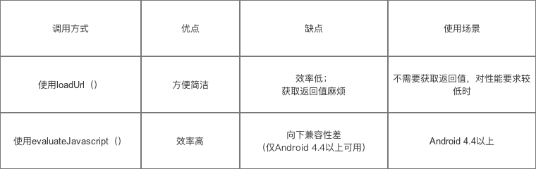
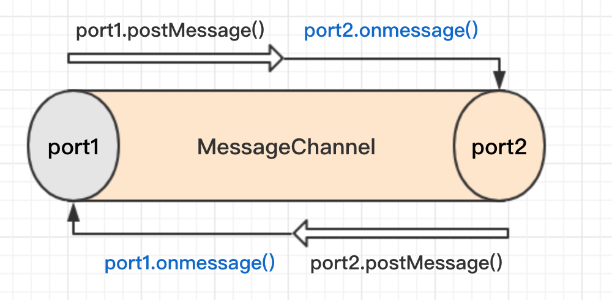
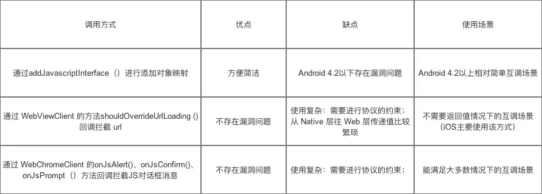

# Native调用JS有2种方法：
## 1、通过evaluateJavascript接口
```java
mWebView.evaluateJavascript（"javascript:callJS()", new ValueCallback<String>() {
        @Override
        public void onReceiveValue(String value) {
            //此处为 js 返回的结果
        }
    });
```
## 2、通过loadUrl
```java
mWebView.loadUrl("javascript:callJS()");
```
两种比较：



# JS调用Native有以下几种方法：
* prompt/alert
* url拦截
* @JavascriptInterface注解
* local socket
* HTML message channels

## 1、prompt/alert/log等
```javascript
var result = prompt("js://webview?arg1=111&arg2=222");
```

```java
// WebChromeClient
public boolean onJsPrompt(WebView view, String url, String message,
                              String defaultValue, JsPromptResult result) {
        //根据协议的参数，判断是否是所需要的url
        // 一般根据scheme（协议格式） & authority（协议名）判断
        //假定传入进来的 url = "js://webview?arg1=111&arg2=222"
        Uri uri = Uri.parse(url);
        if (uri.getScheme().equals("js")) {
            if (uri.getAuthority().equals("webview")) {
                result.confirm("success");
                return true;
            }
        }
        return false;
}
```

```java
  //console.log("js://webview?arg1=111&arg2=222")
  
  @Override  
  public boolean onConsoleMessage(ConsoleMessage consoleMessage) {  
    String message = consoleMessage.message();
    if(this.hijack(message)) {
      return true;
    }
    return super.onConsoleMessage(consoleMessage);  
  }

  @Override  
  public void onConsoleMessage(String message, int lineNumber, String sourceID) {
    if(this.hijack(message)) {
      return true;
    }
    super.onConsoleMessage(message, lineNumber, sourceID);  
  }  
}
```

## 2、url拦截
```javascript
function callback(result){}
document.location = "js://webview?arg1=111&arg2=222&cb=callback";
```
```java
public boolean shouldOverrideUrlLoading(final WebView webView, String url) {
        Uri uri = Uri.parse(url);
        if (uri.getScheme().equals("js")) {
            if (uri.getAuthority().equals("webview")) {

                final String cb = uri.getQueryParameter("cb");
                final String result = "success";
                new Handler().post(new Runnable() {
                    @Override
                    public void run() {
                        webView.loadUrl(String.format("javascript:%1$s(%2$s)", cb, result));
                    }
                });
            }
            return true;
        }
        return super.shouldOverrideUrlLoading(view, url);
}
```

## 3、JavascriptInterface注解
Android 4.4 后才可使用，有安全隐患一般都不会用
```java
//定义一个js可调的native接口"android"
webview.addJavascriptInterface(new JavaScriptinterface(context, this),"android");
public class JavaScriptinterface {
    public JavaScriptinterface(Context context) {
    }
    
    //带有此注释的标记可用于JavaScript代码
    @JavascriptInterface
    public void callAndroid(String url) {
      Uri uri = Uri.parse(url);
        if (uri.getScheme().equals("js")) {
            if (uri.getAuthority().equals("webview")) {
              final String cb = uri.getQueryParameter("cb");
              final String result = "success";
            	webView.loadUrl(String.format("javascript:%1$s(%2$s)", cb, result)); 
         }
    	}
		}
}
```
```javascript
function callNative() {
    android.callAndroid('js://webview?arg1=111&arg2=222&cb=callback');
}
```

## 4、socket
Native启动一个ServerSocket，如端口号为8888，使用socket进行通信，这种比较麻烦。
```javascript
$.get('http://127.0.0.1:8888/getGeoLocation?callback=cbname')
```

## 5、HTML message channels
仅支持android 6.0以上，用来代替JavascriptInterface机制。支持双向通信。
```java
WebMessagePort[] channel = mWebView.createWebMessageChannel();
WebMessagePort port = channel[0];

// Create handler for channel[0] to receive messages
port.setWebMessageCallback(new WebMessagePort.WebMessageCallback() {
    @Override
    public void onMessage(WebMessagePort port, WebMessage message) {
         //message from js
    }
});
// Send channel[1] to webWindow，将触发window.onmessage方法
mWebView.postWebMessage(new WebMessage("", new WebMessagePort[]{channel[1]}), Uri.EMPTY);

//send message to js by port
port.postMessage(new WebMessage("hello from native"));
```
```javascript
//定义window的onmessage回调，接收mWebView.postWebMessage发过来的事件
window.onmessage = function (event) {
    port = event.ports[0];//记录下传过来的port，也即是上面的channel[1]

  	//给port定义onmessage回调，只有就可以通过port进行通信了
    port.onmessage = function (e) {
      parse(e.data);
    }
}
```


说一下`MessagePort`和`MessageChannel`是啥？

MessageChannel 构造函数会创建一对相互关联的 MessagePort 对象(port1 和 port2)，怎么理解 MessagePort 对象呢？可以把一个 MessagePort 对象当成消息传递的端口，而MessageChannel连接着这两个端口，我们可以通过这两个端口来进行消息的传递，port1 和 port2 可以相互传递处理消息，想象一下现实生活中的两个人通过手机打电话，一个 MessagePort 对象就是一个手机，MessageChannel就是电信运营商。


在web环境下，JavaScript 跨域的问题，一直是一个颇为棘手的问题，HTML5 提供了网页文档之间互相接收与发送信息的功能，使用`postMessage` 和 `onmessage`主要就用来解决跨文档通信的问题的（称之为`cross-document messaging`）。当然上面所说的MessageChannel也是一种通信方式，称之为`channel messaging`。他们是HTML5通信接口套件的重要组成部分。

在Native侧，通过WebView#postWebMessage，可以将其中一个port(如port2)封装进WebMessage对象中，并传入JS环境，JS环境拿到port以后，就可以和另外剩余的那个port(如port1)进行通信了。注意到这个过程使用到了上面所述的两种通信方式：通过postMessage传递port，然后通过port进行后续的通信。

# 几种方法的比较



# 第三方库
基本上交互的基本方式就是以上几种，不过有人将通信机制进行了封装，形成一套完善的 WebviewJSBridge 方案，提供了客户端调前端，前端调用客户端的系统解决方案。
* [lzyzsd/JsBridge](https://github.com/lzyzsd/JsBridge)项目，我们从代码中可以看到，其实它在底层是使用了 URL 劫持的方法与 JS 进行交互。 
* 微店也开源了一个小程序运行框架[Hera](https://github.com/weidian-inc/hera)，使用的是addJavascriptInterface方式进行的交互。
* web app项目[Cordova-Android](https://github.com/apache/cordova-android)，则通过addJavascriptInterface 和JS Prompt这两种方式来实现JS对于Native API的调用。
* [DSBridge](https://github.com/wendux/DSBridge-Android)跨平台解决方案，唯一一个支持同步调用的javascript bridge