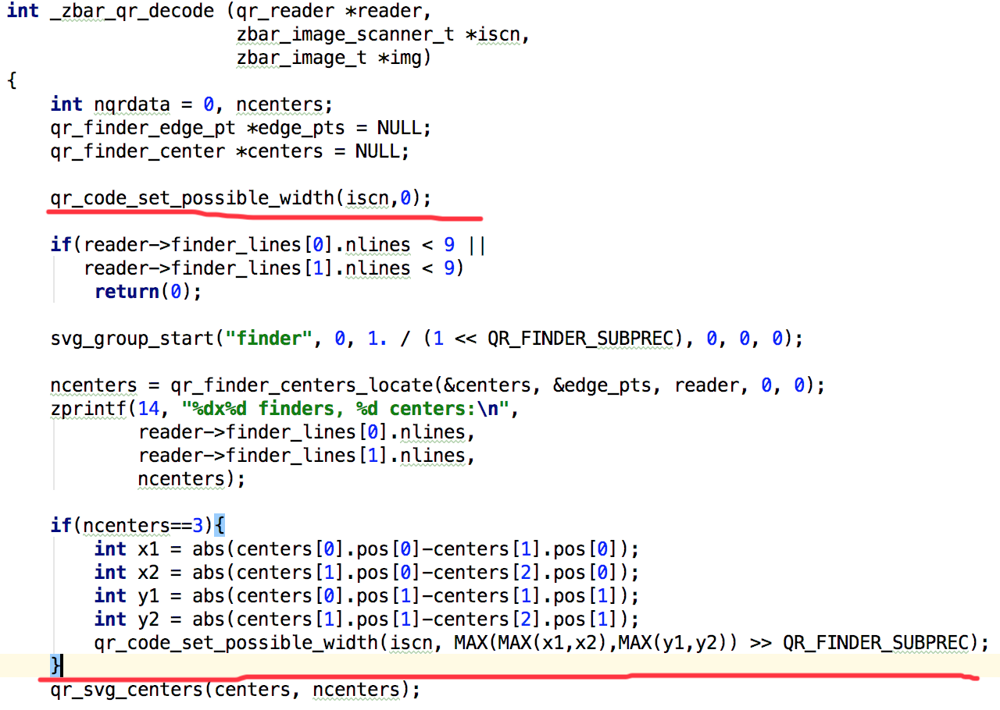

#Zbar

## 编译
android 编译zbar可参考：<https://blog.csdn.net/yanzhenjie1003/article/details/71641368>

## 较小二维码放大
较小面积的二维码，zbar可能识别不出来，但是可能会检测出二维码的三个定位点，基于这个前提，从定位点计算出二维码的预览大小，从而决定相机是否需要调节焦距放大图像。

1. 关注核心方法
    zbar中关于二维码识别的相关代码在`qrcode`目录下，`qrdec.c`中的_zbar_qr_decode是识别二维码的入口方法。

  

通过打日志可观察到，大部分较小的二维码即使不能识别出来，也能首先找到到三个定位点，即上图的`ncenters`。
对于这三个定位点，取最大坐标差值，可计算出二维码图像的大致大小，我们把这个大小放到`zbar_image_scanner_s`结构体中，增加一个整形成员变量`width`。
```C
struct zbar_image_scanner_s {
    zbar_scanner_t *scn;        /* associated linear intensity scanner */
    zbar_decoder_t *dcode;      /* associated symbol decoder */
#ifdef ENABLE_QRCODE
    qr_reader *qr;              /* QR Code 2D reader */
#endif
    int width;                  /*加一个成员*/
    //...
```

`zbar_image_scanner_s`结构体对应Java中的ImageScanner。
在jni接口中增加JNI方法，从`zbar_image_scanner_s`中取出`width`参数。

```C
JNIEXPORT jint JNICALL
Java_net_sourceforge_zbar_ImageScanner_getPossibleWidth (JNIEnv *env,
                                                  jobject obj)
{
    zbar_image_scanner_t *zscn = GET_PEER(ImageScanner, obj);
    return zbar_image_scanner_get_possible_width(zscn);
}
```

最后，在java层拿到二维码定位点间距，相对于扫描窗口，判断是否太小，计算出zoom值，即可实现二维码的放大识别。
```java
Camera.Parameters pa = camera.getParameters();
if (!pa.isZoomSupported()) {
    return;
}
int possibleWidth = mScanner.getPossibleWidth();//定位间距
int windowWidth = (int) (imagePreviewRect.width() * 0.5f);//阈值，不需要放太大
if (possibleWidth > 1 && possibleWidth < windowWidth) {
    int maxRealZoom = windowWidth * 100 / possibleWidth;
    int max = getMaxZoomIndex(pa, maxRealZoom);
    if (max > zoomMax) {
        zoomMax = max;
    }
    if (zoom < zoomMax / 2) {
        zoom *= 2;//二倍增长
    } else {
        zoom = zoomMax;
    }
    if (pa.getZoom() != zoom) {
        pa.setZoom(zoom);
        camera.setParameters(pa);
    }
}
```